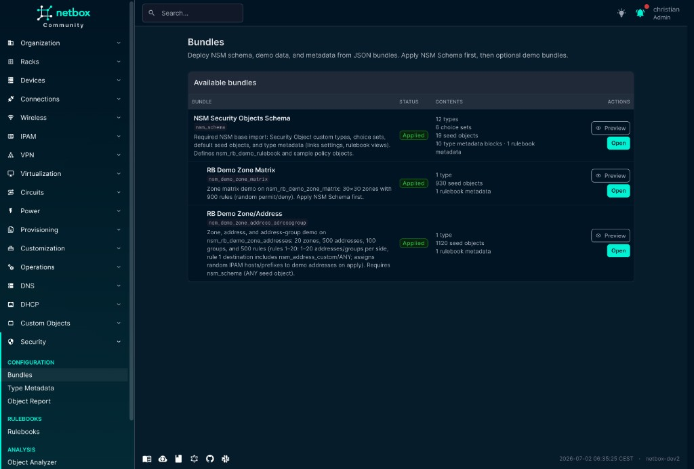
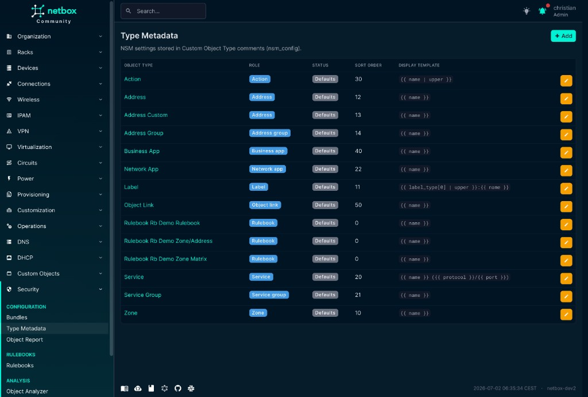
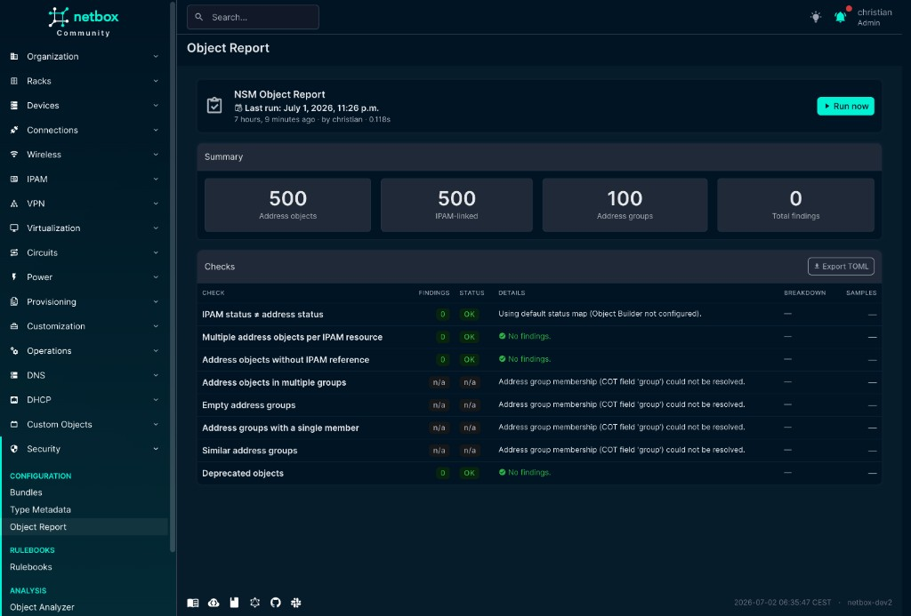
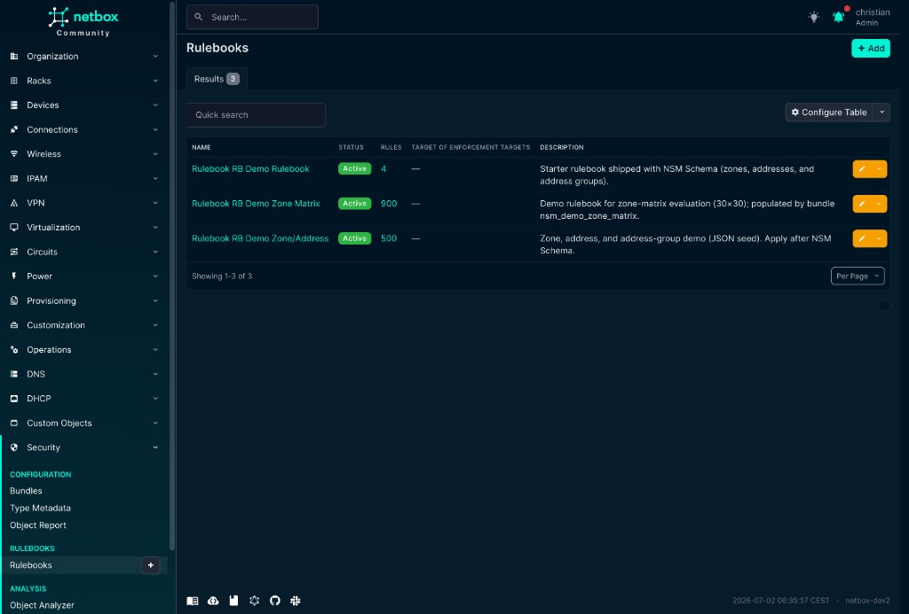
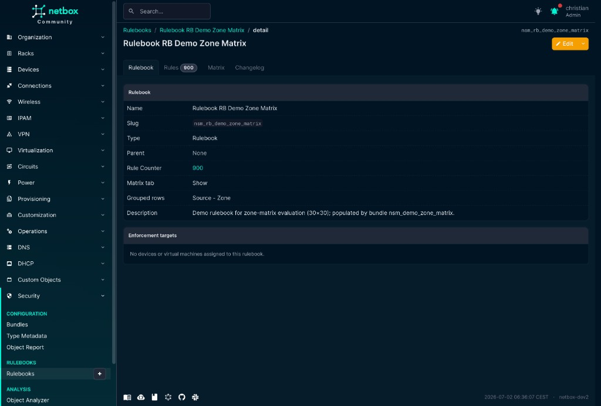
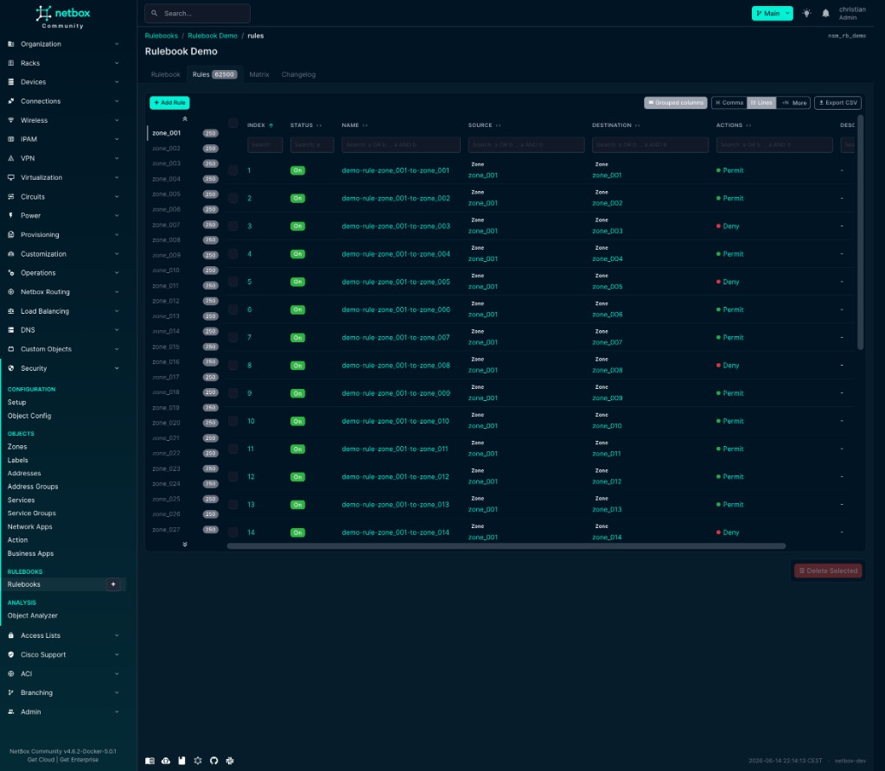
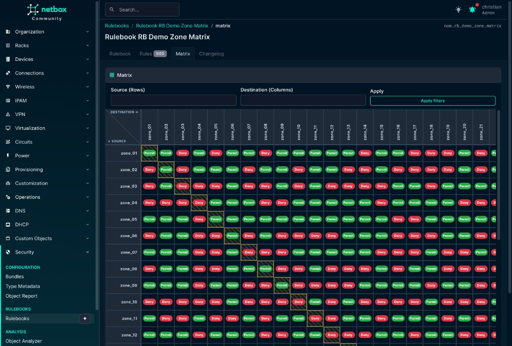
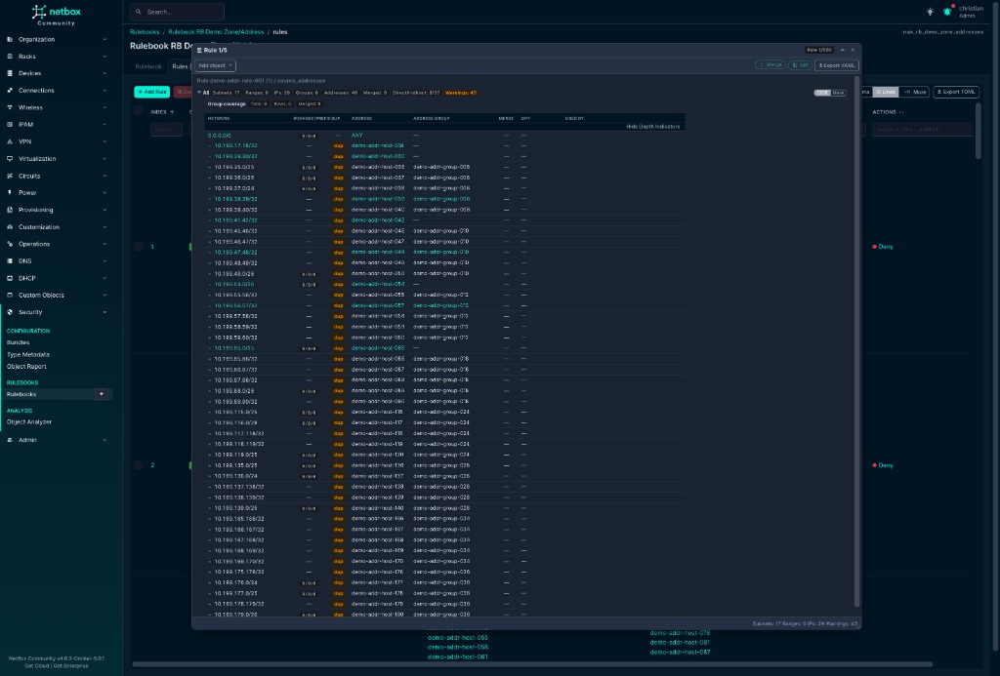

# netbox-nsm

NetBox plugin for **security policy documentation** (zones, rulebooks, object links).  
No firewall push — inventory and policy only.

> **⚠️ Work in progress** — Not recommended for production use yet. Breaking changes possible (e.g. 0.4.5 permission migration).

**Status:** **NetBox:** 4.5–4.6 · **Plugin:** 0.4.14 · **Requires:** [netbox-custom-objects](https://github.com/netboxlabs/netbox-custom-objects)

## Features

- **Security Panel** on prefix, IP, device, VM, custom objects — `+ Assign` for zones, addresses, …
- **Bundles** — deploy NSM schema and demo data from JSON bundles (`Security → Configuration → Bundles`)
- **Type Metadata** — per-COT settings (`nsm_config` in type comments): role, display template, sort order
- **Rulebooks** with flexible columns (zones, addresses, labels, …)
- **Rules** — table, row grouping, grouped columns, zone matrix; **Export JSON** (bundle-compatible, re-import via Bundles)
- **IP Analyzer** — address resolution via the IP Analyzer applet on rule pages (loupe icon)
- **Object Analyzer** — graph from any NetBox object
- **Object Report** — daily background audit of NSM addresses/groups; TOML export

## Navigation

| Group | Items |
|-------|-------|
| **Configuration** | Bundles, Type Metadata, Object Report |
| **Rulebooks** | Rulebooks (+ Add) |
| **Analysis** | Object Analyzer |

## Screenshots

**Bundles** — apply `nsm_schema` first, then optional demo bundles:



**Type Metadata** — `nsm_config` per COT type (role, display template, sort order):



**Object Report** — daily address/group audit with TOML export:



**Rulebooks** — list and detail (fields, enforcement targets):





**Rules** — row grouping, grouped columns, Export JSON:



**Zone matrix** — permit/deny between zones:



**IP Analyzer** — destination tree with merge/diff:



## Installation

```bash
pip install netbox-nsm
```

```python
PLUGINS = ["netbox_custom_objects", "netbox_nsm"]

PLUGINS_CONFIG = {
    "netbox_nsm": {
        "menu_label": "Security",
        "panel_label": "Security",
        "top_level_menu": True,
        "bundles_menu": True,  # False hides Configuration → Bundles
        "setup_allow_destructive_actions": True,  # destructive preview/apply + demos; disable in prod
        "bundle_paths": [],
        "builtin_bundles": True,
        # Optional Jinja2 address naming — see docs/address_name_templates.md
        # "address_name_templates": [
        #     {"template": "h-{ipam>ip}", "match": "host"},
        # ],
    },
}
```

```bash
./manage.py migrate netbox_custom_objects --no-input
./manage.py migrate netbox_nsm --no-input
```

## First run

1. **Security → Configuration → Bundles** — **Apply** `nsm_schema` (required; imports built-in `nsm_*` COT types and writes `nsm_config` into each type's comments).
2. Optional demo bundles: **RB Demo Zone Matrix**, **RB Demo Zone/Address** (Preview → Apply).
3. Open a prefix → **Security** tab → `+ Assign` → zone.
4. Rulebooks under **Security → Rulebooks**.

Details: [docs/using_netbox_nsm.md](docs/using_netbox_nsm.md)

## Rules export / import

On a rulebook **Rules** tab, **Export JSON** downloads all rules matching the current filters (not just the visible page) as a bundle-compatible JSON document (`objects[].records[]` with portable refs like `nsm_zone/zone_01`). Import the file via **Security → Configuration → Bundles** (objects seeding).

## API

`/api/plugins/netbox-nsm/` — Type Metadata via `nsm-configs/<slug>/`, plus `object-links/`, `ip-analyzer/`  
Rules and policy objects: **netbox-custom-objects** API.

## Demos

| Demo | Where | Notes |
|------|-------|-------|
| NSM Schema | Bundles → `nsm_schema` | Required base import (types, choice sets, seed objects, metadata) |
| RB Demo Zone Matrix | Bundles → `nsm_demo_zone_matrix` | 30×30 zone matrix, 900 rules |
| RB Demo Zone/Address | Bundles → `nsm_demo_zone_address_adressgroup` | Zones, addresses, groups, 500 rules |

## Documentation

| File | Topic |
|------|-------|
| [docs/using_netbox_nsm.md](docs/using_netbox_nsm.md) | Operations |
| [docs/DATABASE.md](docs/DATABASE.md) | PostgreSQL tables |
| [docs/RULE_DATA_STORAGE.md](docs/RULE_DATA_STORAGE.md) | UI vs DB data model |
| [docs/object_report.md](docs/object_report.md) | Daily object report: job, checks, scaling |
| [ARCHITECTURE.md](ARCHITECTURE.md) | Code (developers) |
| [CHANGELOG.md](CHANGELOG.md) | Versions |

## License

[LICENSE](LICENSE)
