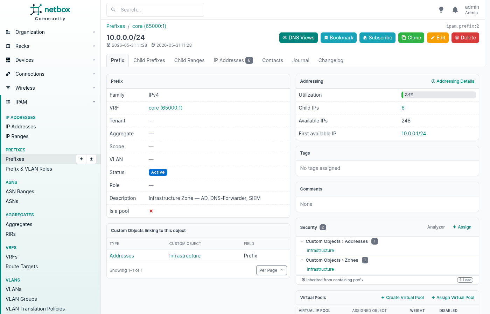
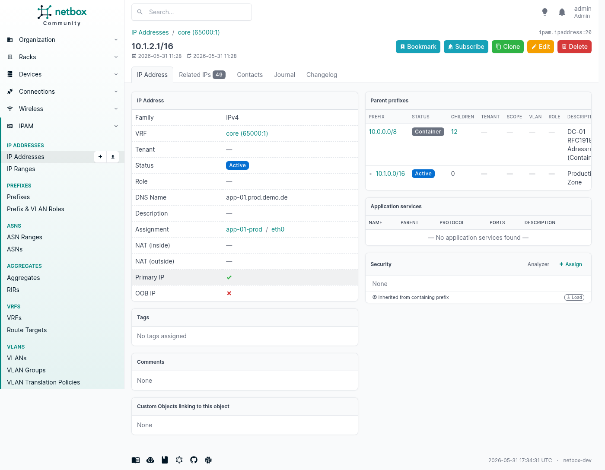
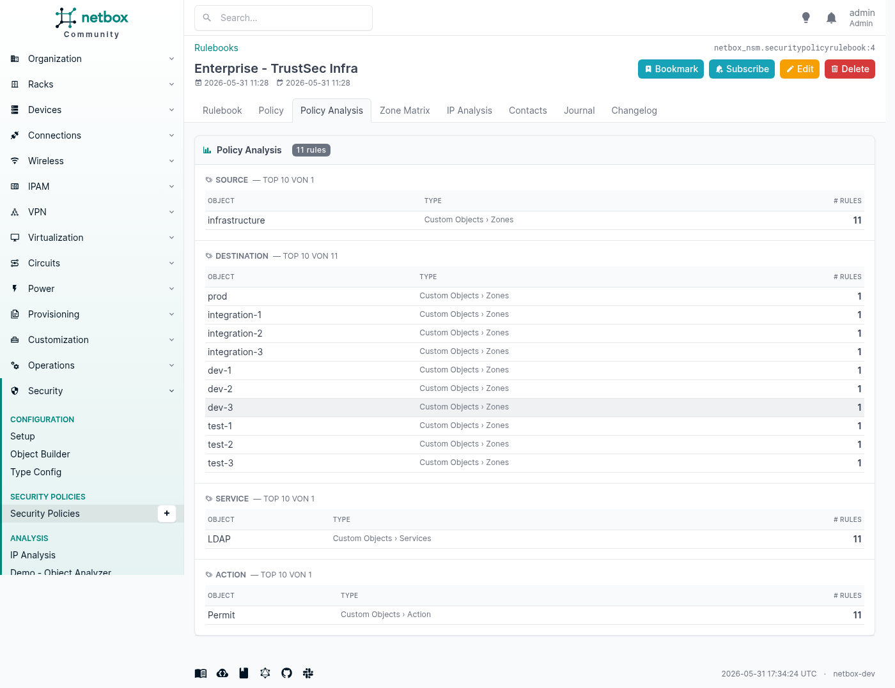

# netbox-nsm — Network Security Management Plugin for NetBox

> **⚠️ Work in Progress — do not use in production.**

A [NetBox](https://github.com/netbox-community/netbox) plugin for managing network security
objects, security policies and object-to-object relationships — modular, vendor-agnostic, and
tightly integrated with NetBox's existing IPAM and DCIM data.

**Requires:** [`netbox-custom-objects`](https://github.com/christianbur/netbox-custom-objects) plugin

---

## Table of Contents

1. [Overview](#overview)
2. [Installation](#installation)
3. [Configuration](#configuration)
4. [Quick Start / Setup Wizard](#quick-start--setup-wizard)
5. [Type Config](#type-config)
6. [NSM Object Links & Security Panel](#nsm-object-links--security-panel)
7. [Security Policies](#security-policies)
   - [Rulebook List](#rulebook-list)
   - [Rulebook Detail](#rulebook-detail)
   - [Policy Rules](#policy-rules)
   - [Policy Analysis](#policy-analysis)
   - [Zone Matrix](#zone-matrix)
8. [Demo – Object Analyzer](#demo--object-analyzer)
9. [Demo Data: Enterprise DC](#demo-data-enterprise-dc)
10. [REST API](#rest-api)
11. [Compatibility](#compatibility)

---

## Overview

`netbox-nsm` is a **documentation plugin** — it helps you maintain an overview of your network
security landscape directly inside NetBox, where your IPAM and DCIM data already lives.

`netbox-nsm` is **not** a policy enforcement tool and does not push rules to firewalls.
It does not replace Tufin, AlgoSec or similar products.
Instead, it gives you a place to **document**, **visualise** and **cross-reference** security
policies alongside the rest of your network inventory — vendor-agnostic, in one place.

Rulebooks are flexible enough to model virtually any firewall vendor's policy style:

| Policy style | Objects used | Typical vendors |
|---|---|---|
| Zone-based | Zone objects in Source + Destination | Palo Alto, Fortinet, Cisco ASA, Check Point |
| Address-based | Address or Prefix objects | iptables, AWS Security Groups, ACLs |
| Zone + Address | Zones and Addresses combined | Mixed environments |
| Label-based | Labels / Tags | Illumio, VMware NSX, cloud micro-segmentation |
| Mixed | Any combination of the above | Multi-vendor / multi-team environments |

Because each Rulebook defines its own column structure, you can document policies from
completely different platforms side by side in the same NetBox instance — each in its own
native style.

Typical use cases:
- Document which security zones a prefix belongs to
- Map firewall rules from different platforms into a common rulebook format
- Visualise zone-to-zone policies as a matrix
- Check at a glance which rules affect a specific IP or prefix
- Keep an audit trail of intended policy alongside the live IPAM data

Key concepts:

| Concept | What it is |
|---|---|
| **Custom Object Type (COT)** | Schema for a security object class (Zone, Address, Label, Service, Action), provided by `netbox-custom-objects` |
| **NSM Object Link** | Bidirectional link between any two NetBox objects (e.g. Prefix ↔ Zone) |
| **Type Config** | Configures how a COT is used inside NSM (matching class, display template, inheritance) |
| **Security Rulebook** | A named, ordered list of firewall / policy rules |
| **Security Rule** | One rule with configurable source, destination, service and action fields |
| **Security Panel** | Auto-injected panel showing security links on every NetBox detail page |

---

## Installation

```bash
pip install netbox-nsm
```

Add to `configuration.py`:

```python
PLUGINS = [
    "netbox_custom_objects",   # required dependency
    "netbox_nsm",
]
```

Run migrations:

```bash
python netbox/manage.py migrate netbox_nsm
```

Restart the NetBox process (gunicorn / uwsgi).

---

## Configuration

All settings are optional:

```python
PLUGINS_CONFIG = {
    "netbox_nsm": {
        # Render plugin as top-level "Security" menu entry (default: True)
        "top_level_menu": True,

        # Add "Security Rulebook Assignments" to the menu (default: False)
        "assignments_menu": False,
    }
}
```

---

## Quick Start / Setup Wizard

**Security → Configuration → Setup**

The wizard guides you through three steps:

1. **Import NSM object types** — creates the five built-in Custom Object Types
   (`nsm_zones`, `nsm_addresses`, `nsm_labels`, `nsm_services`, `nsm_action`) via the
   `netbox-custom-objects` plugin.
2. **Create Type Configs** — links each COT to a TypeConfig that controls matching behaviour,
   display templates and inheritance settings.
3. **Create demo data** *(optional)* — creates example rulebooks or the full
   [Enterprise DC demo](#demo-data-enterprise-dc).


> The "Import Enterprise Demo" button is only shown when the database contains **no IP addresses**,
> to prevent accidental data overwrites.

---

## Type Config

**Security → Configuration → Type Config**

A `TypeConfig` record controls how one specific NetBox object type behaves inside NSM.


A TypeConfig is required for every security object type you want to use inside NSM.
Without it, the plugin does not know how to handle or display that type.

| Field | Description |
|---|---|
| **Object Type** | The NetBox ContentType this config applies to (e.g. `Custom Objects › nsm_zones`) |
| **Matching Class** | Semantic role: `address`, `zone`, `label`, `service`, `action`, … Tells Rulebooks how to interpret objects of this type when building policies |
| **Display Template** | How to render objects of this type in the UI. E.g. `{name}` for zones, `{name} ({protocol}/{port})` for services |
| **Allowed Placements** | Restricts which rule fields this type may appear in: `source`, `destination`, or `fixed` (e.g. services are typically `fixed`, not source/destination) |
| **Inherit from parent** | If enabled: sub-Prefixes and IP Addresses automatically show the NSM links of their parent Prefix in the Security Panel |
| **Stop if own link present** | If enabled: once a child object has its own direct link of this type, the inherited link from the parent is hidden — useful for exceptions |

---

## NSM Object Links & Security Panel

The Security Panel is **automatically injected into every NetBox object's detail page** — no
configuration needed. It shows all security objects linked to the current object, grouped by
type (Zones, Addresses, Labels, Services, …).

An `NSMObjectLink` is a bidirectional link between any NetBox object (Prefix, IP Address,
Device, Interface, …) and a security object (Zone, Address object, Address group, Label, …).
Multiple links per object are supported — a prefix can belong to a zone *and* have an address
object *and* carry several labels at the same time.

Typical examples:

| NetBox object | linked to |
|---|---|
| Prefix `10.10.0.0/16` | Zone `prod`, Address `prod-net` |
| IP Address `10.10.0.5` | Label `web-tier`, Label `app-server` |
| Device `fw-dc-01` | Zone `infrastructure` |

New links are created directly on the detail page via the **+ Assign** button in the Security
panel.

### Security Panel on a Prefix (with data)



The panel groups all linked security objects by type:

- **Zones** — which security zone(s) this object belongs to
- **Addresses** — address objects or address groups that represent this object in policies
- **Labels** — arbitrary classification tags (environment, role, tier, …)
- **Services** — service objects linked to this object (less common, but possible)

Each entry shows the object name with its colour badge and a direct link to the security object.

### IP Address — inherited Security Panel

An IP Address that has no direct NSM links of its own still shows the links of its parent
Prefix — marked with the *"Inherited from containing prefix"* badge.



This means you only need to assign zones/addresses to Prefixes, not to every individual IP.

### Direct vs. Inherited Links

Links can be **direct** (assigned explicitly to this object) or **inherited** (taken from a
containing Prefix). Inherited links are shown with an *"Inherited from containing prefix"* badge.

This is controlled per security object type via the TypeConfig:

- **Inherit from parent** — a sub-Prefix or IP Address automatically shows the NSM links of
  its parent Prefix. Useful so you don't have to assign the same zone to every sub-prefix
  individually.
- **Stop if own link present** — once the child has its own direct link of that type, the
  inherited link is suppressed. Useful for exceptions: a sub-prefix that belongs to a
  *different* zone than its parent.

---

## Security Policies

A **Security Rulebook** is a named, ordered list of firewall rules — the NSM equivalent of a
policy or rule base on a real firewall. Each Rulebook has its own column structure (fields),
so you can model zone-based, address-based or label-based policies side by side.

Rulebooks are purely for **documentation** — they describe the intended or actual policy of a
firewall or firewall cluster, but do not push any configuration to devices.

### Rulebook List

**Security → Security Policies**

Lists all Rulebooks with rule count and type. You can have one Rulebook per firewall, per
cluster, or per team — whatever makes sense for your environment.


### Rulebook Detail

The detail page shows the Rulebook's **fields** (columns) and their configuration.


Each field defines one column in the rule editor, for example:
- **Source** — accepts Zone and Address objects
- **Destination** — accepts Zone and Address objects
- **Service** — accepts Service objects
- **Action** — accepts Action objects (Permit / Deny / Drop)

This column structure is fully configurable per Rulebook. A zone-based Rulebook uses Zone
objects in Source/Destination; an address-based Rulebook uses Address objects instead.
Both can coexist in the same NetBox instance.

### Policy Rules

The **Policy** tab shows all rules as an inline table — one row per rule.


Objects appear as colour-coded pills (using the colour defined on the object) or plain links.
Each rule has:
- An **index** (sort order)
- An **enabled/disabled** toggle
- A **name** and optional **comment**
- One cell per field (Source, Destination, Service, Action, …)
- A **log** flag

Rules can be added directly in the table, reordered by index, enabled/disabled individually,
and bulk-deleted. This is where you transcribe the actual firewall rules.

### Policy Analysis

The **Analysis** tab gives a statistical overview of the Rulebook.



Shows rule counts, enabled vs. disabled breakdown, and which object types (matching classes)
appear across all rules. Useful to quickly check if a policy is complete or has gaps.

### Zone Matrix

The **Zone Matrix** tab renders all rules as a grid: **source zone × destination zone**.
Each cell shows the services that are permitted or denied between those two zones.


This is the most useful view for understanding a zone-based firewall policy at a glance.
Instead of reading through hundreds of rows, you see the entire policy on one screen —
which zones can talk to which, and over which services.

Works best for Rulebooks that use Zone objects in Source and Destination fields (Palo Alto,
Fortinet, Cisco ASA, Check Point, …).

---

## Demo – Object Analyzer

**Security → Analysis → Demo – Object Analyzer**

Select any NetBox object (Prefix, IP Address, Device, …) and see everything NSM knows about it
in one view:

- All direct and inherited **NSM links** (Zones, Addresses, Labels, …)
- All **policy rules** across all Rulebooks where this object appears as source or destination


Useful for answering questions like: *"Which zone does this prefix belong to?"* or
*"Which firewall rules reference this IP address?"*

This is a demo/exploration tool — the same information is also visible directly on each
object's detail page via the Security Panel.

---

## Demo Data: Enterprise DC

The Setup Wizard offers an **Enterprise DC Demo** (only available when no IP addresses exist
in the database) that imports a complete, realistic multi-zone datacenter scenario — including
DCIM objects, prefixes, NSM zones/addresses/labels/services and 11 rulebooks with 250+ rules.

Useful for exploring all plugin features without building data by hand.

> **Note:** The Import button is hidden when IP addresses already exist in the database.
> All imports are idempotent (`get_or_create`) — safe to re-run.

---

## REST API

All NSM models are exposed under `/api/plugins/netbox-nsm/`:

| Endpoint | Model |
|---|---|
| `object-links/` | `NSMObjectLink` |
| `type-configs/` | `TypeConfig` |
| `security-policy/` | `SecurityPolicyRulebook` |
| `security-rule/` | `SecurityPolicyRule` |
| `security-policy-assignments/` | `SecurityPolicyAssignment` |

The portable schema (Custom Object Type definitions) can be applied via:

```
POST /api/plugins/custom-objects/schema/apply/
```

using the bundled `nsm-schema.json` as the request body.

---

## Compatibility

| NetBox | Plugin |
| 4.6.x | 0.1.0 |

---

## License

See [LICENSE](LICENSE).
