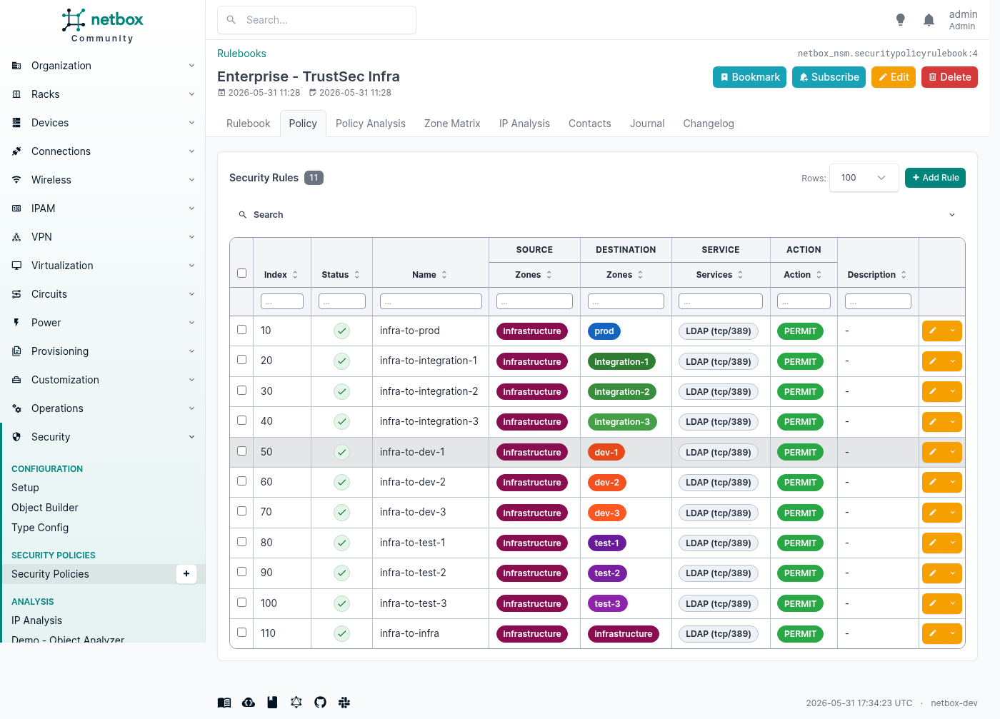
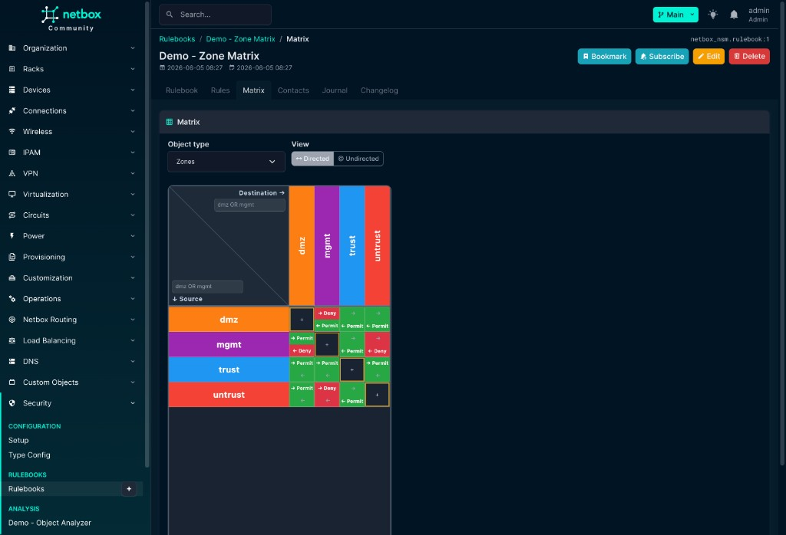

<div align="center">

# netbox-nsm

**Network Security Management for NetBox**

Document zones, firewall rules, and object relationships — vendor-agnostic, inside your existing IPAM and DCIM inventory.

[](https://netboxlabs.com/)
[](#)
[](https://github.com/christianbur/netbox-custom-objects)
[](#)
[](https://github.com/netboxlabs/netbox-branching)

[Full user guide](docs/README.md) · [Using netbox-nsm](docs/using_netbox_nsm.md) · [Architecture](ARCHITECTURE.md) · [Database](docs/DATABASE.md)

</div>

> **Work in progress — not for production use.**  
> netbox-nsm is a **documentation plugin**. It does not push rules to firewalls or replace Tufin, AlgoSec, or similar tools.

---

## At a glance

| | |
|---|---|
| **Security Panel** | Injected on every Prefix, IP, Device, VM, and Custom Object — assign zones, addresses, labels; see policy impact instantly |
| **Rulebooks** | Flexible column layout: zone-based, address-based, label-based, or mixed — side by side in one NetBox |
| **Policy grid** | [AG Grid Community](https://www.ag-grid.com/) — grouping, filter syntax, staged load (50k+ rules) |
| **Zone matrix** | AG Grid Community — source × destination heatmap |
| **IP Analysis** | Compare IP resolution across objects in two columns — with CSV export |
| **Object Analyzer** | [@xyflow/react](https://xyflow.com/) graph from any NetBox object to zones, links, and rulebooks |

---

## Why netbox-nsm?

Your network inventory already lives in NetBox. Security policy should live there too — not in spreadsheets or siloed tools.

- **One source of truth** — link a prefix to `prod`, a VM to an app zone, a device NIC to both
- **Any object type** — rule columns and Security Panel use **TypeConfig**; missing types? Create a Custom Object Type, then bind it in NSM
- **Any vendor style** — Palo Alto zones, AWS address groups, Illumio labels — each in its own Rulebook
- **Bidirectional visibility** — open a zone and see every prefix, VM, and rule that references it
- **Audit-friendly** — Journal and Changelog on rules, links, and configuration

---

## Security Panel — the hub

The **Security Panel** is the core workflow for NSM. From any NetBox object detail page, use **+ Assign** to open the **Assign Link** page — pick an NSM type, set **Direct** or **Inherit to IPAM children**, and create the ObjectLink.

**Macro vs. micro zones** — a single interface can carry multiple zone links:

| Layer | Example | Purpose |
|---|---|---|
| **Macro zone** | `prod` | Datacenter segment, environment, TrustSec macro-segment |
| **Micro zone** | `app-payroll`, `web-tier` | Application or tier within the macro segment |

A device NIC might be in **prod** *and* in a dedicated app zone — both visible in the Security Panel without duplicating IPAM data.

<p align="center">
  
  <br>
  <em>Prefix <code>10.1.0.0/16</code> — <code>prod</code> direct, <code>trust</code> inherited from <code>10.0.0.0/8</code></em>
</p>

<p align="center">
  
  <br>
  <em>Assign Link — choose <strong>Inherit to IPAM children</strong> for macro zones on parent prefixes</em>
</p>

<p align="center">
  
  <br>
  <em>Zone <code>prod</code> — reverse view: rulebooks, prefixes, groups, VMs (expandable rule tree)</em>
</p>

[Security Panel deep dive →](docs/using_netbox_nsm.md#security-panel)

### Extend with your own object types

NSM is not limited to the seven built-in types (Zones, Addresses, …):

1. **Need a new security object class?** Define it in **[netbox-custom-objects](https://github.com/christianbur/netbox-custom-objects)** (schema, fields, UI).
2. **Register it in NSM** — **Security → Type Config → + Add**: pick the ContentType, set matching class, panel slugs, display template, and which NetBox objects may link it (**Linkable in panel**).
3. **Use everywhere** — add the TypeConfig to **Rulebook → Fields** (rule columns + picker) and assign instances from any allowed host object via **+ Assign** in the Security Panel.

Rule columns reference **TypeConfig** records, not hard-coded COT names — so custom and native NetBox types share the same pipeline once configured.

[Full guide: extending NSM →](docs/using_netbox_nsm.md#extending-nsm-custom-and-native-object-types)

---

## Screenshots

Current demo environment (2026-06). Full walkthrough: **[Using netbox-nsm](docs/using_netbox_nsm.md)** · **[Documentation home](docs/README.md)**

<table>
<tr>
<td width="50%" valign="top">

**Setup wizard** — four sections, idempotent imports


</td>
<td width="50%" valign="top">

**Type Config list** — matching class, panel slugs, linkable types


</td>
</tr>
<tr>
<td width="50%" valign="top">

**Type Config detail** — Zones example


</td>
<td width="50%" valign="top">

**Rulebook list** — All Rules + named rulebooks


</td>
</tr>
<tr>
<td width="50%" valign="top">

**Rulebook detail** — Enterprise TrustSec Core, field hierarchy


</td>
<td width="50%" valign="top">

**Policy grid** — grouping, filter query, pills



</td>
</tr>
<tr>
<td width="50%" valign="top">

**Add rule** — Source / Destination / Service / Action tabs


</td>
<td width="50%" valign="top">

**Zone matrix** — directed Permit/Deny


</td>
</tr>
<tr>
<td width="50%" valign="top">

**Matrix filters** — corner query (`dmz OR mgmt`)



</td>
<td width="50%" valign="top">

**Custom Object Types** — seven built-in NSM COTs


</td>
</tr>
<tr>
<td width="50%" valign="top">

**Prefix Security Panel** — direct and inherited zones


</td>
<td width="50%" valign="top">

**Assign Link** — Direct vs Inherit to IPAM children


</td>
</tr>
<tr>
<td width="50%" valign="top">

**Zone detail** — reverse view, expandable rulebook tree


</td>
<td width="50%" valign="top">

**IP Analysis** — two columns, CSV path export


</td>
</tr>
<tr>
<td width="50%" valign="top" colspan="2">

**Object Analyzer** — xyflow graph from any NetBox object


</td>
</tr>
</table>

---

## Quick start

### 1. Install

```bash
pip install netbox-nsm
```

```python
# configuration.py
PLUGINS = [
    "netbox_custom_objects",   # required
    "netbox_nsm",
]
```

```bash
./manage.py migrate netbox_custom_objects --no-input
./manage.py migrate netbox_nsm --no-input
```

### 2. Setup wizard

**Security → Configuration → Setup** — run sections **1 → 2 → 3** in order:

| # | Section | Action |
|---|---|---|
| 1 | Menu & panel title | Labels for sidebar and Security card |
| 2 | Custom Objects | **Add all Custom Object Types** (7 built-in COTs) |
| 3 | TypeConfig | **Add all TypeConfigs** (matching, panels, display) |
| 4 | Demo | Optional Enterprise DC, scale test, or starter demo |

### 3. First links

Open any **Prefix** → Security Panel → **+ Assign** → pick a **Zone**.  
Open the **Zone** object → see the reverse view (prefixes, VMs, matching rules).

### 4. First rulebook

**Security → Rulebooks → + Add** — or import the Enterprise DC demo from Setup.

---

## Configuration

```python
PLUGINS_CONFIG = {
    "netbox_nsm": {
        "top_level_menu": True,              # Security top-level menu
        "setup_menu": True,                  # Setup under Configuration
        "setup_allow_destructive_actions": True,  # Demo imports (disable in prod)
        "assignments_menu": False,           # Rulebook Assignments menu entry
        "menu_label": "Security",
        "panel_label": "Security",
    }
}
```

Restart NetBox after changes.

---

## Feature map

<details>
<summary><strong>Custom Object Types</strong> — zones, addresses, labels, services, actions, apps</summary>

Seven built-in types via Setup Section 2. Managed under **Custom Objects → NSM**.


[Custom Object Types →](docs/using_netbox_nsm.md#custom-object-types-cots)

</details>

<details>
<summary><strong>Type Config</strong> — matching class, display template, panel slugs</summary>

Links each ContentType to NSM (built-in COTs or **your own** Custom Object Types): matching class, display template, panel sections, and **Linkable in panel**. Required before a type can appear in Rulebook fields or **+ Assign**.


[Type Configs →](docs/using_netbox_nsm.md#type-configs) · [Extend with custom types →](docs/using_netbox_nsm.md#extending-nsm-custom-and-native-object-types)

</details>

<details>
<summary><strong>Rulebooks &amp; rules</strong> — flexible columns, All Rules view, rule editor</summary>

- **All Rules** (`/rulebooks/0/`) — read-only aggregate across all rulebooks  
- **Rulebook detail** — configurable field hierarchy (zone-based, address-based, …)  
- **Rules tab** — AG Grid with filter syntax, grouping, staged load  
- **Add rule** — Source / Destination / Service / Action tabs with object picker  


&nbsp;


[Security Rulebooks →](docs/using_netbox_nsm.md#security-rulebooks)

</details>

<details>
<summary><strong>Zone matrix</strong> — source × destination, directed / undirected</summary>


Corner filters (`dmz OR mgmt`), diagonal self-cells, axis limit 250 zones.

[Zone Matrix →](docs/using_netbox_nsm.md#zone-matrix-tab)

</details>

<details>
<summary><strong>IP Analysis</strong> — two-column IP resolution + CSV paths</summary>

**Security → Analysis → IP Analysis**


Add objects per column, **Analyze**, copy CSV paths from the tree.

[IP Analysis →](docs/using_netbox_nsm.md#ip-analysis)

</details>

<details>
<summary><strong>Object Analyzer</strong> — explore links and rulebooks from any object</summary>

**Security → Analysis → Demo – Object Analyzer**

Pick Device, VM, IP, Prefix, or Zone → **Analyse** → expand the graph.

[Object Analyzer →](docs/using_netbox_nsm.md#object-analyzer)

</details>

---

## REST API

Base path: `/api/plugins/netbox-nsm/`

| Endpoint | Model |
|---|---|
| `object-links/` | `ObjectLink` |
| `type-configs/` | `TypeConfig` |
| `rulebooks/` | `Rulebook` |
| `rules/` | `Rule` |
| `security-policy-assignments/` | `RulebookAssignment` |

Portable schema: `POST /api/plugins/custom-objects/schema/apply/` with bundled `nsm_portable_schema.json`.

[REST API reference →](docs/using_netbox_nsm.md#rest-api-reference)

---

## Demo data

Setup **Section 4** offers idempotent demos:

- **Starter** — zones, addresses, labels  
- **Enterprise DC** — full multi-zone datacenter (disabled when IP addresses already exist)  
- **Scale test** — 12k+ rules for UI performance testing  

---

## Compatibility

| NetBox | Plugin |
|---|---|
| 4.6.x | 0.1.0 |

### netbox-branching

Integration with [netbox-branching](https://github.com/netboxlabs/netbox-branching) is **experimental** — **initial tests have already been run** in the homelab stack (branch-aware rule saves, junction-table routing, Security Panel / Object Analyzer API headers, Rules and Matrix tabs). Plugin load order: `netbox_custom_objects` → `netbox_nsm` → `netbox_branching`.

Details: **[Using netbox-nsm § netbox_branching](docs/using_netbox_nsm.md#netbox_branching)**

---

## Third-party UI libraries

NSM embeds two open-source front-end libraries for interactive views:

| Library | Used for | Version | License | Delivery |
|---|---|---|---|---|
| **[AG Grid Community](https://github.com/ag-grid/ag-grid)** | Rules tab, All Rules grid, Zone Matrix | **33.2.4** | [MIT](https://github.com/ag-grid/ag-grid/blob/master/LICENSE.txt) | Vendored under `netbox_nsm/plugin_assets/vendor/ag-grid-community/` (offline, no Enterprise features) |
| **[@xyflow/react](https://github.com/xyflow/xyflow)** (React Flow) | Object Analyzer graph | **12.x** | [MIT](https://github.com/xyflow/xyflow/blob/main/LICENSE) | Loaded from [esm.sh](https://esm.sh/) on the Object Analyzer page only |

Only **AG Grid Community** (MIT) is bundled — **not** AG Grid Enterprise (commercial).  
The plugin itself is [MIT licensed](LICENSE); third-party notices above apply to the embedded UI components.

---

## License

See [LICENSE](LICENSE).
