# netbox-nsm — Network Security Management Plugin for NetBox

> **⚠️ Work in Progress — do not use in production.**

A [NetBox](https://github.com/netbox-community/netbox) plugin for managing network security objects, security policies, and object groups.

This plugin was inspired by [netbox-security](https://github.com/andy-shady-org/netbox-security) by andy-shady-org. After working with it, I decided to write a new plugin from scratch that better fits my workflow and requirements.

The goal is a **modular, vendor-agnostic plugin** that can be used with any kind of firewall or policy system — including traditional firewalls, Cisco TrustSec, and label-based micro-segmentation platforms such as Illumio. Instead of hard-coding object types, the plugin lets you define your own types and fields to match whatever your environment requires.

This plugin was developed using my own hands-on experience in network security, combined with ideas and concepts shaped with the help of AI.

---

## Features

### Custom Object Types
Define your own object types with configurable fields — for example **Addresses**, **Networks**, **Services**, **NAT-Pools**, or anything your network requires.

- **Area-based classification**: each type belongs to one of four areas:
  - `Source/Destination` — objects used as traffic sources or destinations
  - `Services` — port/protocol definitions and similar
  - `Action` — actions applied to matching traffic (permit, deny, log, policer …)
  - `Info` — informational objects attached to rules (install dates, comments …)
- **Configurable field definitions**: JSON list of typed fields per type (`text`, `number`, `boolean`, `url`, `date`, `markdown`, `object_ref`, `multi_object_ref`)
- **Display template**: format string (`{name} ({port}/{protocol})`) that controls how instances are displayed throughout the UI
- **MDI icon**: assign an icon from [pictogrammers.com](https://pictogrammers.com/library/mdi/)
- **Built-in type catalog**: a set of ready-made types (Action, Filter, Log, Policer, Comment, InstalledOn, InstallDate, …) that can be installed with one click

### Custom Objects
Instances of a Custom Type — the actual objects referenced in security rules.

- Dynamic form fields generated from the type's field definitions
- Optional `object_ref` fields that link to any NetBox model (IP prefix, device, …)
- Optional key/value table (`table_data`) for arbitrary extra metadata
- Comments field with template variable substitution (`{name}`, field data keys)
- Full CRUD, bulk-edit, bulk-delete, bulk-import via CSV
- REST API with filterable endpoint (`/api/plugins/netbox-nsm/object-custom-objects/`)

### Custom Object Assignments
Assign any Custom Object to any NetBox object (Device, VM, Interface, IP Address, Prefix, …).

- Generic foreign key — no model restrictions
- Comment field per assignment
- Assignment list tab on every Custom Object detail page

### Object Groups
Named groups that aggregate Custom Objects and/or other groups of the same area.

- Supports nested sub-groups (arbitrary depth)
- Area validation: only objects/groups of the same area can be combined
- Parent-group back-reference shown in group detail view
- Used directly in security rules as `source_groups`, `destination_groups`, etc.

### Security Policies (Rulebooks)
Named policy containers holding an ordered list of security rules.

- `rulebook_type` choice field (currently: *Security Rules*)
- **Rule comment template**: Markdown template pre-filled when adding new rules (`{rule_name}`, `{index}`, `{rulebook}`)
- Assign policies to **Devices**, **Virtual Machines**, and **Virtual Device Contexts** via Rulebook Assignments
- Bulk-assign a policy to multiple devices at once
- Policy visualization view (rule table with source / destination / service / action columns rendered as linked pill badges)

### Security Rules
Individual firewall/security rules inside a policy.

| Field | Description |
|---|---|
| `index` | Rule order (numeric) |
| `enabled` | Enable / disable the rule |
| `name` | Unique name within the rulebook |
| `policy_action` | `permit` / `deny` / `log` / `count` / `reject` |
| `custom_srcdst_objects` | Source custom objects (area: srcdst) |
| `source_groups` | Source object groups (area: srcdst) |
| `destination_custom_objects` | Destination custom objects (area: srcdst) |
| `destination_groups` | Destination object groups (area: srcdst) |
| `custom_service_objects` | Service custom objects (area: services) |
| `service_groups` | Service object groups (area: services) |
| `custom_action_objects` | Action custom objects (area: action) |
| `action_groups` | Action object groups (area: action) |
| `source_users` / `destination_users` | NetBox user references |
| `log_enabled` | Enable logging |

Rule edit form groups fields into **Source / Destination / Service / Action** sections with a live type/value table showing currently selected objects.

### YAML Bundle Export / Import
Transfer Custom Types and their objects between NetBox instances.

- **Export**: select one or more Custom Types → download a `.yaml` bundle file
- **Import**: paste YAML or upload a file, with optional update-existing mode
- `object_ref` fields are serialized as `{__model: …, __str: …}` and resolved on import via natural keys
- Bundle format: `apiVersion: nsm/v1`, `kind: Bundle/CustomType/CustomObject`

### Device / VM Matching Rules
Find all security rules that reference the labels (Custom Object Assignments) of a specific device or VM.

- Accessible from the device/VM detail page
- Separate result tables for rules where the device appears as source vs. destination

### Security Tab on IPAM Objects
A **Security** tab is added to IP Address, Prefix, and IP Range detail pages showing every Object Group chain that references the object — including inherited matches via containing prefixes for IP addresses.

### NSM Object Builder *(advanced)*
A second, more flexible object type system (`NsmObjectType` / `NsmObjectTypeField` / `NsmObject`) for scenarios that require strongly-typed, validated fields with weights and grouping.

### REST API
All models are fully accessible via NetBox's REST API framework:

| Endpoint | Model |
|---|---|
| `/api/plugins/netbox-nsm/object-custom-types/` | ObjectCustomType |
| `/api/plugins/netbox-nsm/object-custom-objects/` | ObjectCustomObject |
| `/api/plugins/netbox-nsm/object-custom-object-assignments/` | ObjectCustomObjectAssignment |
| `/api/plugins/netbox-nsm/object-groups/` | ObjectGroup |
| `/api/plugins/netbox-nsm/security-zone-policy-rulebooks/` | SecurityZonePolicyRulebook |
| `/api/plugins/netbox-nsm/security-zone-policy-rules/` | SecurityZonePolicyRule |
| `/api/plugins/netbox-nsm/security-zone-policy-rulebook-assignments/` | SecurityZonePolicyRulebookAssignment |

All endpoints support filtering, searching, and pagination.

---

## Compatibility

| NetBox Version | Plugin Version |
|---|---|
| 4.5.x | 0.0.1 |
| 4.6.x | 0.0.1 |

---

## Installation

```bash
pip install netbox-nsm
```

Enable the plugin in your NetBox `configuration.py`:

```python
PLUGINS = ["netbox_nsm"]
```

Run database migrations:

```bash
cd /opt/netbox
source venv/bin/activate
python netbox/manage.py migrate netbox_nsm
python netbox/manage.py reindex netbox_nsm
```

Restart NetBox (gunicorn / uwsgi).

---

## Configuration

Add plugin settings in `configuration.py` (all optional):

```python
PLUGINS_CONFIG = {
    "netbox_nsm": {
        # Show plugin menu as top-level entry (default: True)
        "top_level_menu": True,

        # Show assignments sub-menu item (default: False)
        "assignments_menu": False,

        # Position of the NSM panel on Virtual Machine detail pages
        # Options: "left", "right", "full_width", "" (disabled)
        "virtual_ext_page": "left",

        # Position of the NSM panel on Interface detail pages
        "interface_ext_page": "full_width",

        # Position of the NSM panel on IP Address/Prefix detail pages
        "address_ext_page": "right",
    }
}
```

---

## Screenshots

### Navigation & Object Management
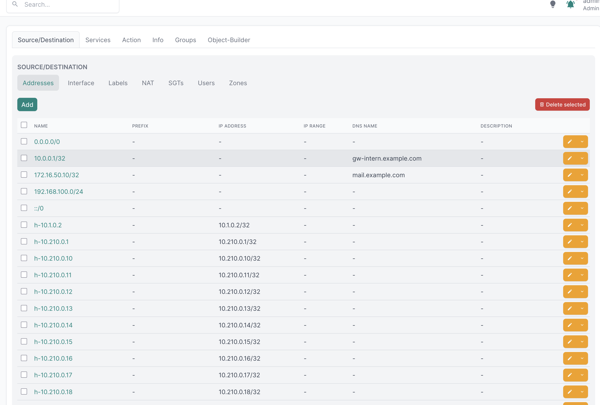
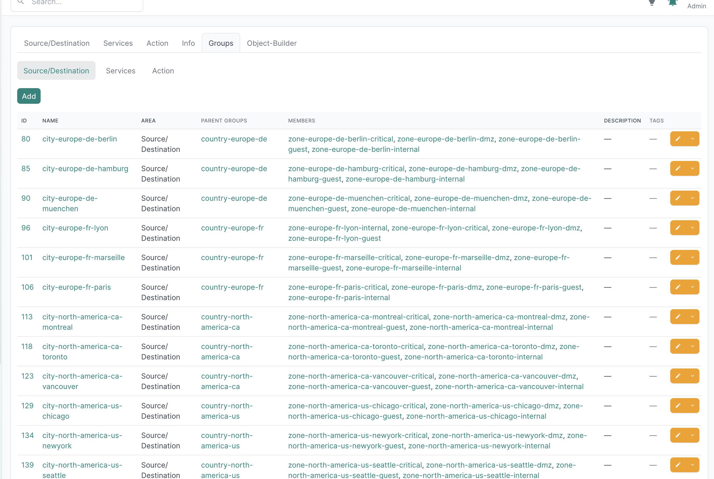
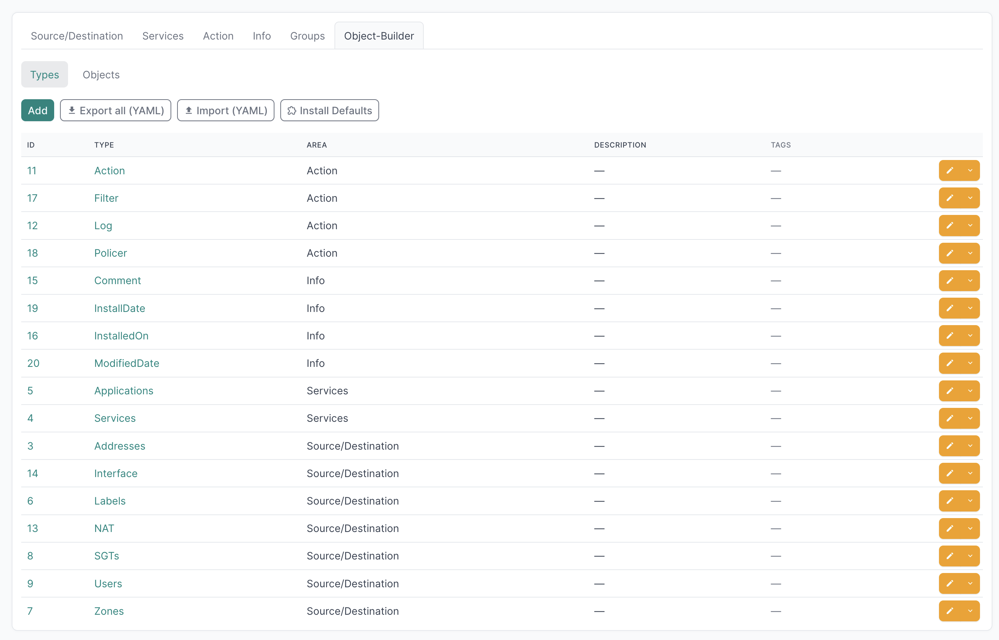
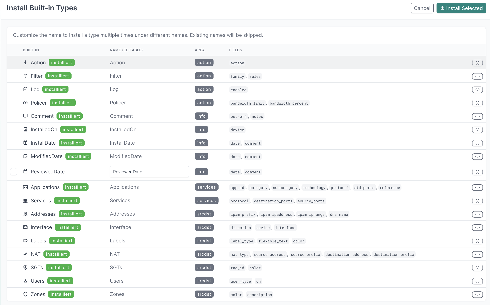
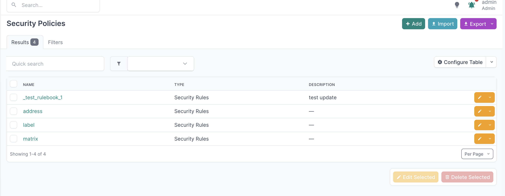

### Object Groups
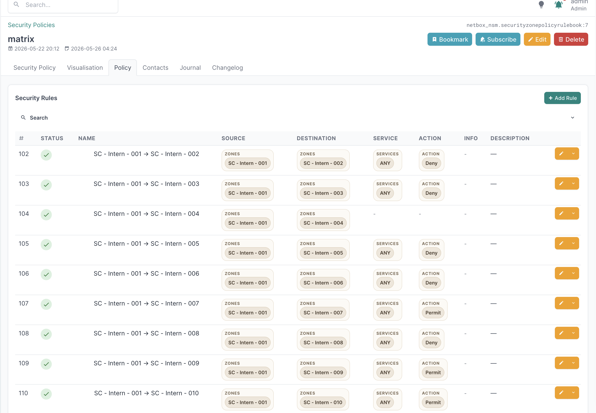
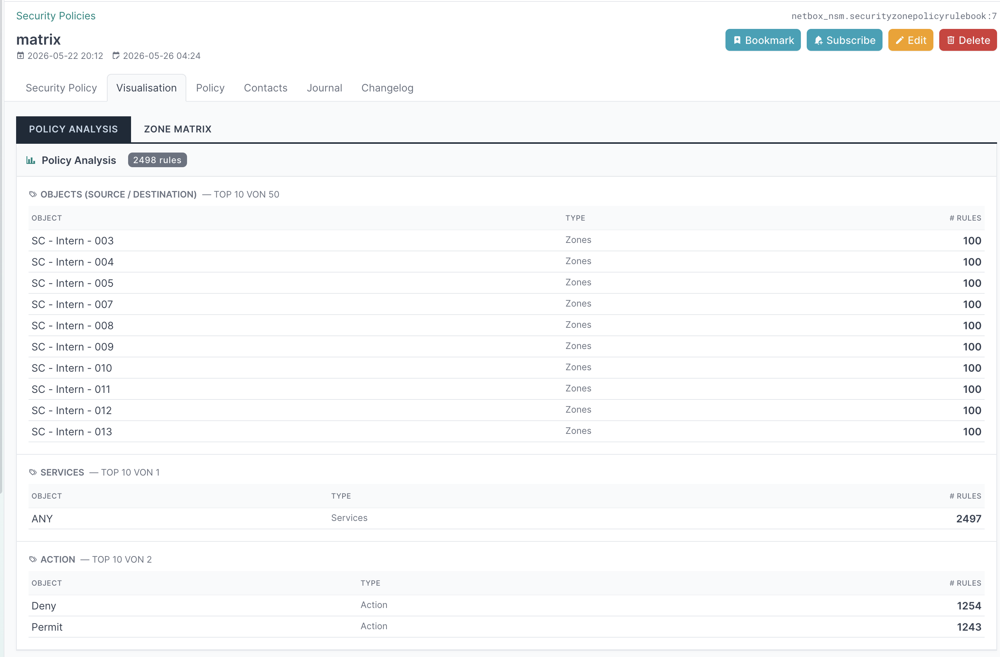

### Built-in Types & YAML Bundle


### Security Policies
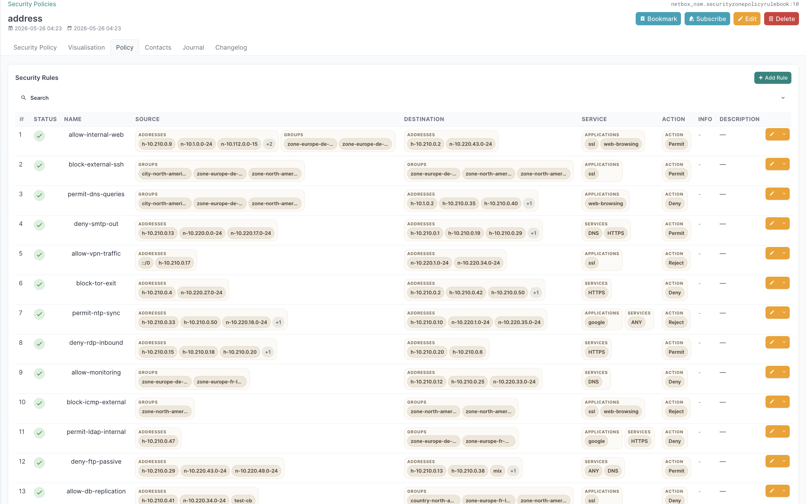
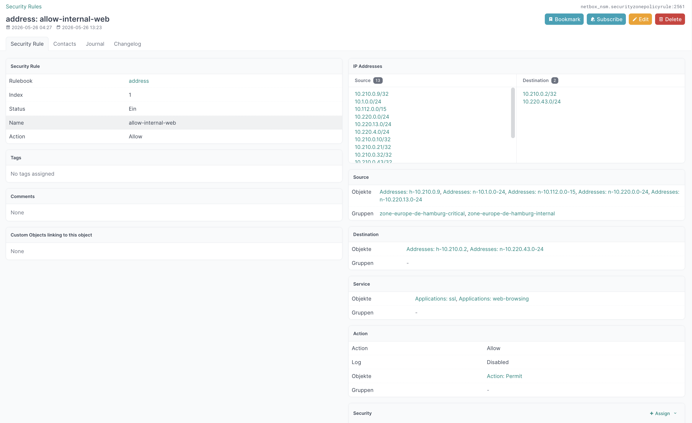


### Object Assignments & Device Integration

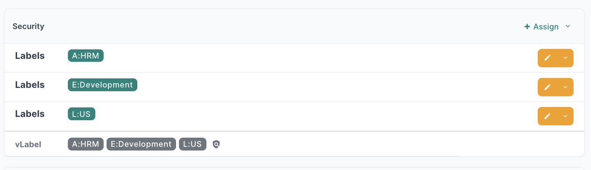

### Security on IPAM Objects

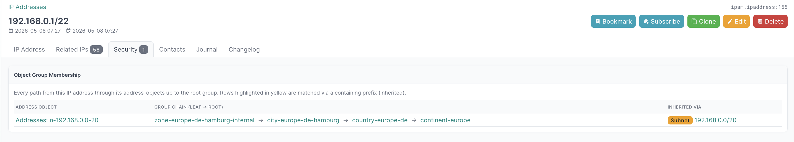

---

## Quick Start

1. **Install built-in types** — go to *Security → Objects → Object-Builder → Install Defaults* and select the types you need (Addresses, Networks, Ports, …).
2. **Create custom objects** — navigate to the matching area tab (Source/Destination, Services, Action) and add objects.
3. **Create object groups** *(optional)* — group related objects under *Security → Objects → Groups*.
4. **Create a Security Policy** — under *Security → Security Policy*.
5. **Add rules** — open the policy and add rules, selecting objects and groups for each column.
6. **Assign the policy to a device** — open a Device and use the *Assign Rulebook* action, or use the bulk-assign view on the policy.

---

## License

[Apache 2.0](LICENSE)
