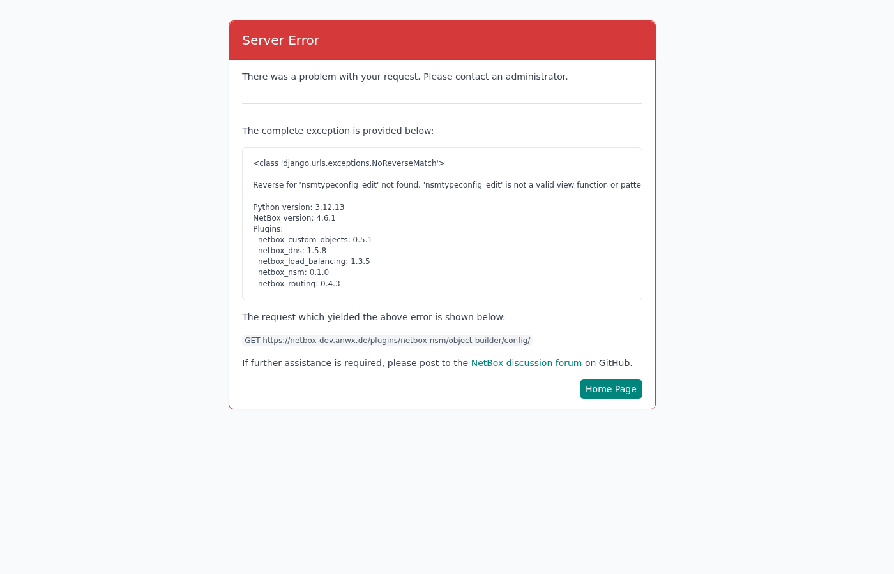

# netbox-nsm — Network Security Management Plugin for NetBox

> **⚠️ Work in Progress — do not use in production.**

A [NetBox](https://github.com/netbox-community/netbox) plugin for managing network security
objects, security policies and object-to-object relationships — modular, vendor-agnostic, and
tightly integrated with NetBox's existing IPAM and DCIM data.

**Requires:** [`netbox-custom-objects`](https://github.com/christianbur/netbox-custom-objects) plugin

---

## Table of Contents

1. [Overview](#overview)
2. [Installation](#installation)
3. [Configuration](#configuration)
4. [Quick Start / Setup Wizard](#quick-start--setup-wizard)
5. [Type Config](#type-config)
6. [Object Builder](#object-builder)
7. [NSM Object Links & Security Panel](#nsm-object-links--security-panel)
8. [Security Policies](#security-policies)
   - [Rulebook List](#rulebook-list)
   - [Rulebook Detail](#rulebook-detail)
   - [Policy Rules](#policy-rules)
   - [Policy Analysis](#policy-analysis)
   - [Zone Matrix](#zone-matrix)
9. [Demo – Object Analyzer](#demo--object-analyzer)
10. [Demo Data: Enterprise DC](#demo-data-enterprise-dc)
11. [REST API](#rest-api)
12. [Compatibility](#compatibility)

---

## Overview

`netbox-nsm` extends NetBox with a complete **network security management** layer on top of the
existing IPAM and DCIM inventory. Security metadata lives directly next to the objects it
describes — no separate security tool needed.

Key concepts:

| Concept | What it is |
|---|---|
| **Custom Object Type (COT)** | Schema for a security object class (Zone, Address, Label, Service, Action), provided by `netbox-custom-objects` |
| **NSM Object Link** | Bidirectional link between any two NetBox objects (e.g. Prefix ↔ Zone) |
| **Type Config** | Configures how a COT is used inside NSM (matching class, display template, inheritance) |
| **Security Rulebook** | A named, ordered list of firewall / policy rules |
| **Security Rule** | One rule with configurable source, destination, service and action fields |
| **Security Panel** | Auto-injected panel showing security links on every NetBox detail page |

---

## Installation

```bash
pip install netbox-nsm
```

Add to `configuration.py`:

```python
PLUGINS = [
    "netbox_custom_objects",   # required dependency
    "netbox_nsm",
]
```

Run migrations:

```bash
python netbox/manage.py migrate netbox_nsm
```

Restart the NetBox process (gunicorn / uwsgi).

---

## Configuration

All settings are optional:

```python
PLUGINS_CONFIG = {
    "netbox_nsm": {
        # Render plugin as top-level "Security" menu entry (default: True)
        "top_level_menu": True,

        # Add "Security Rulebook Assignments" to the menu (default: False)
        "assignments_menu": False,
    }
}
```

---

## Quick Start / Setup Wizard

**Security → Configuration → Setup**

The wizard guides you through three steps:

1. **Import NSM object types** — creates the five built-in Custom Object Types
   (`nsm_zones`, `nsm_addresses`, `nsm_labels`, `nsm_services`, `nsm_action`) via the
   `netbox-custom-objects` plugin.
2. **Create Type Configs** — links each COT to a TypeConfig that controls matching behaviour,
   display templates and inheritance settings.
3. **Create demo data** *(optional)* — creates example rulebooks or the full
   [Enterprise DC demo](#demo-data-enterprise-dc).


> The "Import Enterprise Demo" button is only shown when the database contains **no IP addresses**,
> to prevent accidental data overwrites.

---

## Type Config

**Security → Configuration → Type Config**

A `TypeConfig` record controls how one specific NetBox object type behaves inside NSM.


| Field | Description |
|---|---|
| **Object Type** | The NetBox ContentType this config applies to (e.g. `Custom Objects › Zones`) |
| **Matching Class** | Semantic role: `address`, `zone`, `label`, `service`, `action`, … Used by Rulebooks to auto-derive their matching strategy |
| **Display Template** | Format string for rendering objects in the UI, e.g. `{name}` or `{name} ({protocol}/{port})` |
| **Allowed Placements** | Restricts which rule fields this type may appear in (`source`, `destination`, `fixed`) |
| **Inherit from parent** | Shows NSM links of the parent Prefix on child objects (sub-Prefix, IP Address, IP Range) |
| **Stop if own link present** | Suppresses inherited links once the child has its own direct NSM link of the same type |

---

## Object Builder

**Security → Configuration → Object Builder**

Lists all active Type Configs in one place. From here you can browse, add or edit Type Configs
without navigating to the individual list view.



---

## NSM Object Links & Security Panel

An `NSMObjectLink` is a **bidirectional link** between any two NetBox objects.

Typical use cases:

- Prefix `10.10.0.0/16` ↔ Zone `prod`
- Prefix `10.10.0.0/16` ↔ Address `prod-net`
- IP Address `10.10.0.5` ↔ Label `web-tier`

Links are created on any NetBox object's detail page via the **+ Assign** button in the
Security panel (right column).

### Security Panel on a Prefix (with data)


- **Left:** `Custom Objects linking to this object` — table of all Custom Objects that reference
  this Prefix (here: `Addresses → infrastructure`)
- **Right:** Security panel grouped by type — `Addresses (1)` and `Zones (1)`, both showing
  `infrastructure`, with the badge *"Inherited from containing prefix"* where applicable

### Link Inheritance

When **Inherit from parent** is enabled on a TypeConfig, child objects (sub-Prefix, IP Address,
IP Range) automatically display the NSM links of their containing Prefix in the Security panel.

When **Stop if own link present** is also enabled, inherited links of that type are hidden as
soon as the child object has its own direct NSM link of the same type.

---

## Security Policies

### Rulebook List

**Security → Security Policies**

Lists all Rulebooks with rule count, type and tags.


### Rulebook Detail

The detail page shows the Rulebook's fields (columns), each with its allowed Type Configs and
sort order.


A Rulebook defines its own **fields** (columns), e.g. Source, Destination, Service, Action.
Each field references one or more Type Configs to control which object types are allowed in that
column. This makes Rulebooks fully flexible — one Rulebook can be zone-based, another
address-based, another label-based.

### Policy Rules

The **Policy** tab shows all rules in an inline table.


Each column corresponds to a Rulebook Field. Objects appear as colour-coded pills (if a colour
is defined on the object) or plain links. Rules can be added, reordered by index, enabled/
disabled, and bulk-deleted.

### Policy Analysis

The **Analysis** tab summarises the policy: rule count, enabled vs. disabled, and breakdowns
by matching class.


### Zone Matrix

The **Zone Matrix** tab renders all rules as a matrix of source zone × destination zone.
Each cell lists the services and action for that traffic direction.


Particularly useful for zone-based firewall policies (Palo Alto, Fortinet, Cisco ASA, …) to
instantly see what is allowed between security zones.

---

## Demo – Object Analyzer

**Security → Analysis → Demo – Object Analyzer**

A developer/demo tool to select any NetBox object and inspect all its NSM links and matching
rules in one view.


---

## Demo Data: Enterprise DC

The Setup Wizard (when no IP addresses exist) offers an **Enterprise DC Demo** that creates a
complete, realistic scenario:

**DCIM / Virtualisation**
- Site DC-01, Cisco Nexus Spine/Leaf fabric, Dell R750 hypervisors, 25 racks
- 2 Spines + 22 Leafs + 24 Hypervisors + ~516 VMs (VMware vSphere + GCP cluster)
- Prefixes and IP addresses for all zones

**NSM Objects**
- 11 Zones: prod · integration-1/2/3 · dev-1/2/3 · test-1/2/3 · infrastructure
- 19 Address objects (zone subnets 10.x.0.0/16, OOB/HV-MGMT, Users, GCP DMZ)
- ~40 Labels (Env × App × Role × Tier)
- 34 Services (SSH, HTTPS, DNS, Kerberos, AD-RPC, DB ports, …)

**11 Rulebooks** with 250+ rules in total:
trustsec-core (90) · trustsec-infra · illumio-intra-zone · fw-dc-inter-zone ·
fw-mgmt · fw-user-access · fw-sase · fw-internet-outer · fw-internet-inner ·
fw-gcp-dmz · fw-vpn-partner

All imports are idempotent (`get_or_create`) — safe to re-run.

> **Note:** The Import button is hidden when IP addresses already exist in the database.

---

## REST API

All NSM models are exposed under `/api/plugins/netbox-nsm/`:

| Endpoint | Model |
|---|---|
| `object-links/` | `NSMObjectLink` |
| `type-configs/` | `TypeConfig` |
| `security-policy/` | `SecurityPolicyRulebook` |
| `security-rule/` | `SecurityPolicyRule` |
| `security-policy-assignments/` | `SecurityPolicyAssignment` |

The portable schema (Custom Object Type definitions) can be applied via:

```
POST /api/plugins/custom-objects/schema/apply/
```

using the bundled `nsm-schema.json` as the request body.

---

## Compatibility

| NetBox | Plugin |
|---|---|
| 4.5.x | 0.0.1 |
| 4.6.x | 0.0.1 |

---

## License

See [LICENSE](LICENSE).
