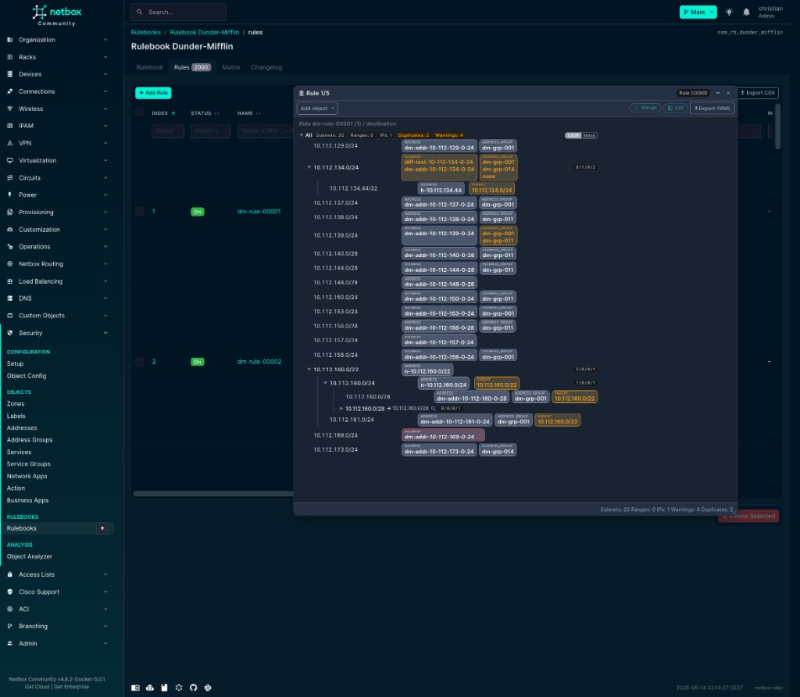

# netbox-nsm

NetBox plugin for **security policy documentation** (zones, rulebooks, object links).  
No firewall push — inventory and policy only.

> **⚠️ Work in progress** — Not recommended for production use yet. Breaking changes possible (e.g. 0.4.5 permission migration).

**Status:** **NetBox:** 4.5–4.6 · **Plugin:** 0.4.5 · **Requires:** [netbox-custom-objects](https://github.com/netboxlabs/netbox-custom-objects)

## Features

- **Security Panel** on prefix, IP, device, VM, custom objects — `+ Assign` for zones, addresses, …
- **Rulebooks** with flexible columns (zones, addresses, labels, …)
- **Rules** — table, grouping, zone matrix
- **IP Analysis** — address resolution (panel loupe or `/plugins/netbox-nsm/ip-analysis/`)
- **Object Analyzer** — graph from any NetBox object

## Screenshots

Setup — import COT types and run demos:


Object config — `nsm_config` per COT type:


Rulebooks list and detail (fields, enforcement targets):


Rules tab — zone grouping (Starter demo, 62.5k rules) and address-based rules:


Zone matrix — permit/deny between zones:


IP Analysis — destination tree with merge/diff:



## Installation

```bash
pip install netbox-nsm
```

```python
PLUGINS = ["netbox_custom_objects", "netbox_nsm"]

PLUGINS_CONFIG = {
    "netbox_nsm": {
        "menu_label": "Security",
        "panel_label": "Security",
        "setup_menu": True,
        "setup_allow_destructive_actions": True,  # demos only; disable in prod
    },
}
```

```bash
./manage.py migrate netbox_custom_objects --no-input
./manage.py migrate netbox_nsm --no-input
```

## First run

**Security → Configuration → Setup** — sections **1 → 2 → 3** (labels, COTs, object configs), then optional **4 Starter demo**.

Then: open a prefix → Security Panel → `+ Assign` → zone. Rulebooks under **Security → Rulebooks**.

Details: [docs/using_netbox_nsm.md](docs/using_netbox_nsm.md)

## API

`/api/plugins/netbox-nsm/` — `nsm-configs/<slug>/`, `object-links/`, `ip-analysis/`  
Rules and policy objects: **netbox-custom-objects** API.

## Demos

| Demo | Where | Notes |
|------|-------|-------|
| Starter | Setup §4 | Sync; recommended — zone matrix + addresses schema |
| Enterprise DC | Setup §4 | Empty IPAM DB only |
| Addresses Million Scale | CLI `scripts/create_addresses_million_scale.py` | Bench; RQ worker required |

## Documentation

| File | Topic |
|------|-------|
| [docs/using_netbox_nsm.md](docs/using_netbox_nsm.md) | Operations |
| [docs/DATABASE.md](docs/DATABASE.md) | PostgreSQL tables |
| [docs/RULE_DATA_STORAGE.md](docs/RULE_DATA_STORAGE.md) | UI vs DB data model |
| [ARCHITECTURE.md](ARCHITECTURE.md) | Code (developers) |
| [CHANGELOG.md](CHANGELOG.md) | Versions |

## License

[LICENSE](LICENSE)
