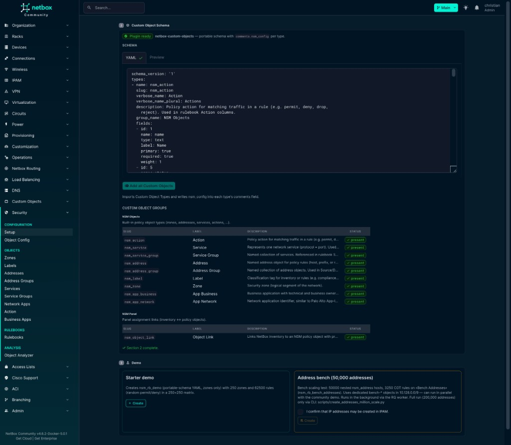
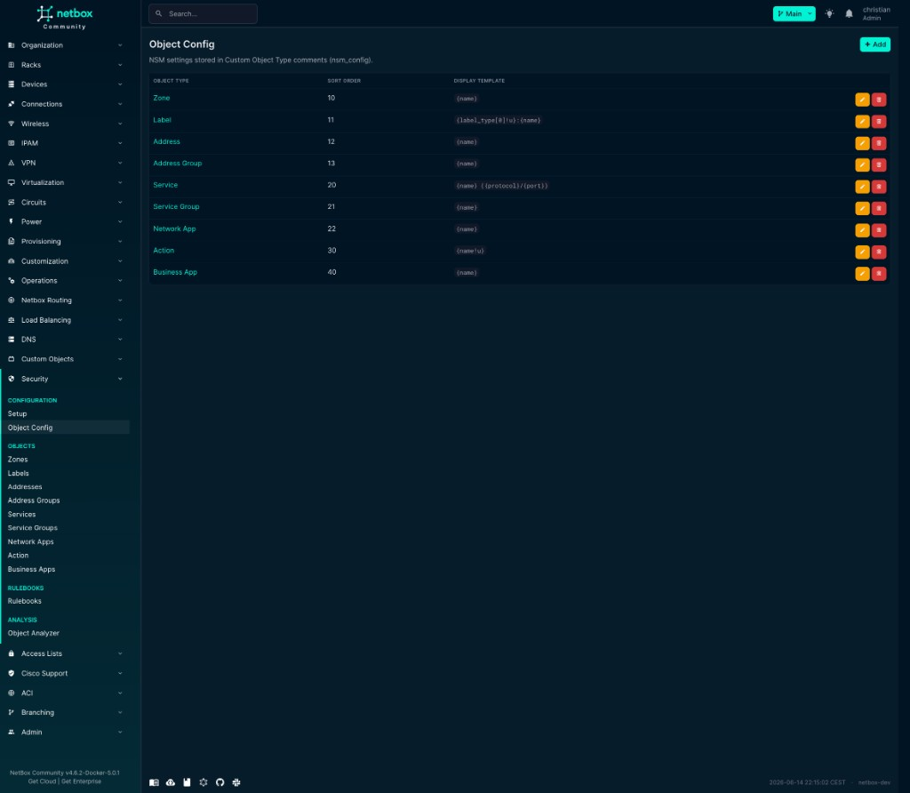
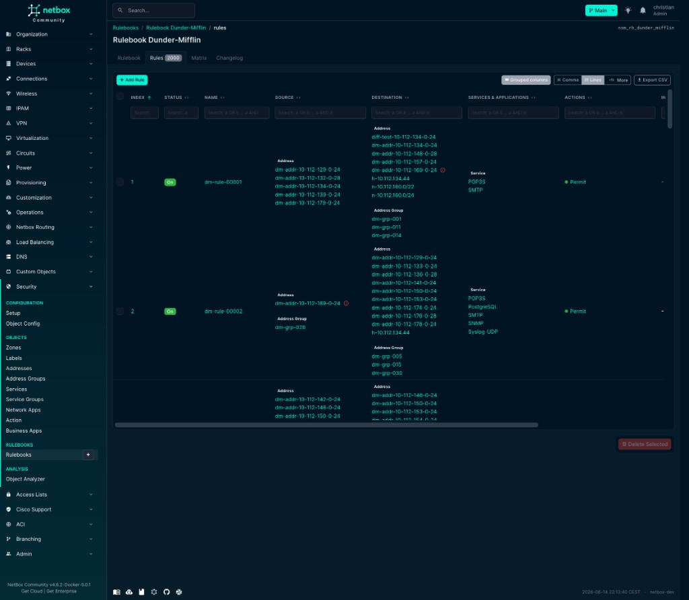

# netbox-nsm

NetBox plugin for **security policy documentation** (zones, rulebooks, object links).  
No firewall push — inventory and policy only.

> **⚠️ Work in progress** — Not recommended for production use yet. Breaking changes possible (e.g. 0.4.5 permission migration).

**Status:** **NetBox:** 4.5–4.6 · **Plugin:** 0.4.7 · **Requires:** [netbox-custom-objects](https://github.com/netboxlabs/netbox-custom-objects)

## Features

- **Security Panel** on prefix, IP, device, VM, custom objects — `+ Assign` for zones, addresses, …
- **Rulebooks** with flexible columns (zones, addresses, labels, …)
- **Rules** — table, grouping, zone matrix
- **IP Analyzer** — address resolution via the IP Analyzer applet on rule pages (loupe icon)
- **Object Analyzer** — graph from any NetBox object
- **Object Report** — daily background audit of NSM addresses/groups (status, duplicates, orphans, groups), TOML export

## Screenshots

Setup — import COT types and run demos:



Object config — `nsm_config` per COT type:



Rulebooks list and detail (fields, enforcement targets):


Rules tab — zone grouping (Starter demo, 62.5k rules) and address-based rules:




Zone matrix — permit/deny between zones:


IP Analyzer — destination tree with merge/diff:


## Installation

```bash
pip install netbox-nsm
```

```python
PLUGINS = ["netbox_custom_objects", "netbox_nsm"]

PLUGINS_CONFIG = {
    "netbox_nsm": {
        "menu_label": "Security",
        "panel_label": "Security",
        "setup_menu": True,
        "setup_allow_destructive_actions": True,  # demos only; disable in prod
        # Optional: Jinja2 address naming — see docs/address_name_templates.md
        # "address_name_templates": [
        #     {"template": "h-{ipam>ip}", "match": "host"},
        #     {"template": "n-{ipam>prefix>network}-{ipam>prefix>cidr}", "match": "prefix"},
        # ],
    },
}
```

```bash
./manage.py migrate netbox_custom_objects --no-input
./manage.py migrate netbox_nsm --no-input
```

## First run

**Security → Configuration → Setup** — **§2 Custom Object Schema** (import the built-in `nsm_*` COT types; `nsm_config` is written into each type's `comments`), then optional **§3 Demo** (Starter demo).

Then: open a prefix → Security Panel → `+ Assign` → zone. Rulebooks under **Security → Rulebooks**.

Details: [docs/using_netbox_nsm.md](docs/using_netbox_nsm.md)

## API

`/api/plugins/netbox-nsm/` — `nsm-configs/<slug>/`, `object-links/`, `ip-analyzer/`  
Rules and policy objects: **netbox-custom-objects** API.

## Demos

| Demo | Where | Notes |
|------|-------|-------|
| Starter | Setup §4 | Sync; recommended — zone matrix + addresses schema |
| Enterprise DC | Setup §4 | Empty IPAM DB only |
| Zone / Address demos | Setup → Bundles (Preview → Apply) | JSON portable schema only |

## Documentation

| File | Topic |
|------|-------|
| [docs/using_netbox_nsm.md](docs/using_netbox_nsm.md) | Operations |
| [docs/DATABASE.md](docs/DATABASE.md) | PostgreSQL tables |
| [docs/RULE_DATA_STORAGE.md](docs/RULE_DATA_STORAGE.md) | UI vs DB data model |
| [docs/object_report.md](docs/object_report.md) | Daily object report: job, checks, scaling |
| [ARCHITECTURE.md](ARCHITECTURE.md) | Code (developers) |
| [CHANGELOG.md](CHANGELOG.md) | Versions |

## License

[LICENSE](LICENSE)
