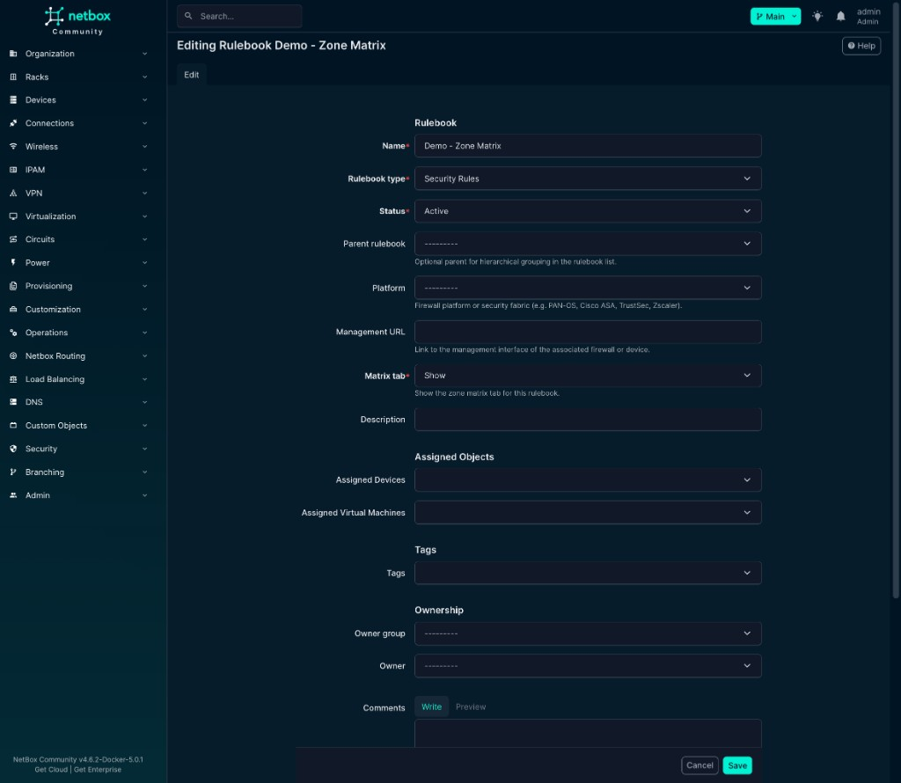
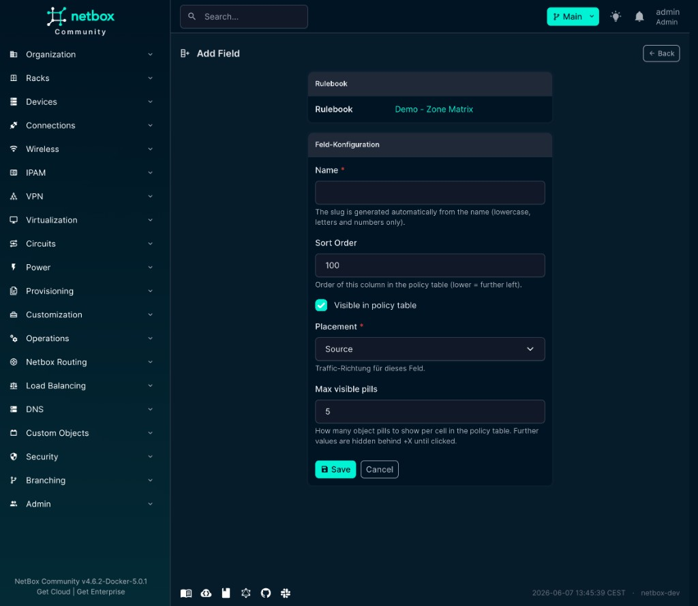
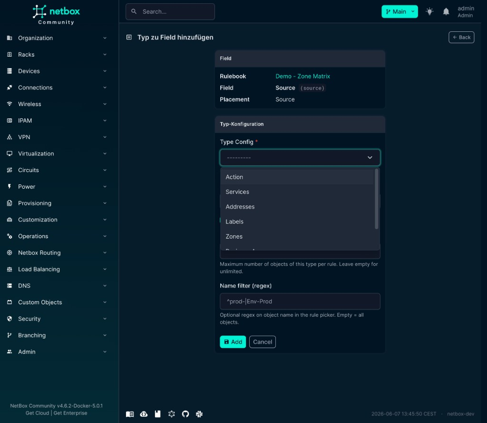
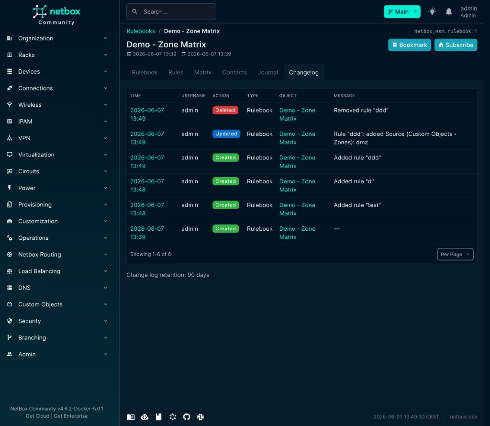

<div align="center">

# netbox-nsm

**Network Security Management for NetBox**

Document zones, firewall rules, and object relationships — vendor-agnostic, inside your existing IPAM and DCIM inventory.

[](https://netboxlabs.com/)
[](#)
[](https://github.com/netboxlabs/netbox-custom-objects)
[](#)

[Full user guide](docs/README.md) · [Using netbox-nsm](docs/using_netbox_nsm.md) · [Architecture](ARCHITECTURE.md) · [Database](docs/DATABASE.md) · [Changelog](CHANGELOG.md)

</div>

> **Work in progress — not for production use.**  
> netbox-nsm is a **documentation plugin**. It does not push rules to firewalls or replace Tufin, AlgoSec, or similar tools.

---

## At a glance

| | |
|---|---|
| **Security Panel** | Injected on every Prefix, IP, Device, VM, and Custom Object — assign zones, addresses, labels; see policy impact instantly |
| **Rulebooks** | Flexible column layout: zone-based, address-based, label-based, or mixed — side by side in one NetBox |
| **Rules grid** | Server-rendered rules table — Table / Group / Matrix views, filter query, cell display modes. See [Rules grid](docs/using_netbox_nsm.md#rules-grid). |
| **Zone matrix** | Source × destination heatmap on the Matrix tab |
| **IP Analysis** | Compare address resolution — **Security Panel** loupe (🔍) on analyzable objects; optional full page `/plugins/netbox-nsm/ip-analysis/` |
| **Object Analyzer** | [@xyflow/react](https://xyflow.com/) graph from any NetBox object to zones, links, and rulebooks |

---

## Why netbox-nsm?

Your network inventory already lives in NetBox. Security policy should live there too — not in spreadsheets or siloed tools.

- **One source of truth** — link a prefix to `prod`, a VM to an app zone, a device NIC to both
- **Any object type** — rule columns and Security Panel use **TypeConfig**; missing types? Create a Custom Object Type, then bind it in NSM
- **Any vendor style** — Palo Alto zones, AWS address groups, Illumio labels — each in its own Rulebook
- **Bidirectional visibility** — open a zone and see every prefix, VM, and rule that references it
- **Audit-friendly** — Journal and Changelog on rules, links, and configuration

---

## Security Panel — the hub

The **Security Panel** is the core workflow for NSM. Once NSM types exist, **any supported
NetBox object** can be linked to **any allowed NSM object** via **+ Assign** — prefixes,
interfaces, VMs, zones, services, … Rulebook references appear **automatically** when an NSM
object is used in a rule column.

**Inheritance** (e.g. **Inherit to IPAM children** on a parent prefix) propagates macro zones
to child prefixes and addresses without repeating **+ Assign** on every object.

**Macro vs. micro zones** — different segmentation products on the same inventory:

| Layer | Example | Purpose |
|---|---|---|
| **Macro zone (product A)** | `prod`, `untrust` on a **prefix** with IPAM inheritance | Site segment, trust boundary |
| **Micro zone (product B)** | `app-payroll` **direct** on a VM **interface** | Application tier within the macro segment |

The **same zone object** linked on an interface is the **same object** used in rulebook columns
(`Source.Zones`, `Destination.Zones`, …).

<p align="center">
  
  <br>
  <em>Zone <code>untrust</code> (Starter demo) — rulebook references + bidirectional service link</em>
</p>

<p align="center">
  
  <br>
  <em>Assign Link — <strong>Direct</strong>, <strong>Inherit to IPAM children</strong>, or <strong>Inherit to group members</strong></em>
</p>

<p align="center">
  
  <br>
  <em>Service <code>SNMP-Trap</code> — reverse link to zone <code>untrust</code> after a bidirectional Direct assignment</em>
</p>

[Universal linking →](docs/using_netbox_nsm.md#universal-linking--any-netbox-object--nsm) · [Security Panel deep dive →](docs/using_netbox_nsm.md#security-panel)

### Extend with your own object types

NSM is not limited to the seven built-in types (Zones, Addresses, …):

1. **Need a new security object class?** Define it in **[netbox-custom-objects](https://github.com/netboxlabs/netbox-custom-objects)** (schema, fields, UI).
2. **Register it in NSM** — **Security → Type Config → + Add**: pick the ContentType, set matching class, panel slugs, display template, and which NetBox objects may link it (**Linkable in panel**).
3. **Use everywhere** — add the TypeConfig to **Rulebook → Fields** (rule columns + picker) and assign instances from any allowed host object via **+ Assign** in the Security Panel.

Rule columns reference **TypeConfig** records, not hard-coded COT names — so custom and native NetBox types share the same pipeline once configured.

[Full guide: extending NSM →](docs/using_netbox_nsm.md#extending-nsm-custom-and-native-object-types)

---

## Screenshots

Starter demo environment (**2026-06-07**). Full walkthrough: **[Using netbox-nsm](docs/using_netbox_nsm.md)** · **[Documentation home](docs/README.md)**

<table>
<tr>
<td width="50%" valign="top">

**Setup wizard** — sections 1–4 complete, Starter demo


</td>
<td width="50%" valign="top">

**Custom Object Types** — seven built-in `nsm_*` types


</td>
</tr>
<tr>
<td width="50%" valign="top">

**Type Config list** — matching class, panel slugs, *All types*


</td>
<td width="50%" valign="top">

**Type Config edit** — Zones, panel slugs, Linkable in panel


</td>
</tr>
<tr>
<td width="50%" valign="top">

**Rulebook list** — Demo - Zone Matrix, Demo - Addresses


</td>
<td width="50%" valign="top">

**Rulebook detail** — Fields hierarchy (Source / Destination / Service / Action)


</td>
</tr>
<tr>
<td width="50%" valign="top">

**Edit rulebook** — metadata, Matrix tab, parent rulebook



</td>
<td width="50%" valign="top">

**Add field** — container column under Source



</td>
</tr>
<tr>
<td width="50%" valign="top">

**Add field type** — TypeConfig picker (Zones, Services, …)



</td>
<td width="50%" valign="top">

**Rulebook changelog** — rule CRUD audit trail



</td>
</tr>
<tr>
<td width="50%" valign="top">

**Policy rules** — Table view, zone/service pills, filter bar


</td>
<td width="50%" valign="top">

**Add rule** — Demo - Zone Matrix, Source tab


</td>
</tr>
<tr>
<td width="50%" valign="top">

**Rule detail** — trust-to-untrust, zone/service columns


</td>
<td width="50%" valign="top">

**Zone matrix** — 4×4 grid, Permit / Deny cells


</td>
</tr>
<tr>
<td width="50%" valign="top">

**Zone untrust** — rulebook references + service link


</td>
<td width="50%" valign="top">

**Assign Link** — link type dropdown (Direct / IPAM / group)


</td>
</tr>
<tr>
<td width="50%" valign="top">

**Service SNMP-Trap** — bidirectional zone link (reverse view)


</td>
<td width="50%" valign="top">

**Object Analyzer** — zone `dmz` → Demo - Zone Matrix → rules


</td>
</tr>
</table>

---

## Quick start

### 1. Install

```bash
pip install netbox-nsm
```

```python
# configuration.py
PLUGINS = [
    "netbox_custom_objects",   # required
    "netbox_nsm",
]
```

```bash
./manage.py migrate netbox_custom_objects --no-input
./manage.py migrate netbox_nsm --no-input
```

### 2. Setup wizard

**Security → Configuration → Setup** — run sections **1 → 2 → 3** in order:

| # | Section | Action |
|---|---|---|
| 1 | Menu & panel title | Labels for sidebar and Security card |
| 2 | Custom Objects | **Add all Custom Object Types** (7 built-in COTs) |
| 3 | TypeConfig | **Add all TypeConfigs** (matching, panels, display) |
| 4 | Demo | **[Starter demo](#starter-demo-recommended)** (recommended) — or Enterprise DC when the IP database is empty |

### 3. First links

Open any **Prefix** → Security Panel → **+ Assign** → pick a **Zone**.  
Open the **Zone** object → see the reverse view (prefixes, VMs, matching rules).

### 4. First rulebook

**Security → Rulebooks → + Add** — or run the **[Starter demo](#starter-demo-recommended)** from Setup (Section 4) for ready-made sample rulebooks.

---

## Configuration

```python
PLUGINS_CONFIG = {
    "netbox_nsm": {
        "top_level_menu": True,              # Security top-level menu
        "setup_menu": True,                  # Setup under Configuration
        "setup_allow_destructive_actions": True,  # Demo imports (disable in prod)
        "assignments_menu": False,           # Rulebook Assignments menu entry
        "menu_label": "Security",
        "panel_label": "Security",
    }
}
```

Restart NetBox after changes.

---

## Feature map

<details>
<summary><strong>Custom Object Types</strong> — zones, addresses, labels, services, actions, apps</summary>

Seven built-in types via Setup Section 2. Managed under **Custom Objects → NSM**.


[Custom Object Types →](docs/using_netbox_nsm.md#custom-object-types-cots)

</details>

<details>
<summary><strong>Type Config</strong> — matching class, display template, panel slugs</summary>

Links each ContentType to NSM (built-in COTs or **your own** Custom Object Types): matching class, display template, panel sections, and **Linkable in panel**. Required before a type can appear in Rulebook fields or **+ Assign**.


[Type Configs →](docs/using_netbox_nsm.md#type-configs) · [Extend with custom types →](docs/using_netbox_nsm.md#extending-nsm-custom-and-native-object-types)

</details>

<details>
<summary><strong>Rulebooks &amp; rules</strong> — flexible columns, All Rules view, rule editor</summary>

- **All Rules** (`/rulebooks/0/`) — read-only aggregate across all rulebooks  
- **Rulebook detail** — configurable field hierarchy (zone-based, address-based, …)  
- **Rules tab** — server-rendered table with Table / Group / Matrix views and filter query — [Rules grid](docs/using_netbox_nsm.md#rules-grid)
- **Add rule** — Source / Destination / Service / Action tabs with object picker  


&nbsp;


[Security Rulebooks →](docs/using_netbox_nsm.md#security-rulebooks)

</details>

<details>
<summary><strong>Zone matrix</strong> — source × destination, directed / undirected</summary>


Corner filters (`dmz OR mgmt`), diagonal self-cells, axis limit 400 zones.

[Zone Matrix →](docs/using_netbox_nsm.md#zone-matrix)

</details>

<details>
<summary><strong>IP Analysis</strong> — two-column IP resolution + CSV paths</summary>

**Security Panel** — loupe icon (address-analyzable objects only)

Opens the **IP Analysis** overlay (same API as `/plugins/netbox-nsm/ip-analysis/`). Compare
prefix trees side by side and copy CSV paths from the tree.

[IP Analysis →](docs/using_netbox_nsm.md#ip-analysis)

</details>

<details>
<summary><strong>Object Analyzer</strong> — explore links and rulebooks from any object</summary>

**Security → Analysis → Object Analyzer**

Pick Device, VM, IP, Prefix, or Zone → **Analyse** → expand the graph.

[Object Analyzer →](docs/using_netbox_nsm.md#object-analyzer)

</details>

---

## REST API

Base path: `/api/plugins/netbox-nsm/`

| Endpoint | Description |
|---|---|
| `type-configs/` | `TypeConfig` CRUD |
| `object-links/` | Security Panel links (`nsm_object_link` COT rows) |
| `rulebook-assignments/` | `CotRulebookAssignment` CRUD |
| `ip-analysis/` | Address resolution / diff (IPAM + analyzable address objects; JSON only) |

Rulebook rules and policy objects live in **netbox-custom-objects** (COT), not under this API.

Portable schema: `POST /api/plugins/custom-objects/schema/apply/` with bundled `nsm_portable_schema.json`.

[REST API reference →](docs/using_netbox_nsm.md#rest-api-reference)

---

## Demo data

After Setup sections **1–3**, use **Section 4 (Demo)** to load sample rulebooks. Requires `setup_allow_destructive_actions: True` in `PLUGINS_CONFIG`.

### Starter demo (recommended)

The **Starter demo** is the primary entry point for exploring netbox-nsm. It runs **synchronously** in the browser (no RQ worker) and is always available at **Security → Configuration → Setup → Demo → Create** once section 3 is complete.

| Created | Details |
|---|---|
| Prerequisites | Imports built-in Custom Object Types and TypeConfigs if missing; seeds default zones (`trust`, `untrust`, `dmz`, `mgmt`), actions (`Permit`, `Deny`), and services (`HTTPS`, `SSH`) |
| **Demo - Zone Matrix** | Zone-based rulebook with six example rules — use it for the [Rules grid](docs/using_netbox_nsm.md#rules-grid), grouping, and [Zone matrix](docs/using_netbox_nsm.md#zone-matrix) |
| **Demo - Addresses** | Address-based rulebook layout (zones + addresses in source/destination columns) — schema only, no pre-filled rules |

**Typical workflow:** run Starter demo → open **Security → Rulebooks → Demo - Zone Matrix** → switch Table / Group / Matrix views → assign zones from any Prefix via the Security Panel.

Step-by-step matrix walkthrough: [Demo - Zone Matrix example](docs/using_netbox_nsm.md#example-rulebook-demo---zone-matrix) in the user guide.

### Other demos

| Demo | Availability |
|---|---|
| **Enterprise DC** | Visible in Setup; full DC scenario (DCIM + IPAM + 11 rulebooks, ~30–60 s). Disabled when IP addresses already exist |
| **Scale test** / **Addresses demo** | Not shown in the Setup UI — high-volume performance tests (~12k / ~6k rules, background RQ queue, ~1–2 min). CLI scripts under `scripts/` if needed |

---

## Compatibility

| NetBox | Plugin |
|---|---|
| 4.5+ | 0.3.x |

---

## Third-party UI

| Library | License | Used in |
|---|---|---|
| [@xyflow/react 12](https://github.com/xyflow/xyflow) | MIT | Object Analyzer (CDN via esm.sh) |

Details: [Third-party UI libraries](docs/using_netbox_nsm.md#third-party-ui-libraries)

## License

See [LICENSE](LICENSE).
