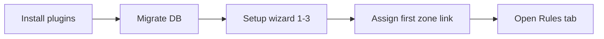

# netbox-nsm Documentation

**Document network security policy inside NetBox**

[NetBox 4.6.x](https://netboxlabs.com/)
[Plugin 0.3.0](../README.md)
[WIP](../README.md)

[← Project README](../README.md) · [Architecture](../ARCHITECTURE.md)


---

## Start here


| Guide                                               | Audience                  | Description                               |
| --------------------------------------------------- | ------------------------- | ----------------------------------------- |
| **[Using netbox-nsm](using_netbox_nsm.md)**         | Operators, firewall teams | Full feature walkthrough with screenshots |
| **[How rule data is stored](RULE_DATA_STORAGE.md)** | Operators, integrators    | Layer model, ER diagrams, UI vs database  |
| **[Database tables](DATABASE.md)**                  | Admins, integrators       | PostgreSQL schema reference               |
| **[Architecture](../ARCHITECTURE.md)**              | Developers                | Code layout, models, extension points     |
| **[Testing](TESTING.md)**                           | Developers                | Local test runs, CI, Black, dev container |


---

## Learning paths

### 1 · First hour — get NSM running




| Step                                           | Where                     | Doc                                                                                |
| ---------------------------------------------- | ------------------------- | ---------------------------------------------------------------------------------- |
| Install `netbox-custom-objects` + `netbox_nsm` | `configuration.py`        | [Prerequisites](using_netbox_nsm.md#prerequisites--first-start)                    |
| Run migrations                                 | `manage.py migrate`       | [Prerequisites](using_netbox_nsm.md#prerequisites--first-start)                    |
| Setup Sections 1–3                             | Security → Setup          | [Setup Wizard](using_netbox_nsm.md#setup-wizard)                                   |
| Link a prefix or zone to NSM                   | Any object → **+ Assign** | [Universal linking](using_netbox_nsm.md#universal-linking--any-netbox-object--nsm) |
| Browse demo rules                              | Rulebook → Rules          | [Rules grid](using_netbox_nsm.md#rules-grid)                                       |


### 2 · Core workflow — Security Panel

The **Security Panel** is the centre of NSM: connect IPAM/DCIM objects to zones, addresses,
labels, and see matching rulebooks.


| Concept                                                 | Doc section                                                                                                                                            |
| ------------------------------------------------------- | ------------------------------------------------------------------------------------------------------------------------------------------------------ |
| **Universal linking** (any NetBox ↔ NSM, macro + micro) | [Universal linking](using_netbox_nsm.md#universal-linking--any-netbox-object--nsm)                                                                     |
| **+ Assign** / ObjectLinks                              | [Workflow](using_netbox_nsm.md#workflow-assign-view-reverse-lookup)                                                                                    |
| **Inheritance in the panel**                            | [Inheritance in the Security Panel](using_netbox_nsm.md#inheritance-in-the-security-panel) — Direct vs *Inherited*, Assign Link propagation, overrides |
| Macro vs micro zones                                    | [Macro zones vs micro zones](using_netbox_nsm.md#macro-zones-vs-micro-zones)                                                                           |
| Direct vs inherited (summary)                           | [Inherited Links](using_netbox_nsm.md#inherited-links)                                                                                                 |
| Custom object types                                     | [Extending NSM](using_netbox_nsm.md#extending-nsm-custom-and-native-object-types)                                                                      |


### 3 · Policy documentation


| Feature                 | Menu path                                           | Doc                                                          |
| ----------------------- | --------------------------------------------------- | ------------------------------------------------------------ |
| Rulebooks               | Security → Rulebooks                                | [Security Rulebooks](using_netbox_nsm.md#security-rulebooks) |
| Policy grid             | Rulebook → Rules                                    | [Rules grid](using_netbox_nsm.md#rules-grid)                 |
| Zone matrix             | Rulebook → **Matrix** tab                           | [Zone Matrix](using_netbox_nsm.md#zone-matrix)               |
| All Rules (global view) | Direct URL `/plugins/netbox-nsm/rulebooks/0/rules/` | [All Rules](using_netbox_nsm.md#all-rules-virtual-rulebook)  |
| IP Analysis             | Security Panel loupe (🔍) or `/plugins/netbox-nsm/ip-analysis/` | [IP Analysis](using_netbox_nsm.md#ip-analysis)               |
| Object Analyzer         | Security → Analysis → Object Analyzer               | [Object Analyzer](using_netbox_nsm.md#object-analyzer)       |


### 4 · Integration


| Topic                     | Doc                                                                      |
| ------------------------- | ------------------------------------------------------------------------ |
| REST API                  | [REST API Reference](using_netbox_nsm.md#rest-api-reference)             |
| xyflow licenses | [Third-party UI libraries](using_netbox_nsm.md#third-party-ui-libraries) |


---

## Screenshot gallery

All images live in `[docs/img/](img/)`. Regenerate with `[make_screenshots.py](img/make_screenshots.py)`.


| Image                                                                                                                                                                     | Topic                                                                  |
| ------------------------------------------------------------------------------------------------------------------------------------------------------------------------- | ---------------------------------------------------------------------- |
| `01-setup.png`                                                                                                                                                            | Setup wizard (4 sections)                                              |
| `02-type-config-list.png` · `03-type-config-detail.png`                                                                                                                   | Type Config                                                            |
| `05-rulebook-list.png` · `06-rulebook-detail.png` · `06-rulebook-edit.png` · `06-rulebook-field-add.png` · `06-rulebook-field-type-add.png` · `06-rulebook-changelog.png` | Rulebooks                                                              |
| `07-policy-rules-demo-table.png` · `07-policy-rules-demo-group.png` · `11-rule-add.png` · `11-rule-detail.png`                                                            | Rules (Starter demo Table view, add/edit form)                         |
| `07-zone-detail.png` · `17-assign-link-propagation-types.png` · `18-service-security-panel-bidirectional.png` · `12-prefix-security-panel.png` · `17-assign-picker.png`   | Security Panel & Assign Link                                           |
| `08-builtin-types.png`                                                                                                                                                    | Custom Object Types                                                    |
| `09-zone-matrix.png` · `09-zone-matrix-demo-undirected.png` · `09-zone-matrix-demo-directed.png`                                                                          | Zone matrix (Enterprise + Demo undirected 2×2 subset + Demo full grid) |
| `10-ip-analysis.png`                                                                                                                                                      | IP Analysis                                                            |
| `11-object-analyzer.png`                                                                                                                                                  | Object Analyzer                                                        |


---

## Menu map

```
Security                          Custom Objects
├── Configuration                 └── NSM (Zones, Addresses, …)
│   ├── Setup
│   └── Type Config
├── Rulebooks
├── Analysis
│   └── Object Analyzer
└── (optional Assignments)
```

---

## Third-party UI


| Library | License | Used in |
|---|---|---|
| [@xyflow/react 12](https://github.com/xyflow/xyflow) | MIT | Object Analyzer |


Details: [Third-party UI libraries](using_netbox_nsm.md#third-party-ui-libraries)

---

## Status & limitations

- **Work in progress** — not for production (0.3.x); see [CHANGELOG](../CHANGELOG.md)
- **Documentation only** — no rule push to firewalls
- **Requires** [netbox-custom-objects](https://github.com/netboxlabs/netbox-custom-objects)

