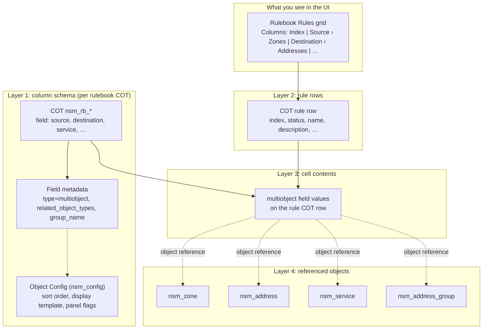
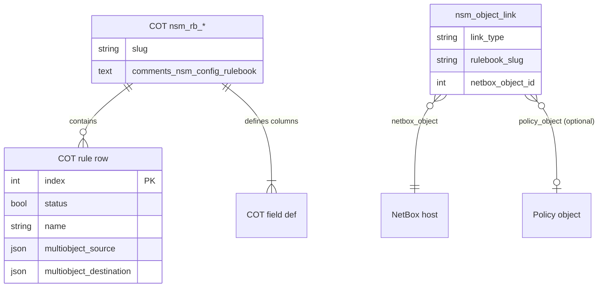
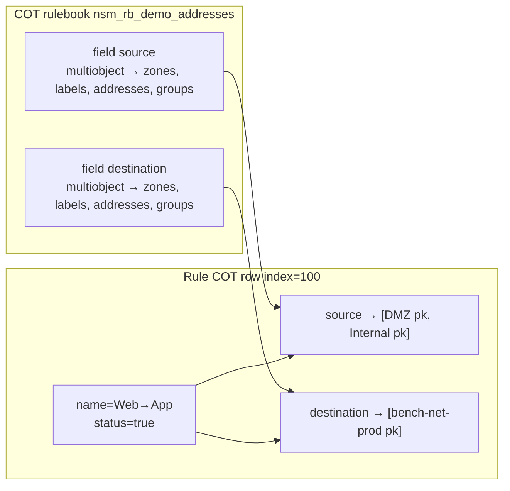
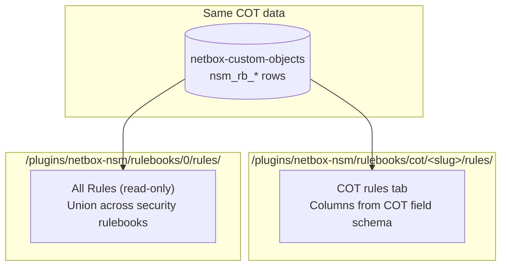
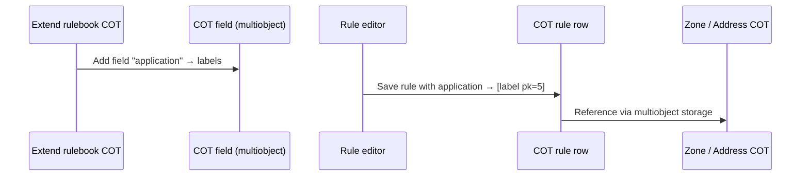

# How rule data is stored

[← Documentation home](README.md) · [Database tables](DATABASE.md) · [Architecture](../ARCHITECTURE.md)

NSM does **not** persist policy as wide `netbox_nsm_rule` rows with dynamic SQL columns.
Since the COT migration, **rulebooks and rules are Custom Object Types** managed by
`netbox-custom-objects`. Configuration lives in COT `comments` (`nsm_config`); links and
assignments use the `nsm_object_link` COT.

Data is split into four layers:

1. **Schema** — COT field definitions on each deployed rulebook (`nsm_rb_*`)
2. **Rules** — one COT row per policy rule
3. **Cell contents** — `multiobject` COT fields on each rule row (references to zones, addresses, …)
4. **Referenced objects** — zones, addresses, services, etc. are separate COT or NetBox core rows

Security **object instances** are never duplicated inside rule rows — cells store references only.
See [What is stored elsewhere](DATABASE.md#what-is-stored-elsewhere).

---

## Layer model

---

## Entity relationships (simplified)

Native `Rulebook`, `Rule`, `RulebookField`, `RuleObjectItem`, and `RuleGroupItem` tables were
**removed**. Do not query `netbox_nsm_rule*` for current installs.

---

## Worked example: one UI row

**Policy table row:**

| Index | Name     | Source › Zones   | Destination › Addresses |
|------:|----------|------------------|-------------------------|
| 100   | Web→App  | DMZ, Internal    | bench-net-prod          |

**How that maps to storage:**

**Important:** multiple pills in one UI cell = **multiple object references** in the same
`multiobject` field on that rule row (stored by `netbox-custom-objects`, not in NSM junction tables).

---

## UI concept → storage

| UI concept | Where it lives | What is stored |
|------------|----------------|----------------|
| Rulebook (deployed) | COT `nsm_rb_<name>` + `comments.nsm_config.rulebook` | COT schema + hierarchy/matrix flags in comments |
| Column “Source” | COT field `source` (or `source_zones`, …) | `multiobject` definition, `group_name`, `related_object_types` |
| Sub-type “Zones” under Source | Polymorphic `related_object_types` + `nsm_config` | UI splits one field by content type |
| Rule row | COT table for `nsm_rb_*` | `index`, `status`, `name`, system + policy fields |
| Object pill in a cell | `multiobject` value on rule row | Reference to zone / address / … instance |
| Group pill | `multiobject` or nested `group` M2M | Address group COT or member references |
| Zone / Address instance | `netbox-custom-objects` | **Not** duplicated in NSM native tables |
| Rulebook on device | COT `nsm_object_link` (`link_type=rulebook`) | `rulebook_slug` + generic FK to Device/VM/VDC |

System columns (Index, Status, Name, Description) are ordinary COT fields on the rulebook type
(see `_FIELD_CATALOG` in `rulebooks/templates.py`).

---

## Rulebook templates and schema apply

Built-in layouts (zone matrix, address-based, …) are Python documents in `rulebooks/templates.py`.
Setup or `POST /api/plugins/custom-objects/schema/apply/` deploys them as `nsm_rb_*` COTs.

Adding a column to a rulebook means **extending the COT schema** (new field on `nsm_rb_*`), not
a Django migration on NSM rule junction tables.

---

## Global rule list vs rulebook Rules tab

Both views read the **same** COT rule rows. Only presentation differs.

| URL | Purpose |
|-----|---------|
| `/plugins/netbox-nsm/rulebooks/cot/<slug>/rules/` | Rules grid for one deployed COT rulebook; optional vertical **Grouped rows** tabs (`nsm_config.rulebook.row_group_by_col_id`, active tab `?row_group_tab=…`) |
| `/plugins/netbox-nsm/rulebooks/0/rules/` | Aggregated read-only view across rulebooks |

The legacy global `/plugins/netbox-nsm/rules/` native list was removed with the COT migration.

---

## What “dynamic sub-fields” means

| Dynamic at… | Mechanism |
|-------------|-----------|
| **Schema** | Each `nsm_rb_*` COT defines its own fields (`rulebooks/templates.py` or schema apply) |
| **Cell content** | Zero or more references per `multiobject` field on each rule row |
| **Rule row shape** | Defined by COT fields — not a fixed `netbox_nsm_rule` model |

---

## Virtual AND/OR groups in cells

The rule editor can group pills into virtual AND/OR bubbles (`allow_virtual_groups` in
`nsm_config`). Structure is stored in editor metadata on the rule row (JSON where the COT
schema provides it); object references remain in the underlying `multiobject` field values.

---

## Related documentation

- [DATABASE.md](DATABASE.md) — permission anchors, removed legacy tables, migrations
- [ARCHITECTURE.md](../ARCHITECTURE.md) — developer model reference
- [Using netbox-nsm](using_netbox_nsm.md) — operator guide (rulebooks, panel)
