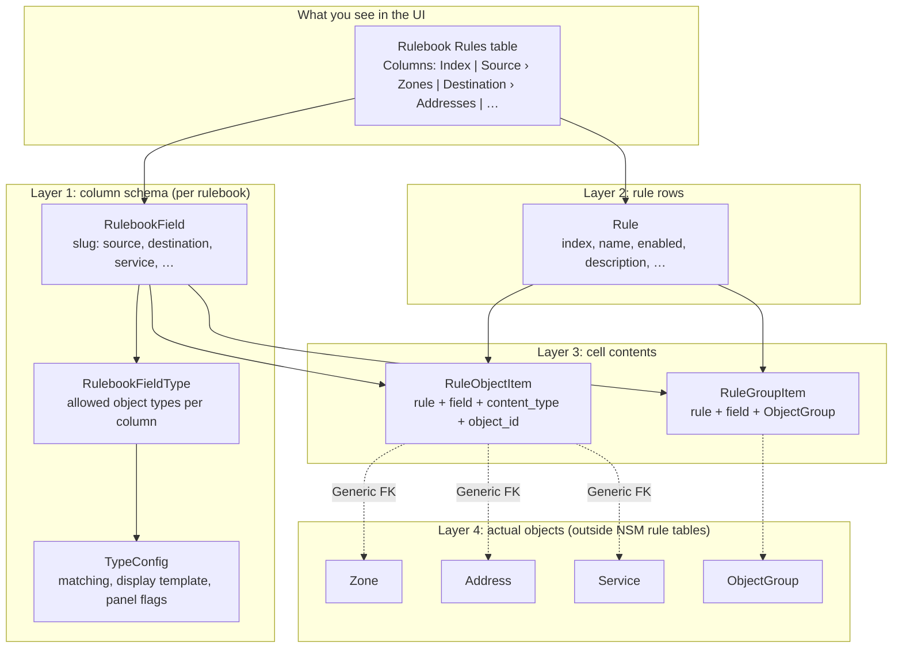
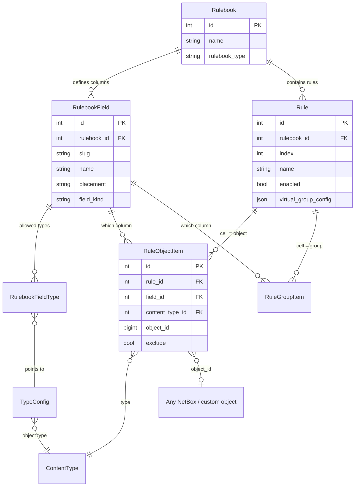
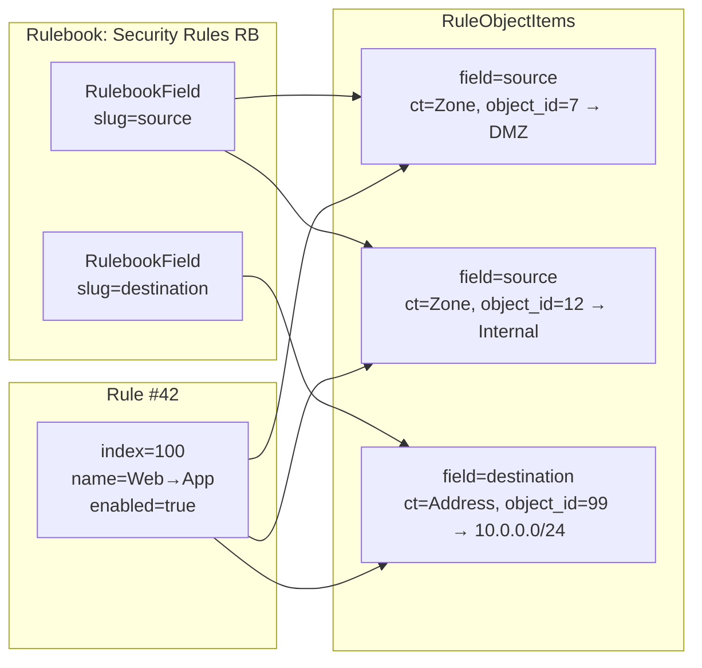
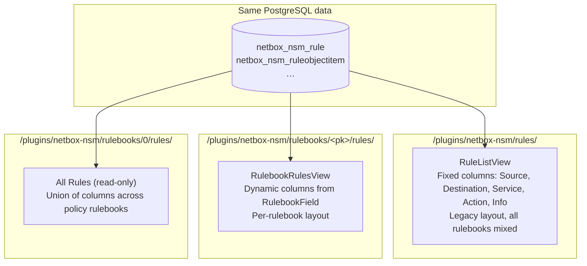
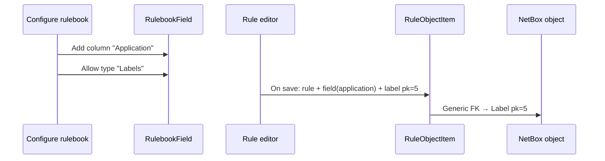

# How rule data is stored

[← Documentation home](README.md) · [Database tables](DATABASE.md) · [Architecture](../ARCHITECTURE.md)

NSM does **not** persist policy as a wide spreadsheet with dynamic columns on the `Rule` row.
Instead, data is split into four layers:

1. **Schema** — which columns a rulebook has (`RulebookField`, `RulebookFieldType`)
2. **Rules** — one row per policy rule (`Rule`)
3. **Cell contents** — links from a rule + column to objects or groups (`RuleObjectItem`, `RuleGroupItem`)
4. **Referenced objects** — zones, addresses, services, etc. live in Custom Objects or NetBox core; NSM stores only generic foreign keys

Security **object instances** are never duplicated inside NSM rule tables. See [What is stored elsewhere](DATABASE.md#what-is-stored-elsewhere).

---

## Layer model

---

## Entity relationships (simplified)

---

## Worked example: one UI row

**Policy table row:**

| Index | Name     | Source › Zones   | Destination › Addresses |
|------:|----------|------------------|-------------------------|
| 100   | Web→App  | DMZ, Internal    | 10.0.0.0/24             |

**How that maps to the database:**

**Important:** multiple pills in one UI cell = **multiple `RuleObjectItem` rows** (same
`rule_id` and `field_id`, different `object_id`).

Unique constraint on `RuleObjectItem`: `(rule, field, content_type, object_id)`.

---

## UI concept → PostgreSQL table

| UI concept | Table | What is stored |
|------------|-------|----------------|
| Rulebook | `netbox_nsm_rulebook` | Name, platform, matrix flag, comment template, … |
| Column “Source” | `netbox_nsm_rulebookfield` | slug, name, placement, sort_order, visibility, … |
| Sub-type “Zones” under Source | `netbox_nsm_rulebookfieldtype` → `netbox_nsm_typeconfig` | Which content type is allowed, max items, … |
| Rule row | `netbox_nsm_rule` | index, name, enabled, description — **not** zone/address text |
| Object pill in a cell | `netbox_nsm_ruleobjectitem` | FK to rule + field + generic object |
| Group pill in a cell | `netbox_nsm_rulegroupitem` | FK to rule + field + `ObjectGroup` |
| Zone / Address instance | Custom Objects / NetBox core | **Not** in NSM rule junction tables |

System columns (Index, Status, Name, Description) are also `RulebookField` rows with
`field_kind=system`; their values live on the `Rule` model, not in `RuleObjectItem`.

---

## Global rule list vs rulebook Rules tab

Both views read the **same** `Rule` and junction rows. Only the **presentation** differs.

| URL | Purpose |
|-----|---------|
| `/plugins/netbox-nsm/rules/` | NetBox object list of all `Rule` records; fixed column set in `RuleTable` |
| `/plugins/netbox-nsm/rulebooks/<pk>/rules/` | Rules grid for one rulebook; columns match that rulebook's fields |
| `/plugins/netbox-nsm/rulebooks/0/rules/` | Aggregated read-only view across all security rulebooks |

Prefer the rulebook Rules tab (or All Rules) for day-to-day policy work. The global `/rules/`
list is mainly a technical inventory / admin view.

---

## What “dynamic sub-fields” means

| Dynamic at… | Mechanism |
|-------------|-----------|
| **Schema** | Each rulebook defines its own `RulebookField` rows and allowed `RulebookFieldType` entries |
| **Cell content** | Zero or more `RuleObjectItem` / `RuleGroupItem` rows per rule and field |
| **`Rule` row itself** | **Not** dynamic — no columns like `source_zones` or `dest_addresses` on the model |

Adding a new column to a rulebook does **not** require a database migration for rule content:
new assignments use existing junction tables with a new `field_id`.

---

## `virtual_group_config` (JSON on `Rule`)

`Rule.virtual_group_config` stores editor metadata for **virtual AND/OR groups** inside a cell
(how pills are grouped in the rule form). Object references still persist in
`RuleObjectItem` / `RuleGroupItem`; the JSON describes structure, not the referenced objects.

---

## Related documentation

- [DATABASE.md](DATABASE.md) — full table list and migration notes
- [ARCHITECTURE.md](../ARCHITECTURE.md) — model field reference for developers
- [Using netbox-nsm — Rules grid](using_netbox_nsm.md#rules-grid) — operator UI guide
