# Using netbox-nsm

<div align="center">

**Operations guide** — Document zones, firewall rules, and security links in NetBox

[Documentation home](README.md) · [Architecture](../ARCHITECTURE.md) · [Database](DATABASE.md)

</div>

> **Documentation plugin** — NSM does not push configuration to firewalls.  
> For a quick overview, see the [project README](../README.md).

---

## How to use this guide

| Path | Sections | Goal |
|---|---|---|
| **First steps** | [Prerequisites](#prerequisites--first-start) → [Setup](#setup-wizard) | Plugin ready, COTs + TypeConfigs imported |
| **Link inventory** | [Object Links](#nsm-object-links) → [Security Panel](#security-panel) → [Universal linking](#universal-linking--any-netbox-object--nsm) | Prefixes, devices, VMs linked to zones; macro/micro zones; same zone in panel and rulebook |
| **Document policy** | [Rulebooks](#security-rulebooks) → [Rules grid](#rules-grid) → [IP Analysis](#ip-analysis) | Rules, matrix, cross-rulebook views |
| **Explore** | [Object Analyzer](#object-analyzer) | Graph walk-through from any NetBox object |
| **Integrate** | [REST API](#rest-api-reference) · [Dev notes](#development-notes) | Automation and development |

---

## Table of contents

1. [Prerequisites and first start](#prerequisites--first-start)
2. [Setup wizard](#setup-wizard)
3. [Custom Object Types (COTs)](#custom-object-types-cots)
   - [Zones](#zones-nsm_zones)
   - [Addresses](#addresses-nsm_addresses)
   - [Labels](#labels-nsm_labels)
   - [Services](#services-nsm_services)
   - [Actions](#actions-nsm_action)
   - [Business Apps](#business-apps-nsm_business_apps)
   - [Network Apps](#network-apps-nsm_network_apps)
4. [NSM Object Links](#nsm-object-links)
5. [Security Panel](#security-panel)
   - [Universal linking — any NetBox object ↔ NSM](#universal-linking--any-netbox-object--nsm)
   - [Why the Security Panel](#why-the-security-panel)
   - [Workflow: assign, view, reverse lookup](#workflow-assign-view-reverse-lookup)
   - [Macro zones vs micro zones](#macro-zones-vs-micro-zones)
   - [Direct links](#direct-links)
   - [Inheritance in the Security Panel](#inheritance-in-the-security-panel)
   - [Inherited links](#inherited-links)
   - [Use case: interface in prod and app zone](#use-case-interface-in-prod-and-app-zone)
   - [Assigning links](#assigning-links)
6. [TypeConfigs](#typeconfigs)
   - [Extending NSM: custom and native object types](#extending-nsm-custom-and-native-object-types)
7. [Security Rulebooks](#security-rulebooks)
   - [Rulebook list](#rulebook-list)
   - [Create a rulebook](#create-a-rulebook)
   - [Rulebook fields (columns)](#rulebook-fields-columns)
   - [Rule editor](#rule-editor)
   - [AND groups](#and-groups)
   - [Rule actions (enable, delete, reorder)](#rule-actions)
8. [Policy views](#policy-views)
   - [Rules grid](#rules-grid)
   - [Zone matrix](#zone-matrix)
   - [IP Analysis](#ip-analysis)
9. [Object Analyzer](#object-analyzer)
10. [REST API reference](#rest-api-reference)
11. [Database tables](#database-tables)
12. [Development notes](#development-notes)
    - [Third-party UI libraries](#third-party-ui-libraries)

---

## Prerequisites and first start

### Database migrations

`netbox-custom-objects` must be migrated **before** NSM. Without those tables, the Setup page
cannot query Custom Object Types (`relation "netbox_custom_objects_customobjecttype"
does not exist`).

After `netbox_nsm` is listed in `PLUGINS`, use the usual NetBox workflow:

```bash
cd netbox/netbox
./manage.py migrate --no-input
```

Or per plugin:

```bash
./manage.py migrate netbox_custom_objects --no-input
./manage.py migrate netbox_nsm --no-input
```

Restart NetBox after migrating.

### Setup page

After installation and migration, open **Security → Configuration → Setup**.
The page is a four-step wizard that checks plugin readiness, creates missing COTs and
TypeConfigs, and optionally loads demo data.

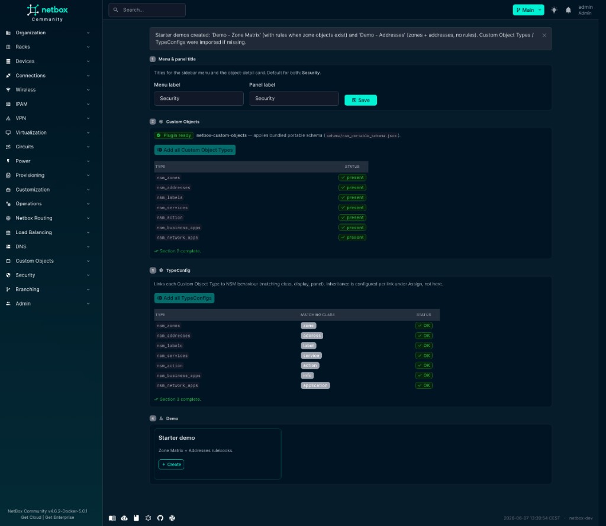

Work through sections **1 → 2 → 3** in order. Section 4 (Demo) unlocks once all TypeConfigs
show **OK**. All **Add all** actions are idempotent — only missing items are created.

---

## Setup wizard

**Security → Configuration → Setup**


### Plugin settings

| Setting | Default | Effect |
|---|---|---|
| `setup_menu` | `True` | Show **Setup** under Security → Configuration; allow `/setup/` URLs |
| `setup_allow_destructive_actions` | `True` | Show section 4 (Demo); set to `False` in production |
| `menu_label` | `"Security"` | Side menu title (also on Setup, section 1, editable) |
| `panel_label` | *(same as `menu_label`)* | Security card title on object detail pages (editable on Setup, section 1) |

```python
PLUGINS_CONFIG = {
    "netbox_nsm": {
        "setup_menu": True,
        "setup_allow_destructive_actions": True,
        "menu_label": "Security",
        "panel_label": "Security",
    },
}
```

Section 1 can override `menu_label` and `panel_label` at runtime via **Save** (stored in plugin config).

### Production vs development actions

With `setup_allow_destructive_actions: False`, sections **1–3** remain available:

- **Menu & panel title** — save UI labels
- **Add all Custom Object Types** — create missing built-in COTs
- **Add all TypeConfigs** — create missing TypeConfigs

Section **4 (Demo)** is hidden and demo POST requests are rejected.

| Demo action | Risk |
|---|---|
| **Starter demo** | Creates Zone Matrix + Addresses sample rulebooks |
| **Enterprise DC Demo** | Full DC scenario (DCIM + IPAM + 11 rulebooks, ~30–60 s). Requires empty IP database |
| **Scale test** | 300 zones + 12,000 rules (~25–50 s) |
| **Addresses demo** | 6,000 address-based rules (~20–40 s) |

Disable demos in production in `configuration.py`:

```python
PLUGINS_CONFIG = {
    "netbox_nsm": {
        "setup_allow_destructive_actions": False,
    },
}
```

Restart NetBox after changing plugin config.

### Setup sections

| # | Section | Purpose |
|---|---|---|
| **1** | **Menu & panel title** | Set side menu label and panel title on object detail pages (default: *Security*). **Save** to persist. |
| **2** | **Custom Objects** | Shows `netbox-custom-objects` readiness (**Plugin ready** / *Migrations pending* / *Plugin not installed*). Applies the bundled schema (`schema/nsm_portable_schema.json`). Lists seven built-in COTs with **present** / **missing** status. **Add all Custom Object Types** creates missing types. Shows *Section 2 complete.* when all seven are present. |
| **3** | **TypeConfig** | Maps each COT to NSM behavior (matching class, display, panel). Inheritance is configured per link under **Assign**, not here. **Add all TypeConfigs** creates missing configs. Shows matching class per type (`zone`, `address`, `label`, `service`, `action`, `info`, `application`) and **OK** / **missing** status. Shows *Section 3 complete.* when everything is configured. |
| **4** | **Demo** | Optional sample data (only when `setup_allow_destructive_actions: True`). **Starter demo** — Zone Matrix + Addresses rulebooks. **Enterprise DC Demo** — full DC + 11 rulebooks; disabled once IP addresses exist. **Addresses demo** — large address-based rulebook. |

Built-in COTs (section 2): `nsm_zones`, `nsm_addresses`, `nsm_labels`, `nsm_services`,
`nsm_action`, `nsm_business_apps`, `nsm_network_apps`.

> The Enterprise DC import is idempotent (`get_or_create`) — but because it creates IP addresses,
> it is only offered when the database contains **no IP addresses**.

---
## Custom Object Types (COTs)

COTs are managed by the `netbox-custom-objects` plugin. Each COT is essentially a named
object class with a custom field schema. NSM ships seven built-in COTs. You can also
create your own COTs and bind a TypeConfig to them.

Use the Setup wizard **[Section 2 — Custom Objects](#setup-sections)** to check
`netbox-custom-objects` readiness and create missing built-in types
(**Add all Custom Object Types**). Section 2 lists each COT with **present** / **missing**
status and shows *Section 2 complete.* when all seven are registered.

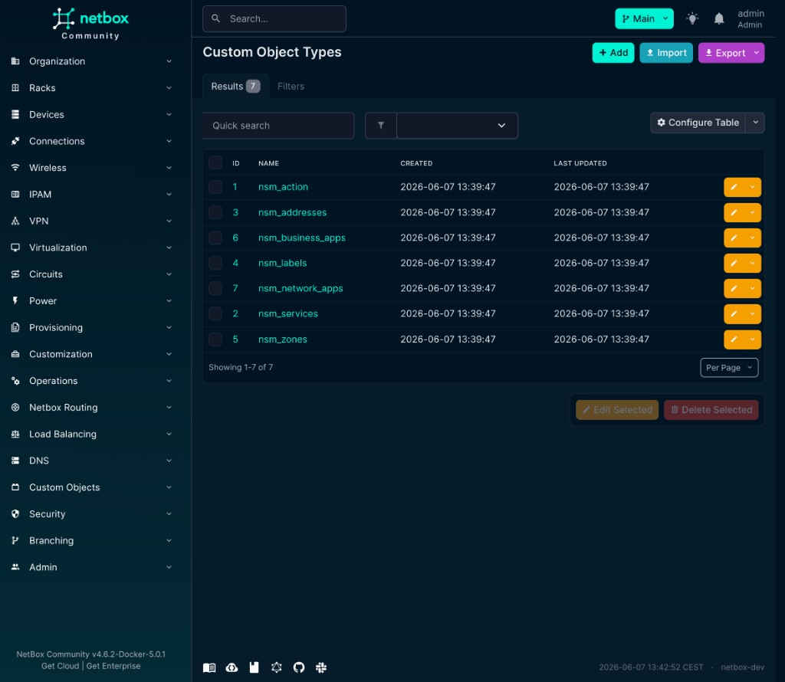

After Setup section 2, all seven types appear under **Custom Objects → Custom Object Types**
(`/plugins/custom-objects/custom-object-types/`). Object instances are managed under
**Custom Objects → NSM** in the sidebar.

| Slug | Sidebar label | Purpose |
|---|---|---|
| `nsm_action` | Action | Rule outcomes (`permit`, `deny`, `drop`, `reject`, …) |
| `nsm_addresses` | Addresses | Named address objects or address groups |
| `nsm_business_apps` | Business Apps | Business applications with owner metadata |
| `nsm_labels` | Labels | Classification tags (environment, role, compliance, …) |
| `nsm_network_apps` | Network Apps | App-ID-style application identifiers |
| `nsm_services` | Services | Port/protocol definitions for service columns in rules |
| `nsm_zones` | Zones | Security zones for zone-based policies |

### Zones (`nsm_zones`)

Security zones — the logical groupings for zone-based policies.

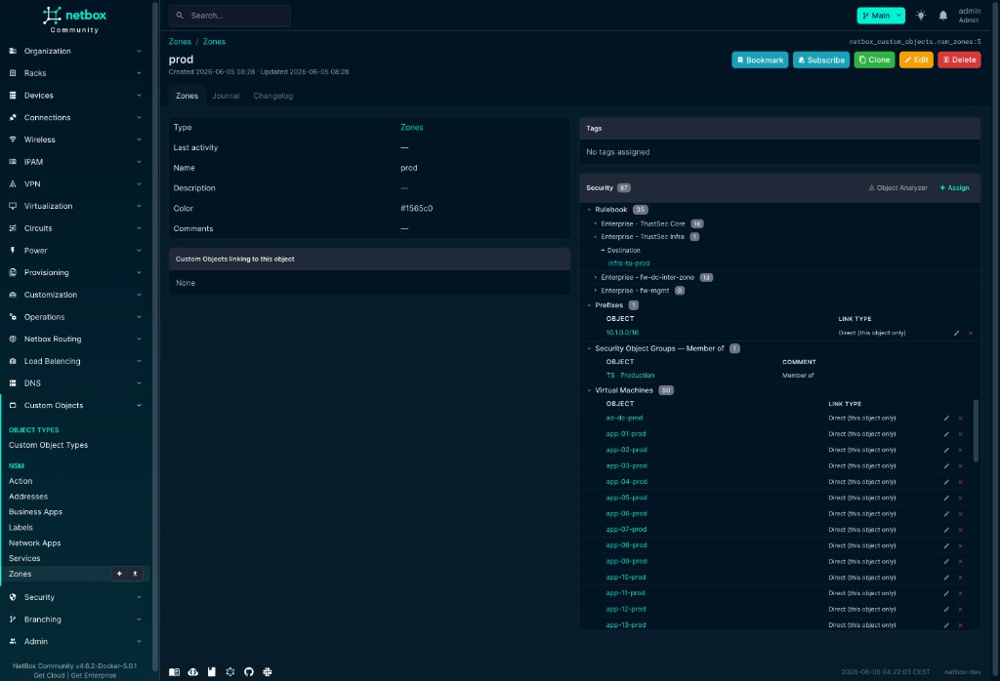

The detail page shows zone attributes (name, color) on the left and the **Security Panel**
on the right — here the zone is the *host* object. **Rulebook** lists rules from **Demo - Zone
Matrix** that reference `untrust` (e.g. `trust-to-untrust` as destination, `untrust-to-dmz` as
source). **Services** shows a direct bidirectional link to `SNMP-Trap (udp/162)`.

| Field | Description |
|---|---|
| `name` | Zone name, e.g. `prod`, `dmz`, `untrust` |
| `description` | Optional text |
| `color` | Hex color for pills and matrix cells |
| `comments` | Extended notes |

Zones are typically linked to prefixes (e.g. `10.0.0.0/8 → prod`). The same zone object can
also appear on devices, interfaces, VMs, and IP objects — see [Macro zones vs micro zones](#macro-zones-vs-micro-zones)
for using multiple zone links on one asset.

### Addresses (`nsm_addresses`)

Named address objects or address groups — equivalent to firewall address objects.

| Field | Description |
|---|---|
| `name` | Address object name |
| `value` | IP address or CIDR notation (optional) |
| `description` | Optional text |
| `color` | Display color |
| `comments` | Extended notes |

### Labels (`nsm_labels`)

Arbitrary classification tags — environment (`prod`, `staging`), role (`web-tier`, `db-tier`),
compliance (`pci`, `gdpr`), or any other dimension.

| Field | Description |
|---|---|
| `name` | Label text |
| `description` | Optional text |
| `color` | Display color |
| `comments` | Extended notes |

### Services (`nsm_services`)

Port/protocol definitions for service columns in rules.

| Field | Description |
|---|---|
| `name` | Display name, e.g. `HTTPS`, `DNS-UDP` |
| `protocol` | `tcp`, `udp`, `icmp`, or custom string |
| `port` | Port number or range, e.g. `443`, `8080-8090` |
| `description` | Optional text |
| `color` | Display color |
| `comments` | Extended notes |

### Actions (`nsm_action`)

Rule outcome objects: `permit`, `deny`, `drop`, `reject`, or custom values.

### Business Apps (`nsm_business_apps`)

Business applications with owner metadata. Used in **fixed** columns of a rule
to document which business application a rule serves.

| Field | Type | Description |
|---|---|---|
| `name` | Text | Application name (required) |
| `criticality` | Choice | `low` / `medium` / `high` / `critical` |
| `business_owner` | Object (ContactGroup) | Responsible business contact group |
| `technical_owner` | Object (ContactGroup) | Responsible technical contact group |
| `description` | Text | Free-text description |
| `color` | Text | Display color (hex) |
| `comments` | Long text | Extended notes |

### Network Apps (`nsm_network_apps`)

App-ID-style application identifiers — equivalent to Palo Alto App-IDs or Fortinet application
signatures. Pre-filled with common apps: `dns`, `http`, `ssl`, `ssh`, `rdp`, `smtp`,
`smb`, `onedrive`, `teams`, `zoom`.

| Field | Type | Description |
|---|---|---|
| `name` | Text | Application name, e.g. `ssl`, `zoom` |
| `app_category` | Choice | `collaboration` / `database` / `email` / `file-sharing` / `general-internet` / `infrastructure` / `media` / `networking` / `remote-access` / `saas` / `security` / `storage` / `voip-video` / `other` |
| `app_risk` | Choice | Risk level `1` (low) to `5` (high) |
| `default_ports` | Text | Comma-separated, e.g. `tcp/443,tcp/80` |
| `description` | Text | Description |
| `color` | Text | Display color (hex) |
| `comments` | Long text | Extended notes |

---

## NSM Object Links

An **ObjectLink** is the central NSM relationship primitive. It connects two arbitrary NetBox objects:
a **host** object (prefix, IP address, IP range, device, interface, VM, VDC, …) and a
**security** object (zone, address, label, service, business app, …).

Links are bidirectional — querying either end finds the link. This bidirectionality drives the
[Security Panel](#security-panel): assign a zone on a prefix detail page, then open the
zone object and see that prefix (and every other linked asset) in the panel's reverse view.

A single NetBox object can have **multiple links of the same type** (e.g. a device interface
in both `prod` and `app-x`) and **links of different types** at the same time (zone + address
+ two labels). There is no single "primary" zone — every direct ObjectLink is shown explicitly.

Links are created and removed on the object detail page via the Security Panel (**+ Assign**)
or programmatically via the REST API (`object-links/`).

| Host object | Typical security links |
|---|---|
| Prefix `10.1.0.0/16` | Zone `prod`, Address `prod-net`, Label `pci` |
| IP Address `10.1.0.5` | *(often inherited from prefix)* or direct label |
| Device / Interface | Zone `prod`, Zone `app-x`, Label `web-tier` |
| VM | Zone `prod`, address group, rulebook assignment |
| Zone `prod` | Prefixes, VMs, interfaces *(reverse perspective)* |

---

## Security Panel

The Security Panel is the **central NSM workspace** on every NetBox object detail page. It is
not a secondary sidebar — this is where all security relationships between IPAM/DCIM inventory and NSM objects (zones, addresses, labels, services,
…) are created, reviewed, and maintained.

The panel is **automatically embedded** on prefix, IP address, IP range, device, interface,
VM, VDC, and every custom object detail page (including zone/address/label instances). Beyond plugin installation and completing the Setup wizard, no
additional configuration is required.

### Universal linking — any NetBox object ↔ NSM

Once NSM types exist (Setup wizard / TypeConfigs), **any supported NetBox object** can be
linked to **any allowed NSM object** through the Security Panel — and vice versa. Operators
create these relationships manually with **+ Assign**; **rulebook references** to NSM objects
appear in the panel **automatically** when that object is used in a rule column (no extra
assignment step).

**Inheritance** extends a single assignment to related objects — for example **Inherit to IPAM
children** on a prefix propagates a zone to all sub-prefixes, IP addresses, and IP ranges
under that prefix without linking each child individually.

Together, manual links, automatic rule references, and inheritance let you document **different
segmentation approaches on the same inventory**:

| Approach | Example | Typical link target |
|---|---|---|
| **Product A — macro zone** | Site or DC trust boundary (TrustSec, Palo Alto zone model) | Parent prefix `10.0.0.0/8 → zone prod` with **Inherit to IPAM children** |
| **Product B — micro segmentation** | Application or workload segment inside a macro zone | VM **interface** `eth0 → zone app-x` with **Direct** (this object only) |

Both use the same `nsm_zones` model — NSM does not define separate “macro” and “micro” types.
The **same zone instance** you assign on an interface (or prefix, VM, device, …) is the
**same object** picked in rulebook columns (`Source.Zones`, `Destination.Zones`, …). Inventory
membership and policy rules always refer to one shared object.

| Link origin | How it appears in the panel |
|---|---|
| **Manual (+ Assign)** | Operator creates an ObjectLink — e.g. zone on prefix, label on IP, service on zone |
| **Automatic (rulebooks)** | NSM object used in a rule → **Rulebook** section lists matching rules on the object detail page |
| **Inherited** | Parent prefix (or group) holds the link → child objects show it with an *Inherited* badge |

**Bidirectional direct links** update both detail pages: link zone `untrust` → service
`SNMP-Trap (udp/162)` with **Direct (bidirectional, visible on both sides)** and the zone page
shows **Services (1)** while the service page shows **Zones (1)** — see screenshots below.

For IPAM propagation, override rules, and link-type dropdown options, see
[Inheritance in the Security Panel](#inheritance-in-the-security-panel) and
[Assigning links](#assigning-links).

### Why the Security Panel

Without the panel, NSM links would be invisible table rows or API entries. With the panel,
operators have a single, consistent place to answer:

- *Which zone(s) does this prefix / IP / NIC belong to?*
- *Which labels or address objects are linked to this server?*
- *Which rulebook rules reference this zone or this prefix?*
- *From this zone: which prefixes, VMs, and interfaces are members?*

Every supported NetBox object type uses **the same panel structure** — grouped sections by NSM
type, colored badges, link type badges (*Direct* vs. *Inherited*), rule reference trees, and
**+ Assign** for new ObjectLinks. Policy documentation stays attached to the live inventory object,
not in a separate security silo.

### Workflow: assign, view, reverse lookup

The daily NSM linking workflow runs entirely through the panel:

1. **Open a host object** — e.g. prefix `10.1.0.0/16`, device `app-01`, or interface `eth0`.
2. Click **+ Assign** in the Security Panel header.
3. **Choose an NSM type** (Zone, Address, Label, …) — only types whose TypeConfig allows the
   current NetBox object type appear in the picker.
4. **Search and select a security object** → **Assign**. NSM creates an ObjectLink immediately; the new entry appears under the matching type section (e.g. **Zones (1)**).
5. **Reverse lookup** — open the zone (or address, label, …) detail page. The same Security
   Panel now lists every NetBox object *linked to* this security object (prefixes, VMs,
   interfaces, …) plus all rulebook rules that reference it.


*Reverse view on zone `untrust` (Starter demo): **Rulebook** references from **Demo - Zone
Matrix**, direct **Services** link to `SNMP-Trap`, header badge **4**.*

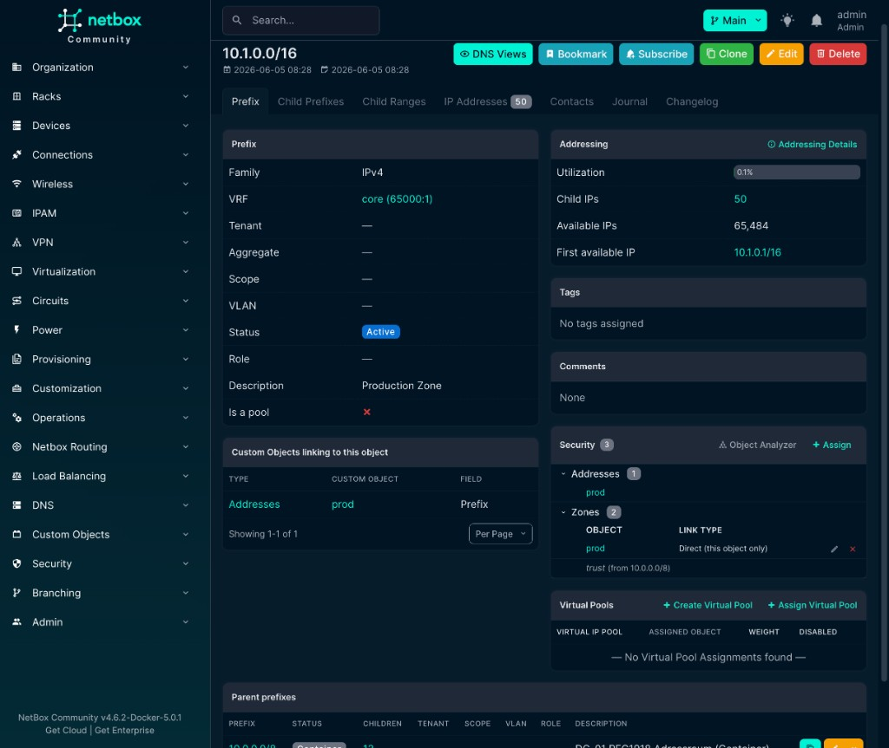

*Host view on prefix `10.1.0.0/16`: zone `prod` assigned **directly** (*Direct (this object
only)*), zone `trust` **inherited** from parent prefix `10.0.0.0/8` (link type column shows
*(from `10.0.0.0/8`)*), plus addresses, labels, and rule references for this prefix.*

From any panel, **Object Analyzer** shows the same relationships as an explorable graph.

The panel shows:
- A **Rulebook** section with all rules from every rulebook that references this object,
  grouped by rulebook and field column (expandable tree)
- All directly assigned security objects, grouped by type (Zones, Addresses, Labels, Prefixes,
  Virtual Machines, Interfaces, …)
- **Security Object Group** membership (*Member of* / *Member*)
- **Group membership** for custom objects with a `group` M2M field (see below)
- **Inherited** links from parent prefixes or primary IP (see [Inherited links](#inherited-links))
- Quick link to **Object Analyzer**
- An **Enforced Rulebooks** section on device/VM/VDC pages (policy assignments, not rule
  references)

The badge in the panel header (e.g. **87**) is the total count of all displayed entries.

### Macro zones vs micro zones

NSM does not ship separate "macro" and "micro" object types — both are ordinary `nsm_zones`
entries. The distinction is an **operational convention** you document via multiple zone
ObjectLinks on the same asset:

| Concept | Typical meaning | Example zone name | Usually linked from |
|---|---|---|---|
| **Macro zone** | Site, DC segment, trust boundary, production vs DMZ | `prod`, `dmz`, `untrust` | Prefixes, primary NICs, VMs |
| **Micro zone** | Application, tier, or workload segment within a macro zone | `app-x`, `web-tier`, `db-tier` | Interfaces, VMs, specific prefixes |

A **macro zone** answers *where in the infrastructure does this asset live?* A **micro zone** answers
*which application or segmentation context applies?* Both appear as separate rows under
**Zones** in the Security Panel — each with link type *Direct (this object only)* when
explicitly assigned.

Example: interface `eth0` on `app-01` can carry **two direct zone links**:

- `prod` — macro: production DC segment (TrustSec / Palo Alto style)
- `app-x` — micro: workload zone for application X (additional segmentation for policy documentation)

Neither link replaces the other; rulebooks referencing `prod` and rulebooks referencing `app-x`
both remain valid. The panel makes overlapping membership visible at a glance, instead of forcing a single zone field in the NetBox model.

Macro assignment at prefix level plus micro assignment at interface level is equally common: prefix
`10.1.0.0/16 → prod` (inherited by child IPs) and interface `eth0 → app-x` (direct, only on
this NIC).

### Rulebook references

When an object appears in one or more rulebook rules, the **Rulebook** section lists each
matching rule in an expandable tree: **Rulebook → field column → rule name**. Each rulebook
row shows the count of distinct rules; expanding shows nested field rows (e.g.
**Destination**) with the specific rule names that reference this object (e.g. `infra-to-prod`).
Rule names link to the filtered Rules grid; Ctrl+click opens the rule detail page.

On zone `prod` in the Enterprise DC demo:

| Rulebook | Rules referencing `prod` |
|---|---|
| Enterprise - TrustSec Core | 18 |
| Enterprise - TrustSec Infra | 1 |
| Enterprise - fw-dc-inter-zone | 13 |
| Enterprise - fw-mgmt | 0 |

Expanding *Enterprise - TrustSec Infra (1)* shows **Destination → infra-to-prod** — the zone
appears in the Destination column of that rule.

### Direct links

**Direct** links are explicit ObjectLink records created on *this* object via **+ Assign** or
the API. They are the authoritative source for macro/micro zone assignments, labels, and
address objects on devices, interfaces, prefixes, and VMs.

Each direct entry shows:
- A colored badge (using the object's `color` field)
- The object name as a link to the detail page
- **Link type** — *Direct (this object only)*
- A remove button (×), when write permission is present

On a **zone** object, the panel shows the **reverse** perspective — all NetBox objects
*linked to* this zone:

- **Prefixes** — e.g. `10.1.0.0/16` with link type *Direct*
- **Virtual Machines** — VMs assigned directly to the zone
- **Interfaces** / **Devices** — when operators attach macro or micro zones at NIC level

See the reverse screenshot above ([Zone `prod`](#workflow-assign-view-reverse-lookup)).

On a **prefix** detail page, direct links appear under **Zones**, **Addresses**, **Labels**,
… with link type *Direct (this object only)*. Prefix `10.1.0.0/16` has zone `prod` assigned
directly; zone `trust` on the same prefix comes from inheritance (next section).

See the host screenshot above ([Prefix `10.1.0.0/16`](#workflow-assign-view-reverse-lookup)).

The same object can have **multiple direct zone links** — this is how macro + micro zone
documentation works in practice (e.g. `prod` and `app-x` both direct on one interface).

### Linking custom objects and the Security Panel

NetBox Custom Objects can define FK/M2M fields pointing at NetBox objects (e.g. an
`nsm_addresses` row with a **Prefix** field). The panel **Custom Objects linking to this object**
(left column, from the Custom Objects plugin) lists those reverse relationships —
type, object name, and field name.

The Security Panel shows **the same NSM objects** in the appropriate type sections, ready for
policy use:

| Custom Objects linking | Security Panel section |
|---|---|
| Addresses → `prod` (field *Prefix*) | **Addresses (1)** → `prod` |
| — | **Zones (2)** → `prod` (direct), `trust` (inherited) |

ObjectLinks via **+ Assign** and FK-backed custom object references both end up in the
Security Panel; the linking panel is the Custom Objects view of FK fields, while the
Security Panel is the NSM policy view (grouped by type, with inheritance and rule references).

### Group membership (address / service / zone objects)

Custom objects with a `group` M2M field (especially `nsm_addresses` and
`nsm_services`) show group relationships in the Security Panel **without** an explicit
ObjectLink:

| Label | Meaning |
|---|---|
| **Member of** | Parent group(s) containing this object (reverse M2M) |
| **Member** | Object(s) contained in this group when viewing a group (forward M2M) |

Example: on address group `group-1`, the panel lists `g-all` as *Member of* and all
contained addresses/subgroups as *Member*. The same edges appear in Object Analyzer.

**Security Object Groups** (NSM-managed groups, separate from address/service M2M groups)
appear in their own section. On zone `prod`, the panel shows *Member of* **TS - Production**
— this zone belongs to the TrustSec production group for group-backed rule columns.

### Inheritance in the Security Panel

Inheritance lets you assign a macro zone (or address, label, …) **once on a parent prefix**
and have it appear automatically on child prefixes, IP addresses, IP ranges, and — via primary
IP — on devices and VMs. The Security Panel **always** shows direct and inherited entries
under the same type section (e.g. **Zones (2)**), with clear badges to tell them apart.

#### What appears in the panel

| Link source | Typical badge / link type column | Remove (×) |
|---|---|---|
| **Direct** ObjectLink on this object | *Direct (this object only)* | Yes (with permission) |
| **Inherited** from a containing prefix | *Inherited from containing prefix* or *(from `10.0.0.0/8`)* | No — edit ancestor |
| **Inherited** from primary IP's prefix (device/VM) | Same as IP inheritance | No — fix primary IP or prefix link |

Inherited rows use **the same color badge and object name** as direct links — only the
link type column and missing × button distinguish them. Direct and inherited entries are
**never merged into one row**: zone `prod` (direct) and zone `trust` (from parent) are two
separate rows under **Zones**.


On **`10.1.0.0/16`**: zone **`prod`** was assigned directly on this prefix; zone **`trust`**
is inherited from parent prefix **`10.0.0.0/8`**. Child IPs under `10.1.0.0/16` show the same
`prod` + `trust` combination unless they override `prod` with their own direct zone link.

#### Creating an inheriting assignment

On the **Assign Link** page (**+ Assign** from the panel), choose **Link type**:

| Link type | Effect |
|---|---|
| **Direct (bidirectional, visible on both sides)** | Stored on object A and shown on both A and B; **not propagated** to children — typical for micro zones on an interface or a one-off label on an IP. |
| **Inherit to IPAM children (prefixes, addresses, ranges)** | The link is stored on object A (usually a **prefix**) and **propagates downward** to sub-prefixes, IP addresses, and IP ranges within that prefix. |
| **Inherit to group members** | Propagates to members of a group or container object (when object A has group members). |

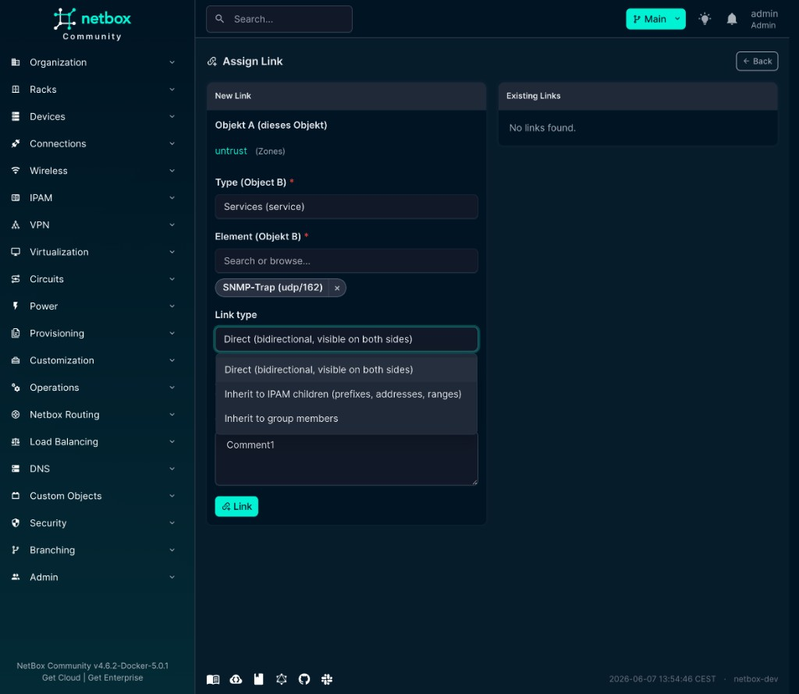

*Assign Link from zone **`untrust`** → service **`SNMP-Trap (udp/162)`** — **Link type**
dropdown lists all three propagation modes (Direct, Inherit to IPAM children, Inherit to group
members). For zone→service links, **Direct** is typical; IPAM inheritance applies when object A
is a prefix or other IPAM parent.*

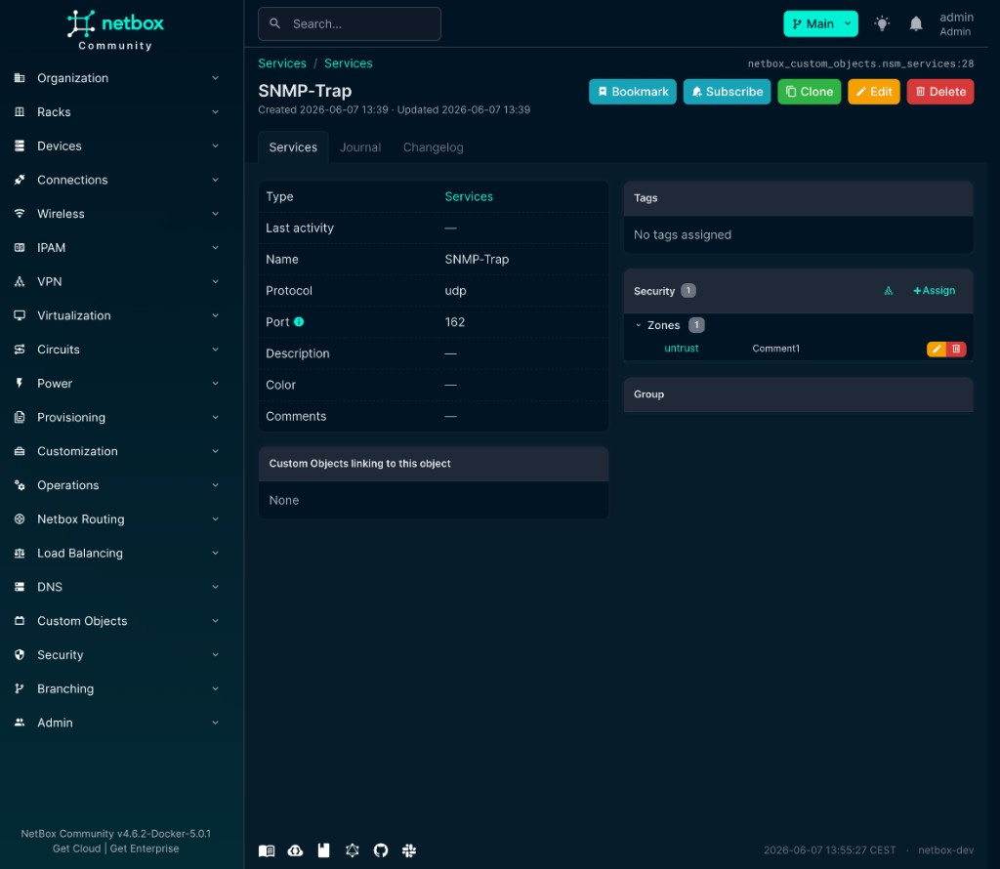

*After linking with **Direct (bidirectional, visible on both sides)**, the service detail page
shows zone **`untrust`** under **Zones** — the mirror of the **Services** entry on the zone
page.*

Example workflow for a **macro zone on a DC container**:

1. Open parent prefix **`10.0.0.0/8`** → **+ Assign** → zone **`trust`** → **Inherit to IPAM children** → **Link**.
2. Open child prefix **`10.1.0.0/16`** — panel shows **`trust`** as inherited *(from `10.0.0.0/8`)* without a separate assignment on `/16`.
3. On **`10.1.0.0/16`**, assign zone **`prod`** as **Direct** for this subnet only — panel shows **Zones (2)**: `prod` direct + `trust` inherited.
4. Open IP **`10.1.0.5`** — both zones appear inherited from containing prefix(es).

#### Inheritance chain (IPAM)

NSM walks **containing prefixes**, most specific first (longest prefix length):

```
10.0.0.0/8  ──inherit──►  trust
    └── 10.1.0.0/16  ──direct──►  prod
            └── 10.1.0.5/32  ──panel shows──►  prod + trust (inherited)
```

| Child object | Inherited from |
|---|---|
| **Sub-prefix** | Parent prefix(es) containing its network (strictly shorter prefix length) |
| **IP Address** | Containing prefix(es) |
| **IP Range** | Prefix covering **both** start and end addresses |
| **Device / VM** | NSM links on **primary IPv4** (or primary IPv6), which in turn inherit from prefix |

Devices and VMs **without** a primary IP show **no** prefix inheritance — only their direct
panel links (e.g. zone only on `eth0`).

#### When inheritance stops (overrides)

Two mechanisms prevent inherited links from cluttering the panel when a child is special:

| Mechanism | Configuration | Behavior |
|---|---|---|
| **Stop when child has own link** | ObjectLink (**Assign Link**) or TypeConfig *Stop inheritance if own link present* | If the child already has a **direct** link of the **same NSM type**, inherited links of that type are hidden on the child. Use for a sub-prefix in a **different** zone than the parent. |
| **Direct-only assignment** | **Direct (bidirectional, visible on both sides)** on Assign Link | Child objects never receive this link via propagation — only object A shows it (plus reverse on object B). |

Example: parent `10.0.0.0/8 → trust` (inherit). Child `10.2.0.0/16` gets **direct** zone
`dmz` with *stop on own* → panel on `/16` shows only **`dmz`**, not `trust`. Sibling
`10.1.0.0/16` without a direct zone still shows **`trust`** inherited.

#### TypeConfig prerequisites

For inherited links to appear in the panel **at all**, the NSM type must allow inheritance in
TypeConfig (Setup wizard sets this for built-in zone/address types):

| TypeConfig field | Meaning |
|---|---|
| **Inherit from parent** | Enable resolution of inherited links for this type in the Security Panel. |
| **Inheritance mode** | `ipam_prefix` — parent prefix → child IPAM objects; `group_member` — parent group → members. |
| **Stop inheritance if own link present** | Type-wide default: suppress inherited rows when the child has a direct link of this type. |

**Link type** at assignment controls **propagation** (whether children receive the link).
TypeConfig **inherit from parent** controls **display** (whether the panel resolves and shows inherited links on children).
Both must align for the expected behavior.

Rulebooks and Object Analyzer use **the same resolved links** as the panel — inherited
zones on an IP affect rule matching and graph expansion the same as direct links.

### Inherited links

> See [Inheritance in the Security Panel](#inheritance-in-the-security-panel) for the full
> workflow, Assign Link propagation, and override rules. Summary below.

**Inherited** links are not stored on the child object — they are resolved at page load from
a parent prefix (IPAM) or from the device's primary IP (DCIM/virtualization). They reduce
repeated assignments: set macro zone once on `10.0.0.0/8`, and every child prefix and
IP within inherits it unless overridden.

| Host object | Inheritance source | Panel indicator |
|---|---|---|
| Sub-prefix | Containing prefix(es), most specific first | *(from `10.0.0.0/8`)* in link type column |
| IP Address / IP Range | Containing prefix | *Inherited from containing prefix* |
| Device / VM | Primary IPv4 (else primary IPv6) → its prefix | Same inheritance badges as the IP |

On prefix `10.1.0.0/16` (see [screenshot](#workflow-assign-view-reverse-lookup)): zone `trust`
is inherited from parent `10.0.0.0/8`; zone `prod` is direct only on `10.1.0.0/16`. Both
appear under **Zones** — direct and inherited are never merged into one row.

For IP ranges, a containing prefix must cover **both** start and end addresses.

**Devices and VMs** do not inherit from a prefix unless they have a primary IP in that prefix.
A server without a primary IP shows only its direct panel links. Macro zone on subnet +
micro zone on `eth0` is a typical split: prefix/carrier inherits `prod`, NIC holds direct
`app-x`.

Inheritance is controlled per security object type via TypeConfig **inherit from parent** and
**stop if own link present** (when the child gets its own direct link of that type, the
inherited link is suppressed — useful for sub-prefix exceptions).

### Use case: interface in prod and app zone

Documenting a production application server with macro + micro segmentation:

1. **Prefix** `10.1.10.0/24` — **+ Assign** → zone `prod` (*direct*). All IPs in the subnet
   inherit `prod` unless they get their own zone link.
2. **Device** `app-01` — primary IP `10.1.10.5` → panel shows zone `prod` as *inherited*
   from `10.1.10.0/24`.
3. **Interface** `eth0` on `app-01` — **+ Assign** → zone `prod` (*direct*, optional when
   inheritance suffices) and zone `app-x` (*direct*, micro zone for application X).
4. Open **zone `prod`** — reverse panel lists prefix `10.1.10.0/24`, VM/device/interface
   links, and TrustSec rule references.
5. Open **zone `app-x`** — reverse panel lists only `eth0` (and other assets explicitly
   linked to the micro zone).

Both zones are visible on the interface Security Panel under **Zones (2)**. Rulebooks for
inter-zone traffic (`prod → dmz`) and application-specific rules (`app-x → app-y`) can reference
the appropriate zone objects without colliding.

### Assigning links

Click **+ Assign** in the Security Panel header to open the **Assign Link** page.

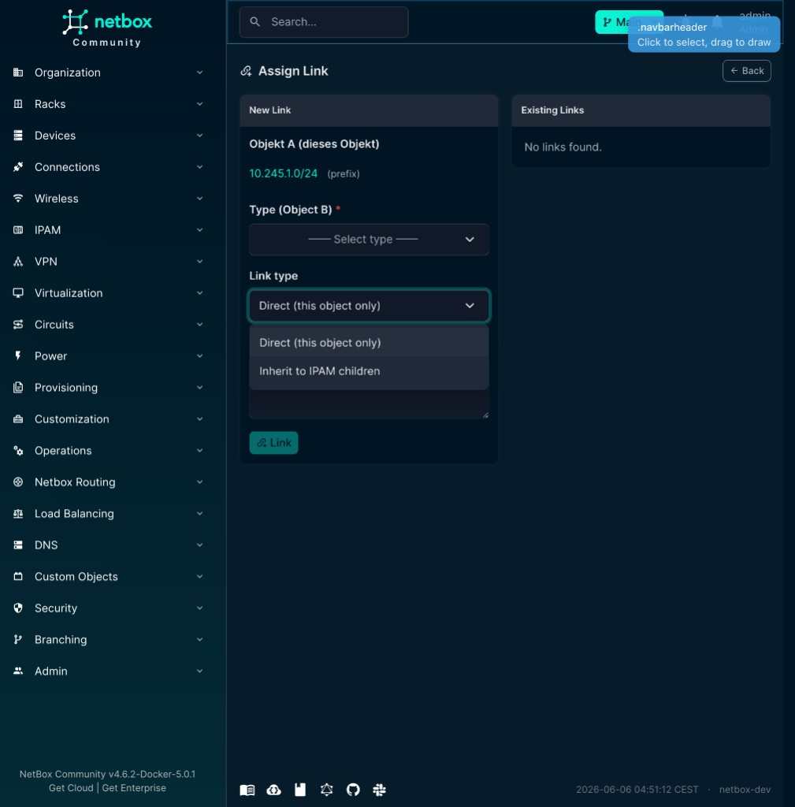

The screenshot shows assignment from prefix **`10.245.1.0/24`**: **Object A** is fixed to the
current NetBox object; you choose NSM type and target on the right.

| Field | Description |
|---|---|
| **Object A (this object)** | The host you came from (prefix, IP, device, interface, VM, …) — read-only. |
| **Type (Object B)** | NSM security type for the link — only types with **Linkable in panel** allowed in TypeConfig (zones, addresses, labels, custom types, …). |
| **Link type** | **Direct (bidirectional, visible on both sides)** — link applies only to this object (no child propagation). **Inherit to IPAM children (prefixes, addresses, ranges)** — sub-prefixes, IP addresses, and IP ranges under this prefix inherit the link (macro zone on parent prefix). **Inherit to group members** — members of a group/container inherit the link. See [Creating an inheriting assignment](#creating-an-inheriting-assignment) for the dropdown screenshot. |
| **Link** | Creates the ObjectLink; **Existing Links** on the right lists current assignments for object A. |

After **Link**, go back via **Back** — the Security Panel shows the new entry under the
matching type group (e.g. **Zones**).

Examples:

- From a **prefix** — zone `prod` with **Inherit to IPAM children** for macro segmentation, or **Direct** for a single subnet only.
- From an **interface** — zone `app-x` with **Direct** as a micro zone on a NIC.
- From a **zone** custom object — assign allowed host types *linked to* this zone (reverse perspective still uses ObjectLinks).

Remove a direct link with the × button in the panel row (write permission required).
Inherited links have no remove action — change or remove the link on the ancestor prefix,
or add a direct override on the child.

### Screenshots — optional additions

These views would further illustrate the Security Panel workflow:

| Suggested filename | What to capture |
|---|---|
| `14-device-security-panel.png` | Device detail — inherited + direct zone links |
| `13-ipaddress-nsm-panel.png` | IP Address — inherited badges from parent prefix |

Existing assets: `07-zone-detail.png`, `12-prefix-security-panel.png`, `17-assign-picker.png`, `17-assign-link-propagation-types.png`.

---
## TypeConfigs

**Security → Configuration → Type Configs**

A TypeConfig connects a Custom Object Type (or other NetBox ContentType) to NSM behavior:
how objects appear in the Security Panel, rule pickers, and display strings. Placement in rule columns
is configured per **RulebookField**; TypeConfigs define which panel sections and
matching classes each object type belongs to.

After the Setup wizard (section 3), seven built-in TypeConfigs exist — one per bundled COT.

### List view

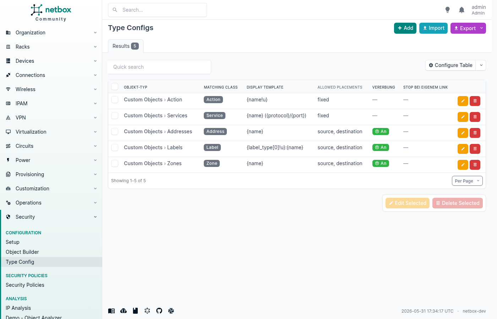

The list shows all TypeConfigs with quick search, **+ Add**, import/export, and edit/delete per row.

| Column | Description |
|---|---|
| **Name** | Display name used as type label in NSM (link to edit form). |
| **Object Type** | Linked ContentType as *App › Model* (e.g. *Custom Objects › Zones*). |
| **Matching Class** | Semantic category badge (`Zone`, `Address`, `Label`, `Service`, `Action`, `Info`, `Application`, …). Controls rulebook matching and icons. |
| **Panel slugs** | Comma-separated Security Panel sections where this type is listed: *Source*, *Destination*, *Services*, *Action*, *Info*. |
| **Sort order** | Numeric order within panel sections (lower = higher in lists). |
| **Display Template** | Format string for object labels; `{field}` placeholders are substituted from the object (e.g. `{name}`, `{label_type[0]!u}: {name}`, `{name} ({protocol}/{port})`, `{name!u}`). |
| **Panel linkable** | Which NetBox object types may assign this NSM type via **+ Assign**. Badge *All types* when unrestricted; otherwise list of allowed types (e.g. *Interface*, *Prefix*). |

Built-in defaults (after Setup):

| Name | Object Type | Matching Class | Panel slugs | Sort order | Display Template |
|---|---|---|---|---|---|
| Zones | Custom Objects › Zones | Zone | Source, Destination | 10 | `{name}` |
| Addresses | Custom Objects › Addresses | Address | Source, Destination | 20 | `{name}` |
| Labels | Custom Objects › Labels | Label | Source, Destination | 30 | `{label_type[0]!u}: {name}` |
| Services | Custom Objects › Services | Service | Services | 100 | `{name} ({protocol}/{port})` |
| Business Apps | Custom Objects › Business Apps | Info | Info | 110 | `{name}` |
| Network Apps | Custom Objects › Network Apps | Application | Services | 110 | `{name}` |
| Action | Custom Objects › Action | Action | Action | 200 | `{name!u}` |

### Edit form

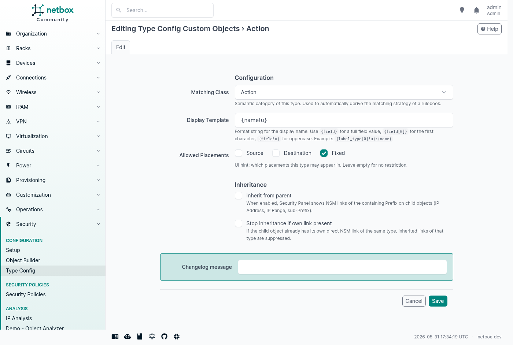

**Identity**

| Field | Description |
|---|---|
| **Name** | Required display name (e.g. *Zones*). Appears in panel headers, pickers, and the list. |

**Configuration**

| Field | Description |
|---|---|
| **Matching Class** | Dropdown — semantic role (`Zone`, `Address`, `Label`, `Service`, `Action`, `Info`, `Application`, …). |
| **Display Template** | Monospace text field; default `{name}`. Controls pill and list entry rendering. |
| **Panel slugs** | Checkboxes for *Source*, *Destination*, *Services*, *Action*, *Info*. Defines which Security Panel sections list objects of this type. |
| **Sort order** | Integer; order within those sections (Zones = 10, Addresses = 20, …). |
| **Linkable in panel** | Multi-select of NetBox object types (`dcim`, `ipam`, `virtualization`, `netbox_custom_objects`, …). **Empty** = any object type may link this NSM type via **+ Assign**. Restrict to e.g. *Interface* only if zones should be assignable from interfaces, not prefixes. |

When **Add**ing, an additional **Object Type** field selects the ContentType (COT or native NetBox model).

> Prefix/IP inheritance (`inherit from parent`, `stop on own link`) lives in the TypeConfig
> model and is set by the Setup wizard for built-in types; not visible in the standard edit form.

### Extending NSM: custom and native object types

NSM separates **inventory hosts** (prefix, IP, device, interface, VM, …) from **security objects**
(the things in rule columns and assignments via the Security Panel). Both sides are flexible.

#### Rulebooks — any TypeConfig-backed object in columns

Every **rulebook field** (Source, Destination, Service, …) accepts one or more **TypeConfig**
entries (`RulebookFieldType`). Rule editor and inline cell picker list every object instance
of those types — built-in COTs (zones, addresses, …) or **your own** types after registration.

| Layer | What you configure | Result |
|---|---|---|
| **Rulebook → Fields** | Child fields under Source/Destination/Service containers; attach TypeConfigs | New columns in Rules tab and matrix matching |
| **TypeConfig** | ContentType + matching class + display template | Objects appear in pickers with correct labels and colors |
| **Allowed types** (optional) | Restrict field to specific TypeConfigs | e.g. only `Zone` types in Source, only custom `AppSegment` in Destination |

You are not limited to zones and addresses: if NetBox can store the object and NSM has a
TypeConfig for its ContentType, it can be referenced in rules.

#### Security Panel — links on every NetBox object

The Security Panel is embedded on **every** supported NetBox detail page (IPAM, DCIM,
virtualization, custom objects, …). **+ Assign** creates **ObjectLinks** from the current
object to security objects whose TypeConfig allows this host type (**Linkable in panel**).

The same custom type from rule columns can be assigned here — e.g. link an interface with
macro zone `prod` and micro zone `app-payroll`, see both in the panel and in matching
rules.

#### When NetBox has no table for your concept

If the object class you need does not exist as a native NetBox model:

1. Create a **Custom Object Type** with `netbox-custom-objects` (fields, validation, list/detail UI).
2. Add a **TypeConfig** in NSM (**Security → Type Config → + Add**) — select the new ContentType,
   set **Matching Class**, **Panel slugs**, **Display Template**, and **Linkable in panel**.
3. Add **rulebook fields** referencing the new TypeConfig (pencil on container → allowed types).
4. **Assign instances** from prefixes, devices, VMs, etc. via **+ Assign** — they appear in the
   Security Panel and can be picked in rules.

No plugin code changes are needed for a new security object class — only schema (Custom Objects)
and NSM configuration (TypeConfig + rulebook fields).

#### Native NetBox models (advanced)

TypeConfig **Object Type** can also point at a built-in NetBox model if you deliberately want
that model treated as a first-class NSM security object (same panel and picker pipeline). The
usual pattern: **inventory stays native** (prefix, device, …), **policy objects are custom
objects** (or the bundled COTs), linked via ObjectLinks.

---

## Security Rulebooks

**Security → Rulebooks**

A **Rulebook** models the rule base of a firewall (or a logical segment of one). Each rulebook
has its own set of **fields** (columns) that define the column structure.

Because each rulebook defines its own schema, you can document zone-based (Palo Alto,
Fortinet), address-based (iptables, ACLs), and label-based (NSX, Illumio) policies
side by side in the same NetBox instance.

### Rulebook list

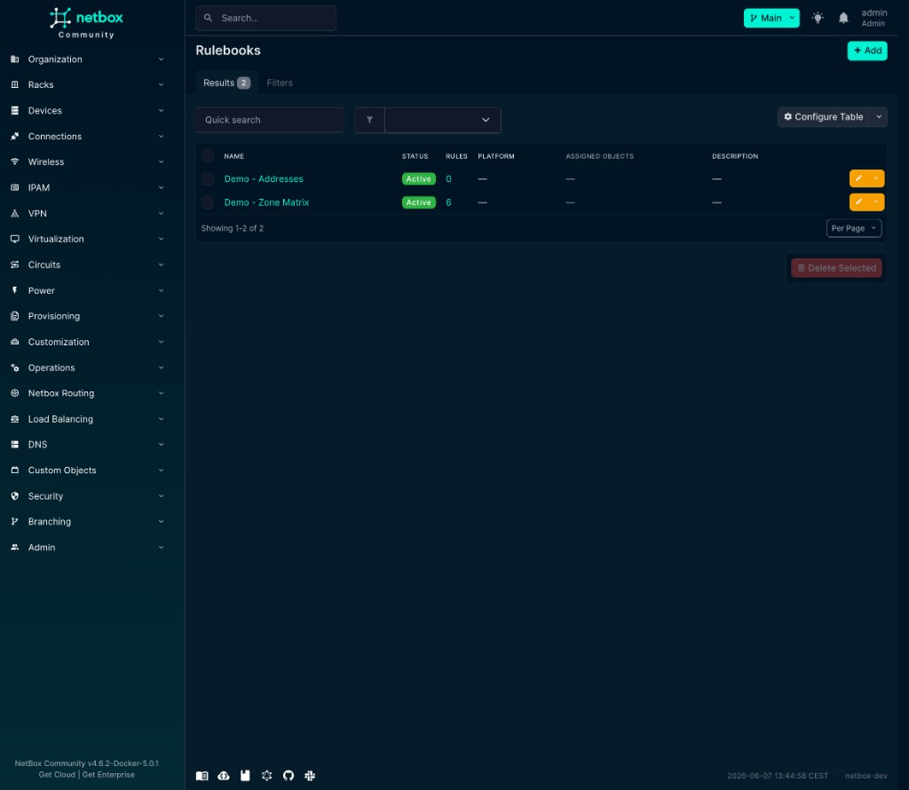

The list shows all policy rulebooks with quick search, **+ Add**, import/export, and edit/delete per row.

| Column | Description |
|---|---|
| **Name** | Rulebook name (link to detail page). Child rulebooks show a **filled dot** before the name (one dot per hierarchy level). |
| **Status** | `Active`, `Deprecated`, `Reserved`, or `Container` (grouping node without rules). |
| **Parent** | Optional parent rulebook for hierarchical grouping. Linked when set; `—` for top-level entries. |
| **Rules** | Rule count (link to Rules tab). |
| **Platform** | Optional link to a DCIM **Platform** (e.g. PAN-OS, Cisco ASA, TrustSec). |
| **Assigned Objects** | Devices, VMs, or VDCs this rulebook documents (via rulebook assignments). |
| **Description** | Free-text notes. |

#### All Rules (virtual rulebook)

**All Rules** is a **read-only virtual rulebook** (not stored in the database). It does **not**
appear in the rulebook list; open it directly:

- **URL:** `/plugins/netbox-nsm/rulebooks/0/` (overview) and `/rulebooks/0/rules/` (Rules tab)
- **Status:** Read-only — no edit/delete actions, no checkbox
- **Rules count:** Total across all rulebooks (e.g. 18,182 in a demo environment)
- **Description:** *Read-only view across all policy rulebooks.*

Use for global search, filter, and analysis of rules without opening each rulebook individually.
The zone matrix is not available for All Rules.

#### Hierarchy (parent / container)

Rulebooks can be organized in a tree:

- Set **Status** to **Container** for a grouping node with child rulebooks that have no
  rules of their own (e.g. `group1` with 0 rules).
- Set **Parent** on child rulebooks to the container. Children appear **below** the parent in
  the list, sorted as a subtree, with a hierarchy dot in the **Name** column.

Containers are for documentation structure only — they do not inherit or merge child rules.

### Create a rulebook

1. Open **Security → Rulebooks** (list above) and click **+ Add**
2. Set name (e.g. `Enterprise - TrustSec Core`), type **Security Rules**, optional
   description, status, **parent** (e.g. container `group1` for hierarchical grouping), and
   platform
3. Save — NetBox opens the rulebook detail page

The detail page has several tabs:

| Tab | Purpose |
|---|---|
| **Rulebook** | Metadata, field hierarchy (columns), security assignments |
| **Rules** | Server-rendered policy table (filter query, Table / Group / Matrix modes) |
| **Matrix** | Source × destination heatmap (when enabled on the rulebook) |
| **Contacts** | NetBox contacts linked to this rulebook |
| **Journal** | Journal entries |
| **Changelog** | Audit history |

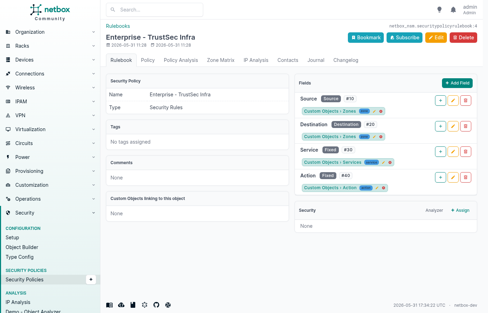

The screenshot shows **Demo - Zone Matrix** from the starter demo: type **Security Rules**,
status **Active**, zone-based **Fields** hierarchy (Source/Destination/Services/Action).
Tabs: **Rulebook**, **Rules**, **Matrix**, **Contacts**, **Journal**, **Changelog**.

A newly created rulebook has no custom fields and no rules yet. Add container and
object fields on the **Rulebook** tab (see below), then switch to **Rules** for policy
rows. Bundled demos (e.g. TrustSec Core) already ship a zone-based field layout.

### Rulebook fields (columns)

On the **Rulebook** tab, the **Fields** card on the right defines the column structure for
the **Rules** tab. Fields are hierarchical:

**System fields** — always present, not deletable:

| Field | Kind | Sort order |
|---|---|---|
| Index | System | 1 |
| Status | System | 2 |
| Name | System | 3 |
| Description | System | 100 |

**Container fields** — group related object columns. Each container has a base sort order
(10, 20, 30, …) and an **Area** (`Source`, `Destination`, or `Fixed`).

On **Enterprise - TrustSec Core** (zone-based, parent `group1`), the **Fields** card shows:

| Container | Area | Sort | Child fields |
|---|---|---|---|
| Source | Source | 10 | Zones (`Zone`, 10) |
| Destination | Destination | 20 | Zones (`Zone`, 20) |
| Service | Fixed | 30 | Services (`Service`, 30) |
| Action | Fixed | 40 | Action (`Action`, 40) |

No **Addresses** columns — this rulebook documents Cisco TrustSec-style zone policies only.
The same containers can hold additional child fields when needed:

| Container | Area | Sort | Optional child fields |
|---|---|---|---|
| Source | Source | 10 | Addresses (`Address`, 10/20) |
| Destination | Destination | 20 | Addresses (`Address`, 20/20) |
| Service | Fixed | 30 | Network Apps (`Application`, 30/20) |

Child fields use composite sort orders (`container/position`, e.g. `10/20`) so columns
stay grouped under their parent. **+** button on a container row to add fields; pencil
icon edits allowed types and options.

Each object column is backed by one or more **TypeConfig** entries (see
[Extending NSM: custom and native object types](#extending-nsm-custom-and-native-object-types)).
Bundled demos use zones, addresses, services, and actions; you can add fields for any
TypeConfig — including custom object types beyond the seven built-ins.

Each object field defines a column in the rule editor:

| Field property | Description |
|---|---|
| **Name** | Internal name (also used for CSV import column headers) |
| **Kind** | `System`, `Container`, or object type (`Zone`, `Address`, `Service`, …) |
| **Area** | On containers: `source`, `destination`, or `fixed` — controls which object types appear |
| **Allowed types** | Optional restriction to specific TypeConfigs (empty = all types for this area) |
| **Sort order** | Column position; containers use round numbers, children `container/position` |

Typical field configurations:

| Style | Fields |
|---|---|
| Zone-based | Source (zone), Destination (zone), Service (fixed), Action (fixed) |
| Address-based | Source (source), Destination (destination), Service (fixed), Action (fixed) |
| App-ID | Source (zone), Destination (zone), Application (fixed), Action (fixed) |

Below the Fields card, the **Security** card links this rulebook to NetBox objects
(**Object Analyzer**, **+ Assign**).

### Rule editor

Rules can be created and edited in two places:

1. **Full-page form** — **+ Add Rule** on the Rules tab (or **Edit** on the rule detail page)
2. **Inline table** — click cells in the policy table to open the object picker (see [Rules grid](#rules-grid))

#### Add / Edit form

**+ Add Rule** opens **Add a new Security Rule** (`/plugins/netbox-nsm/rules/add/`).
From a rulebook's Rules tab, the URL includes `?rulebook=<pk>` so the form
pre-selects that rulebook and sets **Index** to max(existing) + 1.

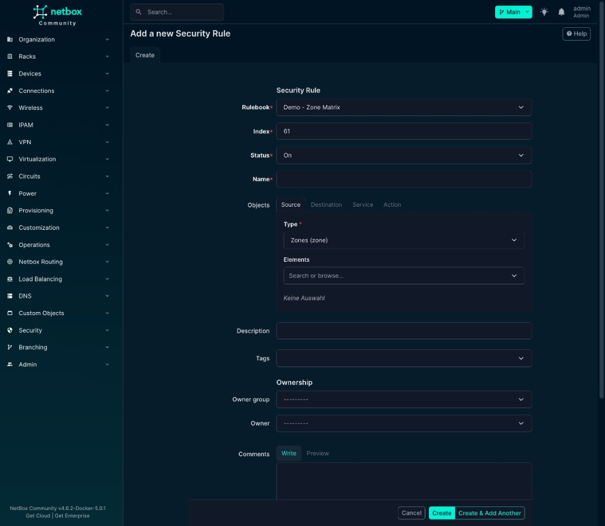

The screenshot shows **Demo - Zone Matrix**: zone-based tabs with active **Source** tab,
type **Zones (zone)**, and empty **Elements** picker (**Keine Auswahl**).

##### Security Rule (metadata)

| Field | Description |
|---|---|
| **Rulebook** | Target rulebook (required). Locked when editing — rules cannot move between rulebooks. |
| **Index** | Sort order within the rulebook (required). Auto-increment when adding from rulebook context. |
| **Status** | **On** / **Off** — whether the rule is active in policy views. |
| **Name** | Rule identifier (required). Appears in grid, matrix filters, and rule trees in the Security Panel. |

##### Objects (Source / Destination / Service / Action)

Tabs mirror the rulebook's container fields (**Source**, **Destination**, **Service**, **Action**).
Tab labels and available types depend on the selected rulebook — change **Rulebook** and the
picker reloads the column layout.

| Control | Description |
|---|---|
| **Type** | Object type picker for the active tab (e.g. **Zones (zone)**, **Addresses (address)**). Shown when the column accepts more than one type. |
| **Elements** | Search or browse field — type to filter or open list to select. |
| **Pills** | Selected objects appear below **Elements** as color-coded pills (from the object's `color` field). **×** on a pill to remove. |

Use **AND** in the picker to build AND groups (see [AND groups](#and-groups)).

##### Additional fields

| Field | Description |
|---|---|
| **Description** | Optional free-text note (last column in the rules grid). |
| **Tags** | Standard NetBox tags. |
| **Owner group** | Optional ownership (NetBox contacts integration). |

Footer actions: **Cancel**, **Create**, **Create & Add Another** (keeps same rulebook, increments index).

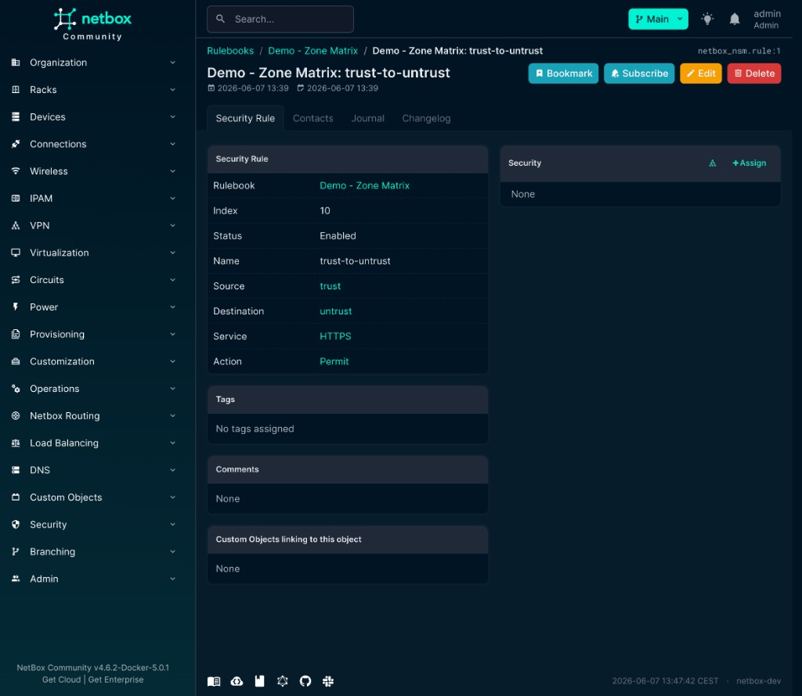

Rule detail page for **trust-to-untrust** in **Demo - Zone Matrix**: metadata, zone/service
columns, and **Security** assignments card.

#### Inline cell editing (rules grid)

On the **Rules** tab, each row is a rule; each cell maps to a field column.

**Edit a rule cell:**

1. Click anywhere in the cell to open the object picker for that column
2. The picker shows:
   - A **type selector** (when the column accepts multiple object types) — choose type to add
   - A **search field** — type to filter or leave empty to browse
   - A **browse list** with up to 10 matching objects
   - A **Load more** button when more than 10 results are available
   - The **current selection** on the right with × buttons to remove
3. Click an item in the browse list to add it to the rule
4. Click outside the picker or press Escape to close

**Edit rule metadata** (name, index, enabled, comment, log):
Click the pencil icon on the left of the rule row, or open the rule detail page and click **Edit**.

### AND groups

By default, multiple elements in a cell are treated as OR (any one can match).

For an AND group (all elements must match), click **AND** in the picker.
This creates a subgroup; elements in the group must match simultaneously.

AND binds tighter than OR — `(A AND B) OR C` means "A and B together, or C alone".

### Rule actions

| Action | How |
|---|---|
| Enable / Disable | Click toggle icon in the rule row |
| Reorder | Edit **Index** in rule metadata |
| Delete | Row checkbox → **Delete selected** |
| Duplicate | Not yet implemented |

---

## Policy views

### Rules grid

The **Rules** tab is the main policy editing and analysis surface. Rules are rendered in a
**server-rendered HTML table**: one row per rule; object columns follow the rulebook field
layout under **SOURCE**, **DESTINATION**, **SERVICE**, and **ACTION** headers.

The same page supports three **view modes** — **Table**, **Group**, and **Matrix** — plus a
filter query bar, drop zones, and an action rail. Use **Table** for everyday editing;
**Group** to collapse rules by column values; **Matrix** for a source × destination heatmap
on the dedicated **[Matrix tab](#zone-matrix)** (see below).

The virtual **All Rules** entry (`rulebook:0`) uses the same table with an extra **Rulebook**
column and scoped filter syntax. **Matrix** mode is not available for All Rules.

#### Toolbar layout

Two bars sit above the grid:

| Bar | Contents |
|---|---|
| **Chrome bar** (top) | **Filter query** input with Apply, Clear filters, and Copy; **object cell display** (comma / lines / +N more); **+ Add Rule**; **Delete selected** (when rows are checked); **Export CSV** |
| **View bar** (below) | **Help** (`?`); **view-mode selector** (Table / Group / Matrix); mode-specific **drop zone**; **action rail** (right) |

Drag-and-drop is disabled in **Table** mode — switch to **Group** or **Matrix** first. The
inline **Help** panel documents the same workflow (grouping steps, matrix axes, CSV export,
`view()` syntax).

**Export CSV** downloads the currently visible data — the flat rules list in Table or Group
mode, or the active matrix when both row and column fields are set.

#### View modes

| Mode | Drop zone | Grid layout | When to use |
|---|---|---|---|
| **Table** | Disabled (hint only) | Flat list — one row per rule | Default editing, filtering, bulk actions |
| **Group** | Group drop zone | Nested group rows when columns are dropped; flat list until then | Summarize rules by zone, action, name, … |
| **Matrix** | Matrix drop zone | Source × destination heatmap when Row + Column slots are filled | Zone (or matching object-type) policy overview |

Switch modes with the **Table / Group / Matrix** buttons, or add `view(table)`,
`view(group)`, or `view(matrix)` to the [filter query](#filter-query-and-view-directives)
(combined with rule filters via **AND**). Only one `view()` directive is allowed per query.

##### Table mode

**Table** is the default. Every rule appears as a single row with inline editing (cell click
opens the object picker), floating column filters, row checkboxes, and status toggles. No
drop zone is active — the view bar shows a short hint to switch to Group or Matrix for
drag-and-drop layout.

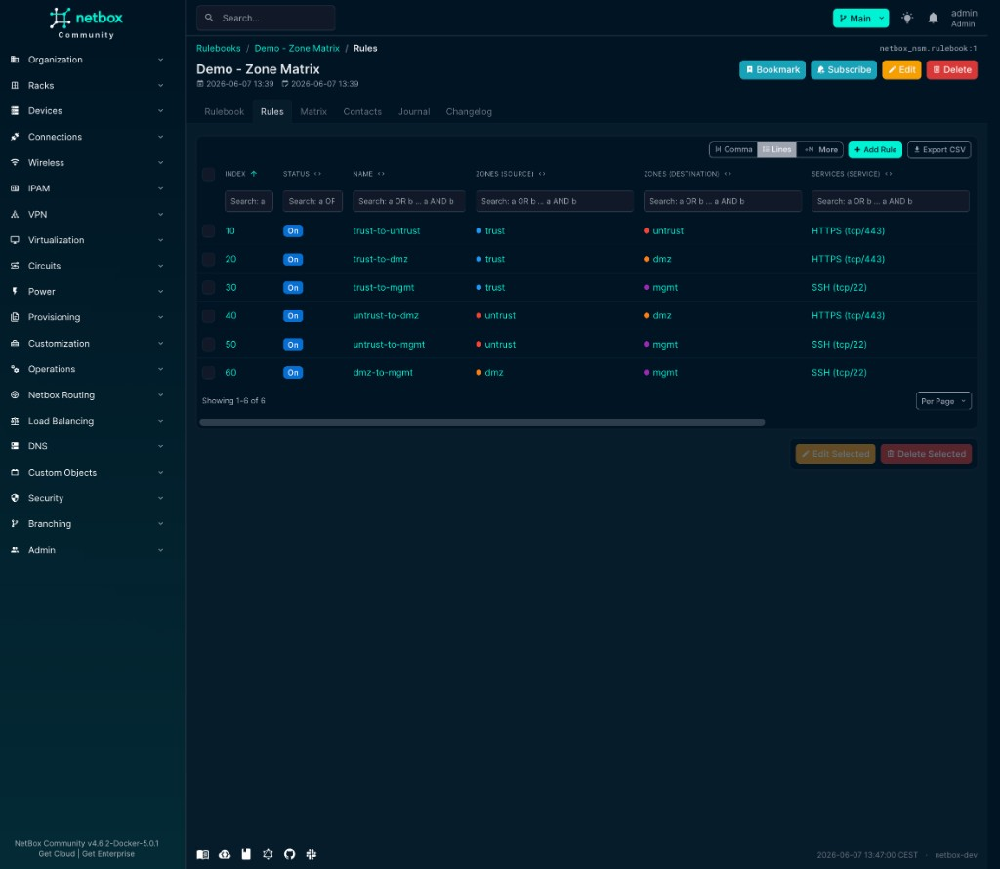

*Starter demo — **Table** mode with zone/service pills, per-column search filters, cell
display toolbar (Comma / Lines / +N More), and **+ Add Rule**.*

##### Group mode

Select **Group**, then drag one or two **column headers** from the grid into the **group
drop zone** (not from a separate chip row). Each dropped column becomes a grouping level;
active levels appear as **pills** in the drop zone:

| Pill role | Level | Meaning |
|---|---|---|
| **Main group** | First column | Top-level group headers (e.g. all rules with the same **SOURCE Zones** value) |
| **Subgroup** | Second column | Nested groups under the main group (maximum **two** levels total) |

Pills show the role label plus the column name (e.g. *Main group · SOURCE Zones*). Remove a
level with **×** on its pill, or drag pills to reorder levels. Grouped columns are hidden
from the flat column area and drive a dedicated **Group** column with expand/collapse
headers and rule counts (e.g. `dev-2 (7)`).

When at least one grouping pill is set, the **action rail** shows **Expand all** and
**Collapse all**. You can also expand or collapse individual group rows in the grid.
Grouping state persists in the URL (`group_by`, `group_by_2`, expansion keys).

`view(group)` selects Group mode in the toolbar. Without grouping pills, the grid stays a
flat table but the group drop zone is enabled so you can drag columns in.

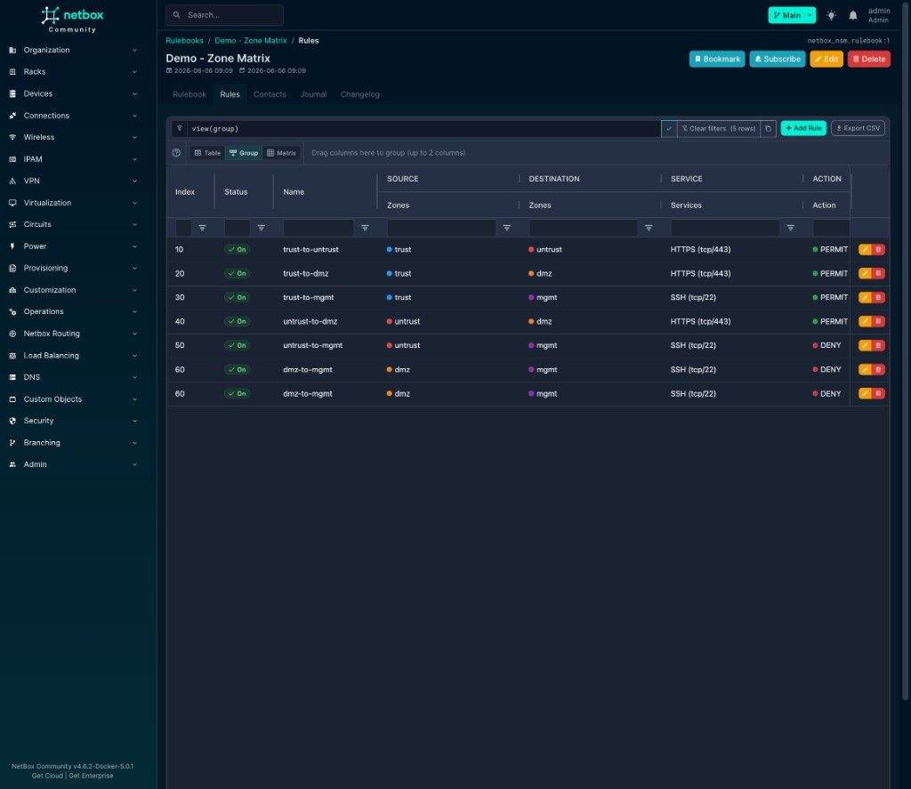

*Starter demo (`rulebook:1`) — **Group** toolbar mode with `view(group)` and no grouping
columns yet: flat rule rows, group drop zone ready.*

##### Matrix mode

Select **Matrix**, then drag two **matching object columns** (same ContentType — e.g.
**SOURCE Zones** and **DESTINATION Zones**) into the matrix drop zone. The first drop fills
the **Row** slot; the second fills **Column**. Pills are labeled **Row** and **Column** plus
the field name. When both slots are set, the grid switches to the embedded heatmap.

Matrix mode is rulebook-only (not All Rules). For cell colors, corner axis filters,
directed/undirected traffic, axis limits, and walkthrough examples, see
[Zone matrix](#zone-matrix).

`view(matrix)` selects Matrix mode; the heatmap appears only when Row and Column fields are
already configured (via drop zone or URL parameters `matrix_row` / `matrix_col`).

#### Mutual exclusivity (Group vs Matrix)

**Group** and **Matrix** layouts cannot be active at the same time:

- Dropping a column into the **group** drop zone clears any matrix row/column configuration.
- Setting matrix **Row** and **Column** fields clears grouping pills and nested group rows.
- The toolbar shows **one** drop zone at a time — group drop zone in Group mode, matrix
  drop zone in Matrix mode; Table mode disables both.

Starting grouping while a matrix is configured (or vice versa) replaces the previous layout.

#### Action rail

The narrow control strip on the right of the view bar appears only when context actions apply:

| Control | Visible when | Purpose |
|---|---|---|
| **Expand all / Collapse all** | Group mode **and** at least one grouping pill | Expand or collapse every nested group row |
| **Directed / Undirected** | Matrix mode **and** both Row and Column fields active | **Directed:** separate **→** (row→column) and **←** lines per cell. **Undirected:** merge A↔B into one cell. |

In **Table** mode, or in Group/Matrix mode before pills or matrix axes are configured, the
action rail stays hidden.

#### Filter query and view() directives

The **filter query** input (chrome bar) accepts shorthand across columns, e.g.:

```text
Name(server OR db) AND Source.Zones(dmz)
```

- **AND** combines conditions across columns; **OR** / nested **AND** in parentheses apply within a column.
- When the same label appears in Source and Destination (e.g. *Zones*), qualify with `Source.Zones` or `Destination.Zones`.
- **Apply** (checkmark) runs the query; **Clear filters** resets column filters; **Copy** copies the current query to the clipboard.
- The query stays in sync with **floating filters** under each column header — edits in either place update the other.
- On the virtual **All Rules** rulebook (`/rulebooks/0/rules/`), an optional rulebook scope prefix is supported (e.g. `"Enterprise - TrustSec Core": Name(…) AND …`).

Append a display-mode directive to the same query (one per query):

| Directive | Effect |
|---|---|
| `view(table)` | Flat rules grid (default); clears grouping and matrix layout |
| `view(group)` | Group toolbar mode; nested rows when grouping pills / `group_by` params are set |
| `view(matrix)` | Matrix toolbar mode; heatmap when Row and Column fields are set |

Example deep link combining rule filter and matrix view:

```text
Destination.Zones(dmz OR mgmt) AND Source.Zones(dmz OR mgmt) AND view(matrix)
```

Changing the view-mode selector updates the query to include or remove the matching
`view()` clause. Deep links and matrix cell navigation use the same syntax via `?nsm_q=…`
(or `filter_q` where configured).

#### Columns

| Column | Description |
|---|---|
| **Group** | Appears when row grouping is active — expand/collapse group headers with rule counts (e.g. `dev-2 (7)`). |
| **Index** | Rule sort order within the rulebook. |
| **Status** | On/Off toggle — enable or disable rule inline. |
| **Name** | Rule name (system field). |
| **SOURCE / DESTINATION / SERVICE / ACTION** | Object columns from the **Rulebook** tab. Each cell shows one or more **pills** (color-coded from the object's `color` field) or plain links for empty values. |
| **Description** | Optional comment (last column before row actions). |
| **Rulebook** | All Rules only — which rulebook owns the row. |

Pills are content-sized (not stretched to column width); long names are truncated with ellipsis.
**DENY** / **PERMIT** action pills use red/green styling.

#### Staged loading

Large rulebooks load in **staged steps** (10 → 20 → 40 → … rows) until the full set is cached client-side
(limit 50,000 rules). Progress bar during fetch; status bar shows loaded
vs. total rows. Floating filters and filter query bar operate on the loaded subset.

#### Row actions

| Action | How |
|---|---|
| Add rule | **+ Add Rule** (toolbar) — opens rule editor |
| Enable / Disable | **Status** toggle in row |
| Edit cells | Click cell for object picker (see [Rule editor](#rule-editor)) |
| Bulk delete | Row checkboxes → **Delete selected** |
| Reorder | Edit **Index** in rule row |

### Zone matrix

The **Matrix** tab renders zone (or other object) policy as a **source × destination**
heatmap. Rows are **Source** objects; columns are **Destination** objects. Each cell
summarizes matching rules (Permit/Deny from the **Action** column) instead of listing every
rule row.

Available only for normal rulebooks with **Matrix tab** enabled — the virtual **All Rules**
entry has no matrix mode. Legacy bookmarks to `/rulebooks/<pk>/matrix/` still work.

#### Example rulebook: Demo - Zone Matrix

The **Starter demo** in Setup (Section 4) creates **Demo - Zone Matrix** with four zones
(`dmz`, `mgmt`, `trust`, `untrust`) and six example rules. Use it to learn the matrix UI
without the Enterprise DC dataset.

| Step | Action |
|---|---|
| Create demo data | **Security → Setup → Demo → Starter demo** |
| Open rulebook | **Security → Rulebooks → Demo - Zone Matrix → Rules** |
| Browse rules | **Table** or **Group** view — see [Group mode](#group-mode) |
| Switch to matrix | Click **Matrix** in the view-mode selector (Table / Group / Matrix) |
| Set axes | Drag **Source / Zones** into the drop zone (Row), then **Destination / Zones** (Column) |
| Deep link | Add `view(matrix)` to the filter query, e.g. `view(matrix)` |

**Recommended doc walkthrough** — undirected mode, rule filter, and corner axis filters together:

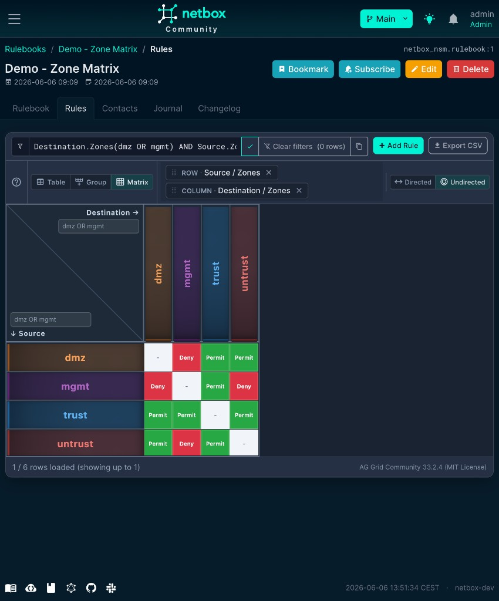

*Demo rulebook from **Starter demo**. Regenerate with [`make_screenshots.py`](img/make_screenshots.py).*

Why this view works well as a documentation example:

| Aspect | What the screenshot shows |
|---|---|
| **Filtered subset** | Only zones whose names match `dmz` or `mgmt` appear on both axes — a readable 2×2 focus inside the full 4-zone rulebook. |
| **Rule filter query** | The filter bar limits which rules load (`1 / 6 rows` in the status line). |
| **Corner filters** | The top-left cell hosts separate **Source** and **Destination** axis filters (`dmz OR mgmt` on both). |
| **Undirected merge** | **Undirected** in the action rail merges A↔B into one cell (e.g. **Deny** for dmz↔mgmt instead of separate → / ← lines). |

**Filter query** (rule bar — combine with `view(matrix)` for a deep link):

```text
Destination.Zones(dmz OR mgmt) AND Source.Zones(dmz OR mgmt)
```

Only rules that touch `dmz` or `mgmt` on **both** source and destination are shown. Qualify
`Source.Zones` / `Destination.Zones` when the same label appears in both columns (see
[Filter query and view() directives](#filter-query-and-view-directives).

**Corner axis filters** (matrix top-left — independent of the rule filter bar):

```text
dmz OR mgmt
```

Enter the same expression in both Source and Destination fields to limit rows and columns.
Syntax: space-separated **OR** groups; **AND** / `&&` within a group (substring match,
case-insensitive). See [Corner header](#corner-header-source--destination-filters).

Toggle **Undirected** in the action rail or add `mode=undirected` to the URL. Persist axis
filters via `src_q` and `dst_q` query parameters.

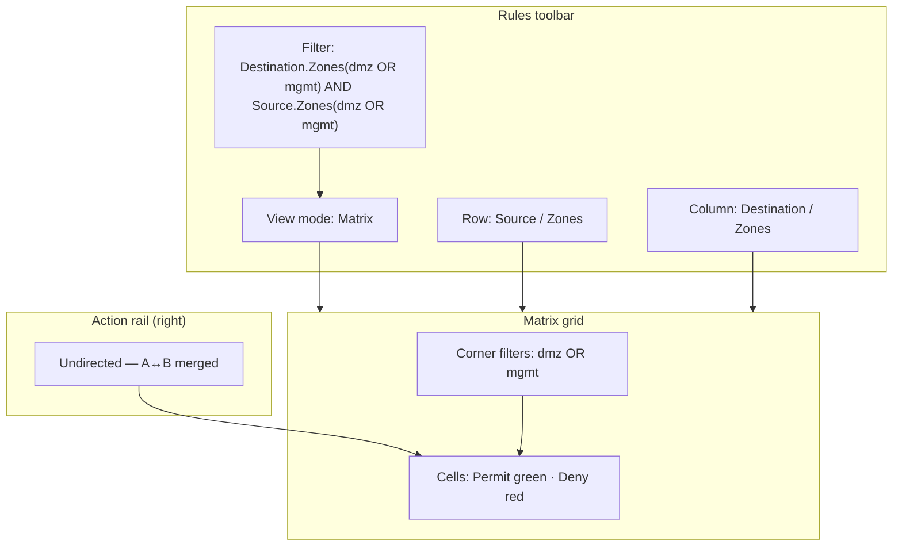
```mermaid
flowchart TB
  subgraph toolbar ["Rules toolbar"]
    VM["View mode: Matrix"]
    DZ["Row: Source / Zones"]
    CZ["Column: Destination / Zones"]
    FQ["Filter: Destination.Zones(dmz OR mgmt) AND Source.Zones(dmz OR mgmt)"]
  end
  subgraph rail ["Action rail (right)"]
    DIR["Undirected — A↔B merged"]
  end
  subgraph grid ["Matrix grid"]
    CORNER["Corner filters: dmz OR mgmt"]
    CELLS["Cells: Permit green · Deny red"]
  end
  VM --> grid
  DZ --> grid
  CZ --> grid
  FQ --> VM
  DIR --> CELLS
  CORNER --> CELLS
```

**Full grid reference** — all four demo zones, `view(matrix)` (before axis subset filters):

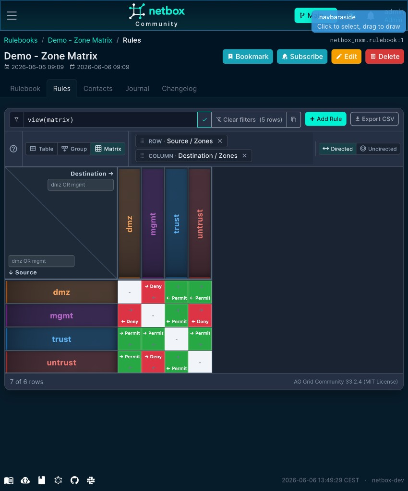

*Complete 4×4 heatmap for **Demo - Zone Matrix**. Corner axis filters show `dmz OR mgmt`; all zones
remain on both axes. Compare with the filtered 2×2 undirected walkthrough below.*

**Directed reference** — all six demo rules, forward **→** only (empty cells show **+**):

| Rule | Source | Destination | Action |
|---|---|---|---|
| trust-to-untrust | trust | untrust | permit |
| trust-to-dmz | trust | dmz | permit |
| trust-to-mgmt | trust | mgmt | permit |
| untrust-to-dmz | untrust | dmz | permit |
| untrust-to-mgmt | untrust | mgmt | deny |
| dmz-to-mgmt | dmz | mgmt | deny |

| Source ↓ \ Dest → | dmz | mgmt | trust | untrust |
|---|---|---|---|---|
| **dmz** | ◆ | → deny | — | — |
| **mgmt** | — | ◆ | — | — |
| **trust** | → permit | → permit | ◆ | → permit |
| **untrust** | → permit | → deny | — | ◆ |

◆ = diagonal. **—** = no rule in that direction.

For a large production-style rulebook, the same UI scales to many zones:

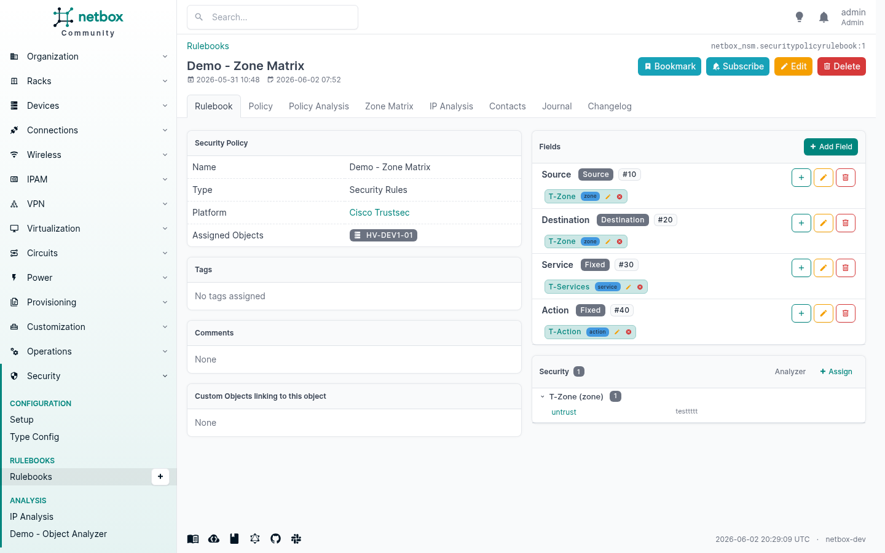

#### Toolbar and view modes

For the shared chrome bar (filter query, CSV export), view-mode selector, drop zones,
mutual exclusivity between Group and Matrix, and the action rail, see
[Rules grid](#rules-grid). The summary below focuses on matrix-specific behavior.

Above the grid, the **view-mode selector** switches layout (Group and Matrix are mutually exclusive):

| Mode | Drop zone | Result |
|---|---|---|
| **Table** | Disabled | Flat rules grid (default) |
| **Group** | Drag up to two column headers | Nested group rows; expand/collapse in action rail |
| **Matrix** | Drag two **matching** object columns (same ContentType) | Source × destination heatmap |

Quick start: choose **Matrix**, drag **Source / Zones** (Row slot), then **Destination / Zones**
(Column slot). Remove a slot with **×** on its pill. The **?** help button documents the same
steps inline.

Alternatively, set row/column fields once and persist them in the URL (`matrix_row`, `matrix_col`)
or add **`view(matrix)`** to the filter query bar (combines with rule filters via **AND**).

#### Action rail

Matrix-specific controls on the right of the view bar (see also [Action rail](#action-rail)
in Rules grid):

| Control | Visible when | Purpose |
|---|---|---|
| **Directed / Undirected** | Matrix mode active | **Directed:** **→** (row→column) and **←** (column→row) in separate lines per cell. **Undirected:** bidirectional traffic merged (A↔B). |
| **Expand all / Collapse all** | Group mode with grouping pills | Expand or collapse all grouped rows |

In **Directed** mode, arrow labels use the rule **Action** (e.g. Permit, Deny); cell background
uses the action object's color (green/red). Multiple rules in one direction show a count badge.

#### Corner header (Source / Destination filters)

The top-left **corner cell** labels the axes (**Source ↓** down the rows, **Destination →**
across the columns) and hosts **axis filters** (see the [Demo walkthrough](#example-rulebook-demo---zone-matrix)):

| Field | Filters |
|---|---|
| Source (rows) | Which source zones appear as rows |
| Destination (columns) | Which destination zones appear as columns |

Syntax: space-separated **OR** groups; within a group, **AND** / `&&` requires all terms to match
(substring match on zone names, case-insensitive). Example: `dmz OR mgmt` limits both axes to zones
whose name contains `dmz` or `mgmt`. Combine with AND: `prod AND test`.

#### Cells and interactions

| Element | Meaning |
|---|---|
| **Permit / Deny** label | Action from the matching rule(s) |
| Green / red background | Action object color |
| **+** | No rule for that direction — click to open a pre-filled **Add Rule** form |
| **Gold border** | Diagonal — source zone equals destination zone |
| Cell click (with rules) | Jump to **Table** view with filters for that source/destination pair |

#### Directed vs undirected

| Mode | Behavior |
|---|---|
| **Directed** | Each cell shows **→** (source→dest) and **←** (dest→source) separately. |
| **Undirected** | Traffic between A and B merged in one cell. |

Toggle via the action rail or URL parameter `mode=undirected`.

#### Limits and best use

**Axis limit:** Each axis shows at most **250** zones (`MATRIX_AXIS_MAX`). If a rulebook
references more zones, a warning banner appears and only the first 250 source and/or destination
zones are shown.

Works best for rulebooks with zone objects in Source and Destination fields (Palo Alto, Fortinet,
Cisco ASA, Check Point, …). For address-based rulebooks, the matrix is less meaningful — see
[KNOWN_ISSUES](../KNOWN_ISSUES.md).

### IP Analysis

**Not in the Security menu** — open from the **Security Panel** on any address-analyzable
object (prefix, address, address custom object, …): click the **loupe** (🔍) in the panel
header or on a linked row. The overlay compares prefix trees side by side (same backend as
the standalone page).

**Direct URL:** `/plugins/netbox-nsm/ip-analysis/` (optional; useful for deep links with
`?ip_ct=&ip_pk=&ip_name=` query parameters).

Compares how different security objects resolve to IP prefixes and networks — side by side in
two columns. Useful for address-based rulebooks and overlap checks between zones, address
groups, or custom objects.

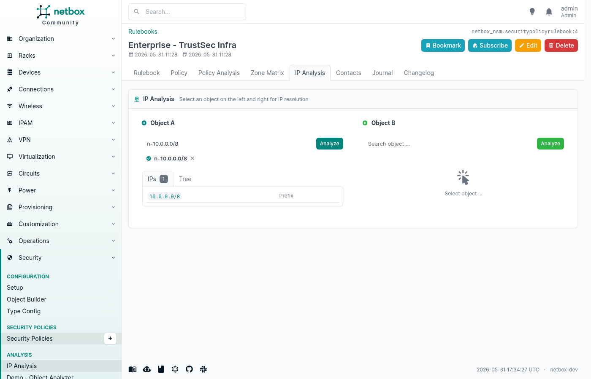

#### Workflow

1. Open a **prefix**, **IP address**, or **address** custom object → **Security Panel** →
   **loupe** (🔍), **or** browse to `/plugins/netbox-nsm/ip-analysis/`.
2. Add objects per column via **Search and add objects…** (chips label each column).
3. Click **Analyze** in each column to resolve the hierarchy.
4. Expand tree nodes — leaves show `object → prefix` (e.g. `demo-addr-0016 → 10.245.16.0/24`).

#### CSV export

There is no file download button. Use **Copy** icons on tree nodes (**All**, groups, leaves)
to copy **CSV path** lines to the clipboard — comma-separated, no spaces.

| Copy scope | Line format (example) |
|---|---|
| **All** (top summary) | `all,group,object,10.0.0.0/24` |
| Group / leaf | `group,object,10.0.0.0/24` (without the leading `all,`) |

The **CIDR / Mask** toggle on the **All** row applies to prefix segments in copied lines.
Paste into a spreadsheet or script for further analysis.

Requires at least one **Address** matching TypeConfig in the rulebook's field layout.

---
## Object Analyzer

**Security → Analysis → Object Analyzer**

The Object Analyzer is a read-only graph using **[@xyflow/react](https://xyflow.com/)**
(React Flow, v **12**, [MIT license](https://github.com/xyflow/xyflow/blob/main/LICENSE)),
visualizing how a NetBox object connects to NSM links, infrastructure neighbors, and
policy references. It mirrors the Security Panel and rulebook assignments, but as an
explorable tree you can walk node by node. The library is loaded only on this page
from esm.sh (not bundled).

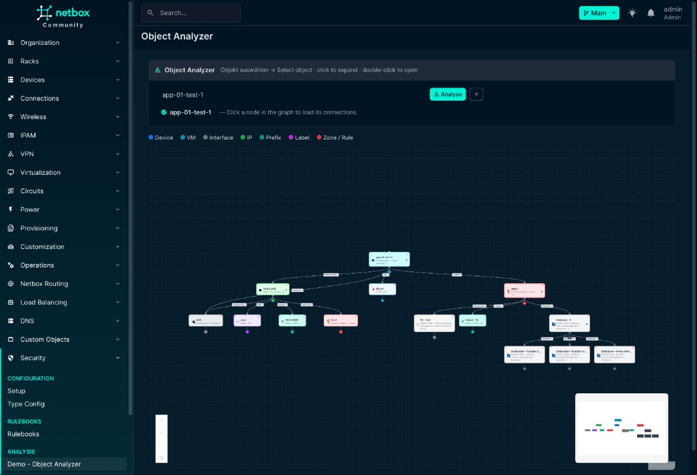

The screenshot uses the **Starter demo** only: root object **dmz** (zone) → rulebook
**Demo - Zone Matrix** → individual rules (`trust-to-untrust`, `trust-to-dmz`, …).
There is no separate Enterprise DC demo dataset in a fresh install — examples in this
section refer to **Demo - Zone Matrix** unless noted otherwise.

### Workflow

1. Open **Security → Analysis → Object Analyzer** (or follow **Object Analyzer** from
   an object's Security Panel).
2. Type a name in the search field — device, VM, IP, prefix, label, zone, rule, …
3. Pick a match from the dropdown (or keep typing until the right object appears).
4. Click **Analyze** — the graph initializes with the chosen object as the root node.
5. **Click** a node to expand its connections; **double-click** opens the NetBox
   detail page for the object. Use zoom controls (bottom left) and minimap (bottom right) for large graphs.

A green checkmark below the search bar confirms the active object. The hint *"Click a node in
the graph to load its connections"* applies after the first expansion.

### Legend (node colors)

| Color | Node type |
|---|---|
| Blue | Device |
| Cyan / Light blue | Virtual Machine |
| Gray | Interface |
| Green | IP address |
| Teal | Prefix |
| Magenta / Pink | Label |
| Red | Zone or Policy Rule |

Custom NSM objects (zones, addresses, labels, services, …) use colors from the legend
entries above the graph (from each TypeConfig).

### What the graph shows

From the root object, edges fan out by relationship type. Edge labels describe the link
(e.g. **Primary IPv4**, **Host**, **Zone**, **Address**, **Label**, **Rulebook**).

| Relationship | Example (Starter demo) |
|---|---|
| **NSM links** | Zone **dmz** → **Rulebook** → **Demo - Zone Matrix** |
| **Policy — Rules** | Rulebook → rules (`trust-to-untrust`, `trust-to-dmz`, `untrust-to-mgmt`, …) |
| **Infrastructure** | Device / VM / prefix → **Zone**, **Label**, interfaces (when linked in NetBox) |

With only the Starter demo loaded, the graph from a zone root is shallow: zone → rulebook →
rules. Infrastructure-heavy paths (VM → host → prefix → labels) need additional NetBox
objects and links beyond the demo seed data.

When multiple children share the same edge label (e.g. several rulebooks under **Zone**), the
graph groups them under a summary node (`Zone · 3`); click the group to show each child.

Inherited links (e.g. zone from a containing prefix on an IP address) appear as in the
Security Panel — the analyzer resolves them via the same edge resolvers.

### Typical questions

- *"Which zone does this prefix / VM belong to?"*
- *"Which interfaces and labels hang off this subnet?"*
- *"Which rulebooks and rules reference this object?"*
- *"Is this server covered by a deny rule anywhere?"*

Object Analyzer is for exploration and documentation — the same facts are in the
**Security Panel** on every object and in the **All Rules** rules grid.

---

## REST API reference

All NSM models are available under `/api/plugins/netbox-nsm/`.
The root endpoint (`GET /api/plugins/netbox-nsm/`) lists all available endpoints.

### Endpoints

| Endpoint | Description | Key filters |
|---|---|---|
| `type-configs/` | TypeConfig entries | `slug`, `matching_class` |
| `object-links/` | ObjectLink entries | `host_ct_id`, `host_obj_id`, `sec_obj_ct_id` |
| `rulebooks/` | Rulebook entries | `name` |
| `rules/` | Rule entries | `rulebook_id`, `enabled` |
| `rulebook-assignments/` | Rulebook → object assignments | — |
| `object-groups/` | ObjectGroup entries | — |
| `rulebook-fields/` | Column definitions per rulebook | `rulebook_id` |
| `rulebook-field-types/` | Allowed types per field | — |
| `rule-object-items/` | Object elements in a rule cell | `rule_id`, `field_id` |
| `rule-group-items/` | AND group elements in a rule cell | `rule_id`, `field_id` |

### Schema import

The COT schema can be (re)applied via the `netbox-custom-objects` API:

```http
POST /api/plugins/custom-objects/schema/apply/
Content-Type: application/json

< nsm-schema.json
```

This is idempotent — existing COTs and fields are updated, not duplicated.

### Authentication

All API endpoints require a NetBox API token:

```bash
curl -H "Authorization: Token <your-token>" \
     https://your-netbox/api/plugins/netbox-nsm/type-configs/
```

---

## Database tables

NSM stores plugin data in PostgreSQL under `netbox_nsm_*` tables (Django app `netbox_nsm`).
Rulebook **fields** map to `netbox_nsm_rulebookfield`; **types within a field** to
`netbox_nsm_rulebookfieldtype` and `netbox_nsm_typeconfig`; rule rows and cell assignments
use `netbox_nsm_rule`, `netbox_nsm_ruleobjectitem`, and `netbox_nsm_rulegroupitem`.

Actual security objects (zones, addresses, labels, etc.) are **not** in these tables — they
live in `netbox-custom-objects` (and NetBox core when referenced).

See **[DATABASE.md](DATABASE.md)** for the full table list, hierarchy, and SQL examples.

---

## Development notes

### Third-party UI libraries

| Library | Use | Version | License |
|---|---|---|---|
| [@xyflow/react](https://github.com/xyflow/xyflow) | Object Analyzer | 12.x (esm.sh) | MIT — CDN import in `object_analyzer.html` |

Rules and Matrix use **server-rendered HTML** (no third-party grid library).

### Template changes require restart

NetBox uses Django's `cached.Loader`, which keeps compiled templates in memory.
**Any change to a `.html` file requires a process restart:**

```bash
docker compose restart netbox
```

Saving in the editor alone is not enough — the old template stays in RAM until restart.

### TypeConfig updates via Setup wizard

When you change TypeConfig field values in `builtin_types.py` or `views/setup.py`, run Setup wizard
**Sync** again to write updates to the database. Existing entries are updated by
sync (not skipped).

### Locale / i18n

Translation strings for templates and Python live in:

```
netbox_nsm/locale/de/LC_MESSAGES/django.po
netbox_nsm/locale/en/LC_MESSAGES/django.po
```

After new `` tags or edits to `django.po`, compile catalogs
(in **netbox-dev** after `docker compose build`, or via host `msgfmt` if installed):

```bash
# netbox-dev (recommended)
./scripts/netbox-compilemessages.sh

# or in the container
docker compose exec -T netbox python /opt/netbox/netbox/manage.py compilemessages
```

Several strings in the rule editor and Security Panel (e.g. `"Member of"`, `"Member"`,
`"Inherited from containing prefix"`) are listed in `django.po` with German translations.
