# NetBox NSM
The NetBox NSM plugin enables NetBox to manage operational security elements related to firewalls and possibly other devices.

## Objectives
NetBox NSM is designed to be the 'Security Source of Truth' analogous to NetBox being the 'Network Source of Truth'.

The plugin stores information about Security Zones and Policies, Firewall Rules, NAT Pools and Rules, making it a data source for automatic provisioning of firewalls and other devices.

Main features include:

* Addresses, Address Sets and Address Lists, used in Security Policies.
* Security Zones and Security Policies
* NAT Pools, Pool Members, NAT Rule Sets and NAT Rules
* Firewall Filters and Firewall Filter Rules
* Device and Virtual Device Context association through various association tables


## Installation and Configuration
The installation of plugins in general is described in the [NetBox documentation](https://netbox.readthedocs.io/en/stable/plugins/).

### Requirements
The installation of NetBox NSM requires a Python interpreter and a working NetBox deployment. The following versions are currently supported:

* NetBox 4.1.0 or higher
* Python 3.10 or higher

### Compatibility
NetBox NSM is compatible with the following NetBox versions.

| NetBox Version | NetBox NSM Version |
|----------------|-------------------------|
| NetBox 4.2     | \>= 1.0.2               |
| NetBox 4.3     | \>= 1.1.0               |
| NetBox 4.4     | \>= 1.3.0               |
| NetBox 4.5     | \>= 1.4.0               |
| NetBox 4.6     | \>= 1.5.0               |


### Installation of NetBox NSM
NetBox NSM is available as a PyPi module and can be installed using pip:

```
$ source /opt/netbox/venv/bin/activate
(venv) $ pip install netbox-nsm
```
This will install NetBox DNS and all prerequisites within the NetBox virtual environment.

### Adding NetBox NSM to the local NetBox requirements
To ensure that NetBox NSM is updated when a NetBox update is performed,  include it in the local requirements file for NetBox:

```
echo netbox-nsm >> /opt/netbox/local_requirements.txt
```
If the local requirements file does not exist, this command will create it.

This will guarantee that NetBox NSM will be updated every time the update script provided with NetBox is executed.

### Enabling the Plugin
In configuration.py, add `netbox_nsm` to the PLUGINS list:

```
PLUGINS = [
    'netbox_nsm',
]
```

### Running the Django database migration procedure
NetBox NSM requires some tables for its data models within the NetBox database to be present. Execute the following command to create and update these tables:

```
/opt/netbox/netbox/manage.py migrate
```

### Restarting NetBox
Restart the WSGI service and the request queue worker to load the new plugin:

```
systemctl restart netbox netbox-rq
```
Now NetBox NSM should show up under "Security" at the bottom of the left-hand side of the NetBox web GUI. If you with the plugin to show up under the "Plugins" menu, you can set
the following settings within your Netbox Configuration:

```
PLUGINS_CONFIG = {
    'netbox_nsm': {
        'top_level_menu': False,
    },
}
```

### Reindexing Global Search
In order for existing NetBox NSM objects to appear in the global search after the initial installation or some upgrades of NetBox NSM, 
the search indices need to be rebuilt. This can be done with the command

```
/opt/netbox/netbox/manage.py reindex netbox_nsm
```
This can be done at any time, especially when items that should show up in the global search do not.


## Object types

NetBox NSM can manage ten different object types: 

* CustomPrefix
* Address
* AddressSet
* SecurityZone
* SecurityZonePolicy
* NatPool
* NatPoolMember
* NatRuleSet
* NatRule
* FirewallFilter
* FirewallFilterRule
* Policer

In addition, further object types are using to handle Many-to-Many relationships with Netbox Device, VirtualDeviceContext and Interface object types. These assignment objects are:

* AddressList -> Address and AddressSet (used with security zone policy list items)
* AddressAssignment -> Device and VirtualDeviceContext
* AddressSetAssignment -> Device and VirtualDeviceContext
* SecurityZoneAssignment -> Device, VirtualDeviceContext and Interface (for assigning an interface to a security zone)
* NatPoolAssignment -> Device, VirtualDeviceContext and VirtualMachine
* NatRuleSetAssignment -> Device, VirtualDeviceContext and VirtualMachine
* NatRuleAssignment -> Interface (Used for outbound interface assignments)
* FirewallFilterAssignment -> Device and VirtualDeviceContext

### Device and Interface Associations

As Objects can be associated to devices, virtual device contexts and interfaces for the purposes of forming a relationship between the object and the device/interface, the ability to create these relationships is handled on the device or interface view.
A series of association 'cards' have been placed on these views to allow for these to be created or viewed.

In the case of an interface association, there is a special case, where NAT rules may contain an outbound interface. The purpose of this NAT rule associations are to assign an interface to the NAT rule so that it can be modelled as such.

For security zones, a device may be associated to a security zone, which may also contain interfaces from the same device. As such, security zones may be associated to both a device and an interface.

### ScreenShots

Devices
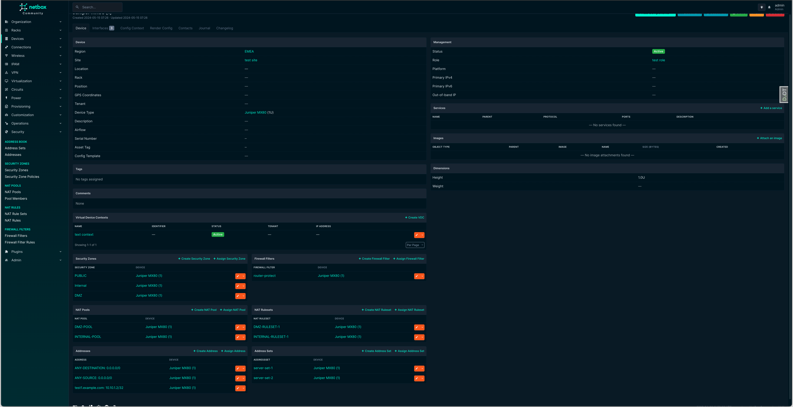

Interfaces
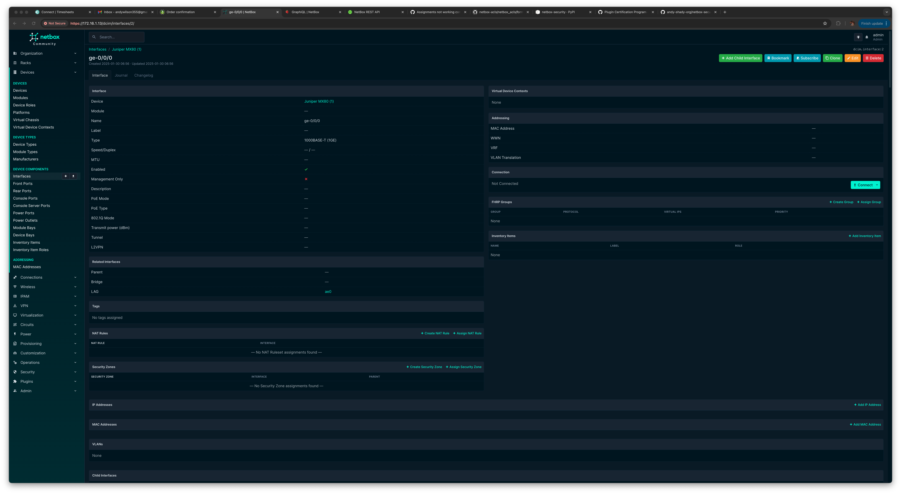


### Custom Prefixes, Addresses, Address Sets and Address Lists

Custom Prefixes and used to store IP Prefixes that are not defined in Netbox IPAM. 
This is useful for storing prefixes that are used in firewall policies but are not necessarily part of the IPAM data, e.g. a prefix that is used for a specific service or application.

Addresses and Address Sets are normally used by security zone policies as source and destination list elements. 
To ensure that both can be used, each Address and AddressSet object needs to be assigned to a unique AddressList object.
AddressList objects are then used as the list items for the relevant source and destination list fields within any given security zone policy.

#### Permissions

The following Django permissions are applicable to Address objects:

| Permission                            | Action                  |
|---------------------------------------|-------------------------|
| `netbox_nsm.add_customprefix`    | Create new view objects |
| `netbox_nsm.change_customprefix` | Edit view information   |
| `netbox_nsm.delete_customprefix` | Delete a view object    |
| `netbox_nsm.view_customprefix`   | View view information   |

| Permission                       | Action                  |
|----------------------------------|-------------------------|
| `netbox_nsm.add_address`    | Create new view objects |
| `netbox_nsm.change_address` | Edit view information   |
| `netbox_nsm.delete_address` | Delete a view object    |
| `netbox_nsm.view_address`   | View view information   |

The following Django permissions are applicable to AddressSet objects:

| Permission                          | Action                  |
|-------------------------------------|-------------------------|
| `netbox_nsm.add_addressset`    | Create new view objects |
| `netbox_nsm.change_addressset` | Edit view information   |
| `netbox_nsm.delete_addressset` | Delete a view object    |
| `netbox_nsm.view_addressset`   | View view information   |

The following Django permissions are applicable to AddressList objects:

| Permission                           | Action                  |
|--------------------------------------|-------------------------|
| `netbox_nsm.add_addresslist`    | Create new view objects |
| `netbox_nsm.change_addresslist` | Edit view information   |
| `netbox_nsm.delete_addresslist` | Delete a view object    |
| `netbox_nsm.view_addresslist`   | View view information   |

#### ScreenShots

Addresses
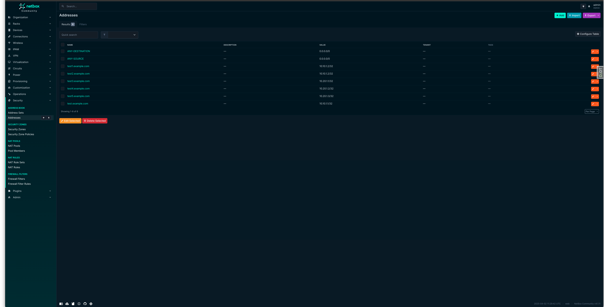
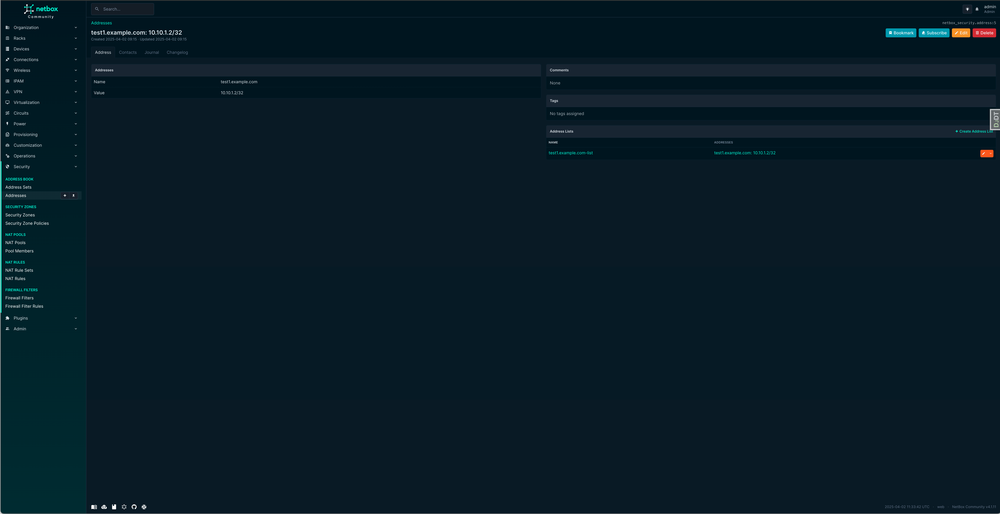

Address Sets
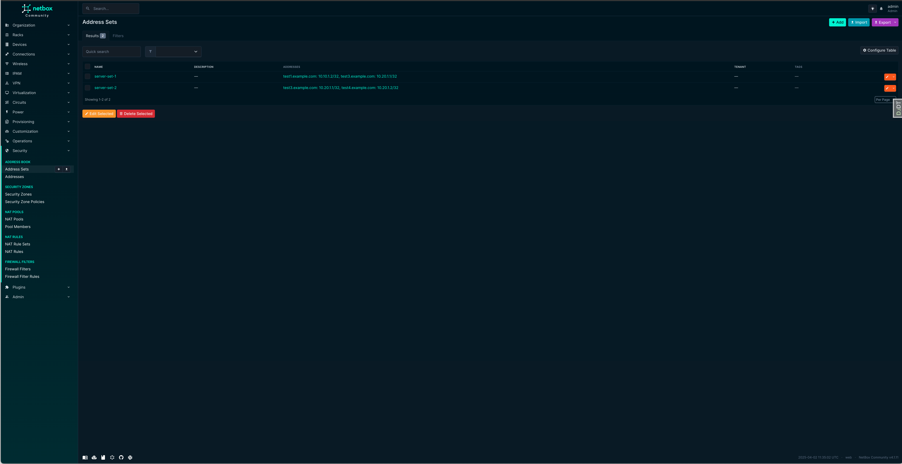
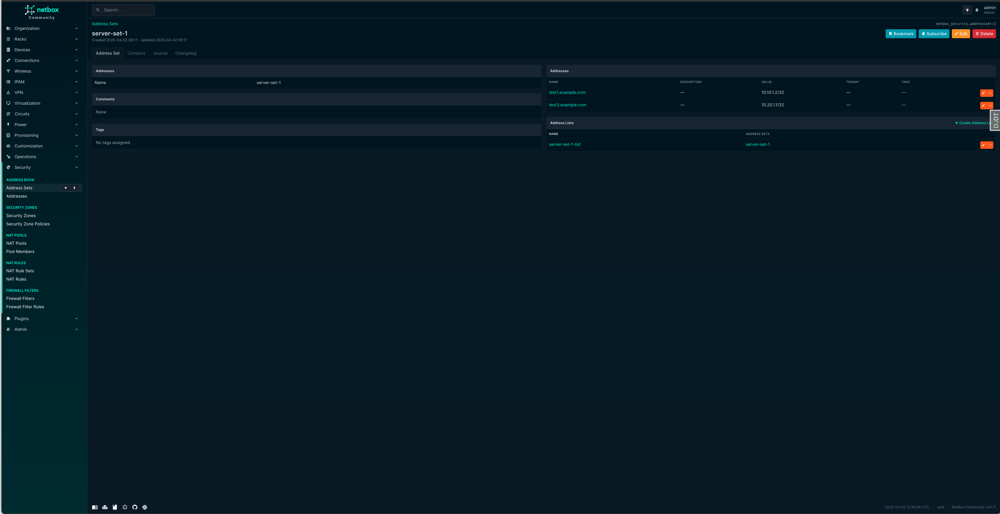


### Security Zones and Security Zone Policies

Firewall security zones are logical groupings of network interfaces used to control and log traffic flow, 
allowing administrators to define security policies based on zones rather than individual interfaces, 
enhancing security and simplifying management.

In NetBox NSM, a security zone can be assigned to one or more devices or virtual device contexts. It can also be assigned to one or more interfaces.
Security zone assignments are stored within the SecurityZoneAssignment table.

#### Permissions

The following Django permissions are applicable to SecurityZone objects:

| Permission                            | Action                  |
|---------------------------------------|-------------------------|
| `netbox_nsm.add_securityzone`    | Create new view objects |
| `netbox_nsm.change_securityzone` | Edit view information   |
| `netbox_nsm.delete_securityzone` | Delete a view object    |
| `netbox_nsm.view_securityzone`   | View view information   |

The following Django permissions are applicable to SecurityZonePolicy objects:

| Permission                                  | Action                  |
|---------------------------------------------|-------------------------|
| `netbox_nsm.add_securityzonepolicy`    | Create new view objects |
| `netbox_nsm.change_securityzonepolicy` | Edit view information   |
| `netbox_nsm.delete_securityzonepolicy` | Delete a view object    |
| `netbox_nsm.view_securityzonepolicy`   | View view information   |


#### ScreenShots

Security Zones
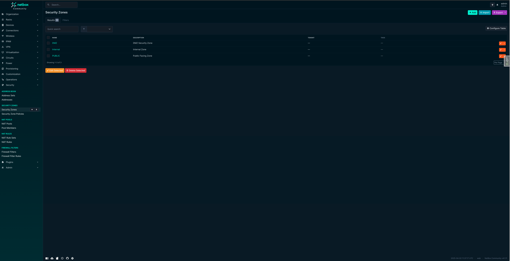
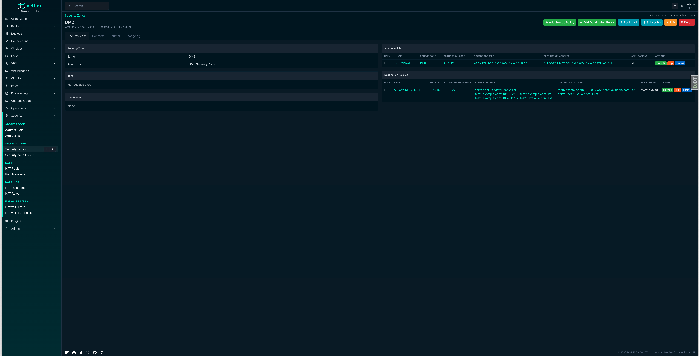

Security Zone Policies
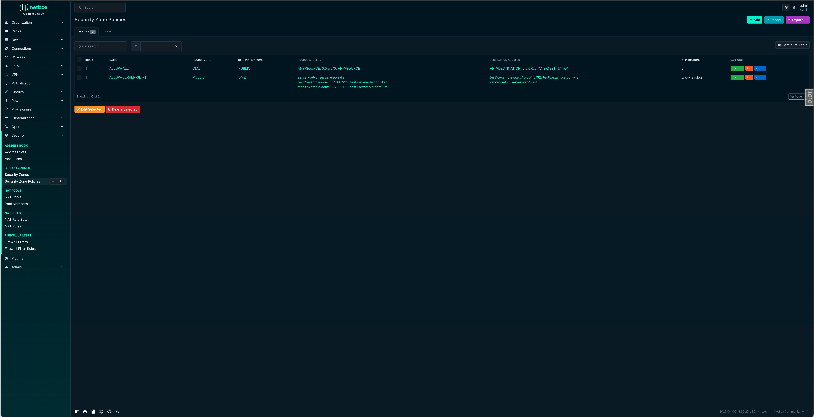
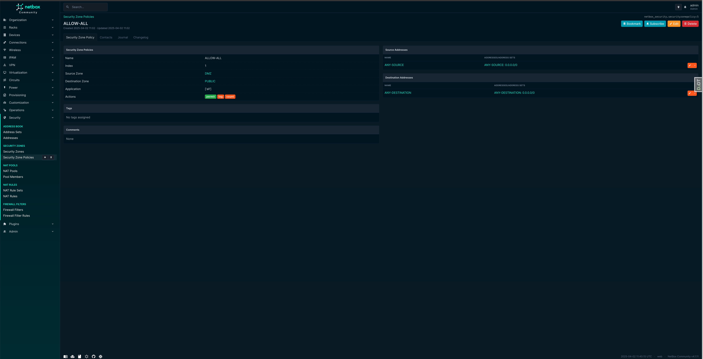


### NAT Pools and NAT Pool Members

NAT Pools are used as part of a NAT operation for forwarding traffic. Nat Pools consist of pool members that are used as the source or destination of the traffic.

In NetBox NSM, a NAT pool can be assigned to one or more devices, virtual device contexts or virtual machines. 
NAT pool assignments are stored within the NatPoolAssignment table.

#### Permissions

The following Django permissions are applicable to NatPool objects:

| Permission                       | Action                  |
|----------------------------------|-------------------------|
| `netbox_nsm.add_natpool`    | Create new view objects |
| `netbox_nsm.change_natpool` | Edit view information   |
| `netbox_nsm.delete_natpool` | Delete a view object    |
| `netbox_nsm.view_natpool`   | View view information   |

The following Django permissions are applicable to NATPoolMember objects:

| Permission                              | Action                  |
|-----------------------------------------|-------------------------|
| `netbox_nsm.add_natpoolmember`     | Create new view objects |
| `netbox_nsm.change_natpoolmember`  | Edit view information   |
| `netbox_nsm.delete_natpoolmember`  | Delete a view object    |
| `netbox_nsm.view_natpoolmember`    | View view information   |


#### ScreenShots

NAT Pools
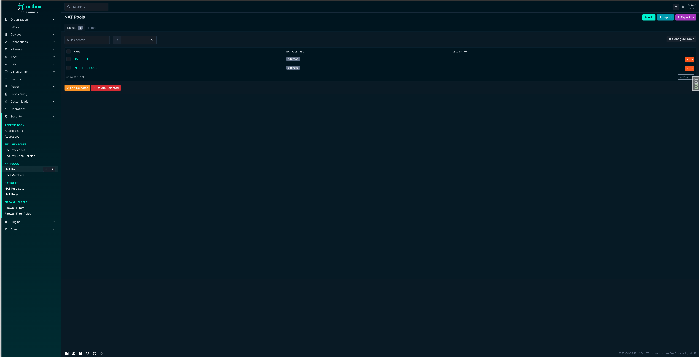
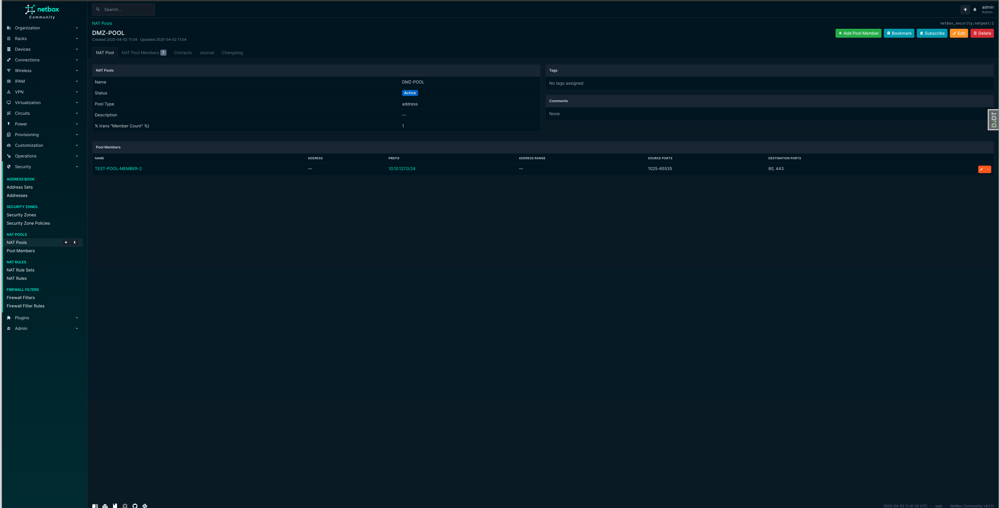

NAT Pool Members

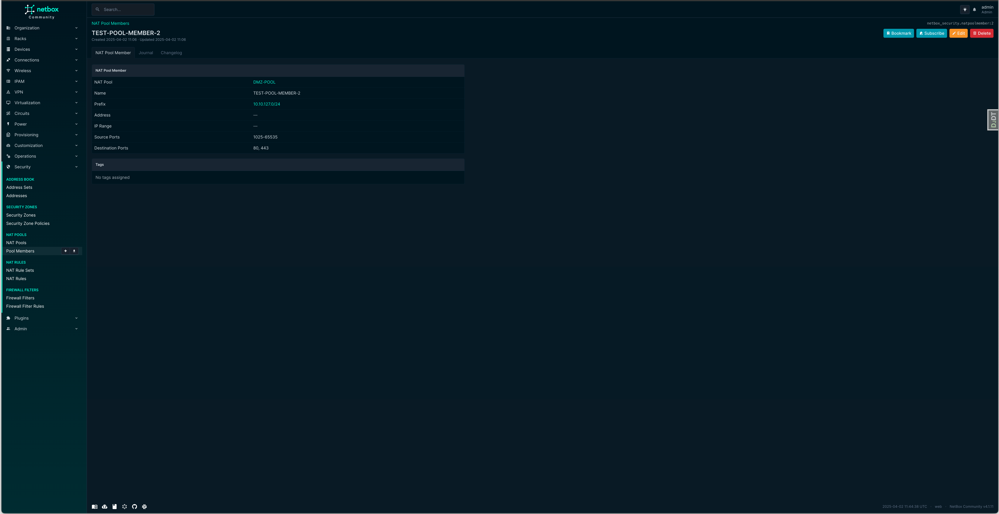


### NAT Rule Sets and NAT Rules

NAT Rule Sets are collections of NAT rules. Nat Rules control the forwarding of NAT based traffic.

In NetBox NSM, a NAT Rule Set can be assigned to one or more devices, virtual device contexts or virtual machines. 
NAT pool assignments are stored within the NatRuleSetAssignment table.

In addition, a NAT Rule may be assigned to an outbound interface, and therefore this assignment is achieved through the NatRuleAssignment table.

#### Permissions

The following Django permissions are applicable to NatRuleSet objects:

| Permission                          | Action                  |
|-------------------------------------|-------------------------|
| `netbox_nsm.add_natruleset`    | Create new view objects |
| `netbox_nsm.change_natruleset` | Edit view information   |
| `netbox_nsm.delete_natruleset` | Delete a view object    |
| `netbox_nsm.view_natruleset`   | View view information   |

The following Django permissions are applicable to NATRule objects:

| Permission                       | Action                  |
|----------------------------------|-------------------------|
| `netbox_nsm.add_natrule`    | Create new view objects |
| `netbox_nsm.change_natrule` | Edit view information   |
| `netbox_nsm.delete_natrule` | Delete a view object    |
| `netbox_nsm.view_natrule`   | View view information   |


#### ScreenShots

NAT Rule Sets
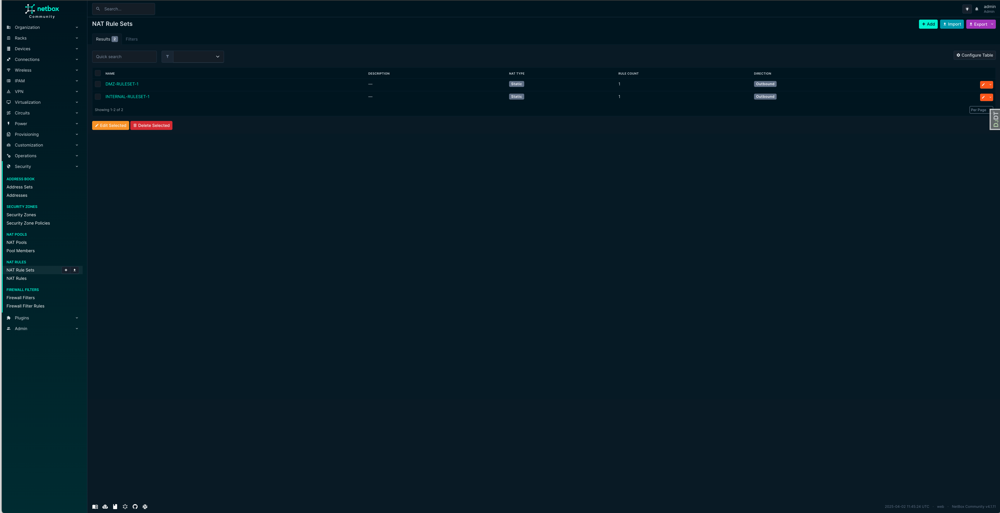
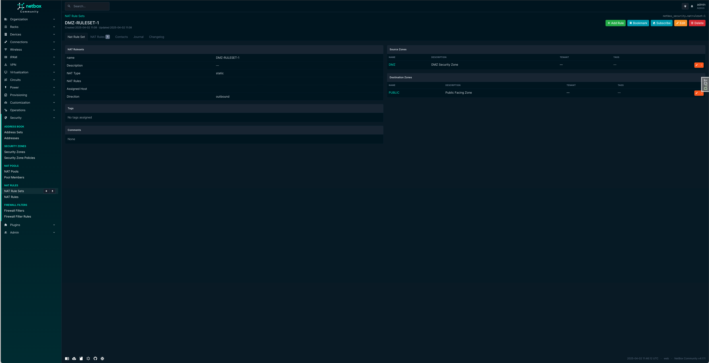

NAT Rules
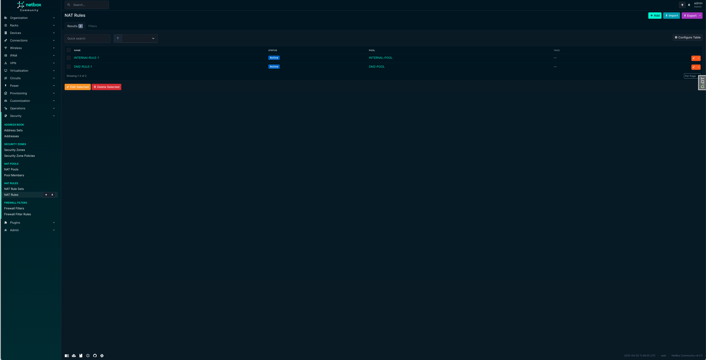
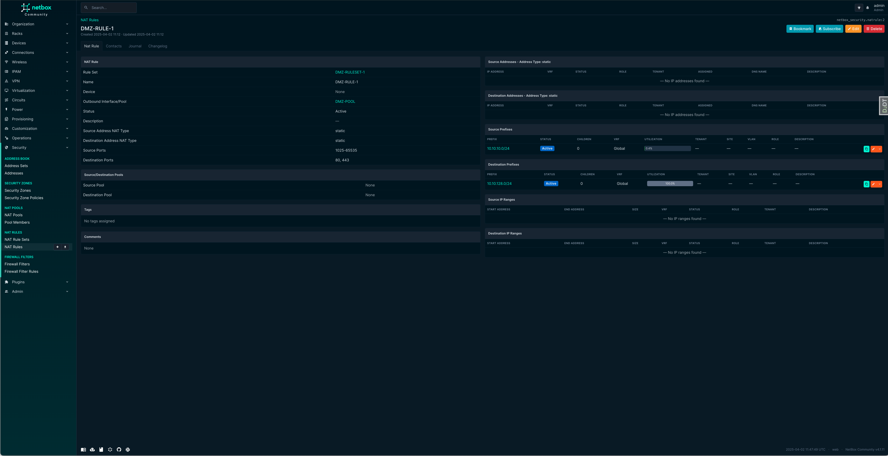


### Firewall Filters, Firewall Rules and Policers

Firewall filters are essentially containers for firewall rules. Different vendors have different types of firewall rules, and 
Cisco Access Lists has been covered in an alternate Netbox plugin.

In NetBox NSM, a Firewall Filter can be assigned to one or more devices or virtual device contexts. 
Firewall Filter assignments are stored within the FirewallFilterAssignment table.

#### Permissions

The following Django permissions are applicable to Firewall Filter objects:

| Permission                              | Action                  |
|-----------------------------------------|-------------------------|
| `netbox_nsm.add_firewallfilter`    | Create new view objects |
| `netbox_nsm.change_firewallfilter` | Edit view information   |
| `netbox_nsm.delete_firewallfilter` | Delete a view object    |
| `netbox_nsm.view_firewallfilter`   | View view information   |

The following Django permissions are applicable to Firewall Filter Rule objects:

| Permission                                   | Action                  |
|----------------------------------------------|-------------------------|
| `netbox_nsm.add_firewallfilterrule`     | Create new view objects |
| `netbox_nsm.change_firewallfilterrule`  | Edit view information   |
| `netbox_nsm.delete_firewallfilterrule`  | Delete a view object    |
| `netbox_nsm.view_firewallfilterrule`    | View view information   |

The following Django permissions are applicable to Policer objects:

| Permission                       | Action                  |
|----------------------------------|-------------------------|
| `netbox_nsm.add_policer`    | Create new view objects |
| `netbox_nsm.change_policer` | Edit view information   |
| `netbox_nsm.delete_policer` | Delete a view object    |
| `netbox_nsm.view_policer`   | View view information   |


#### ScreenShots

Firewall Filters
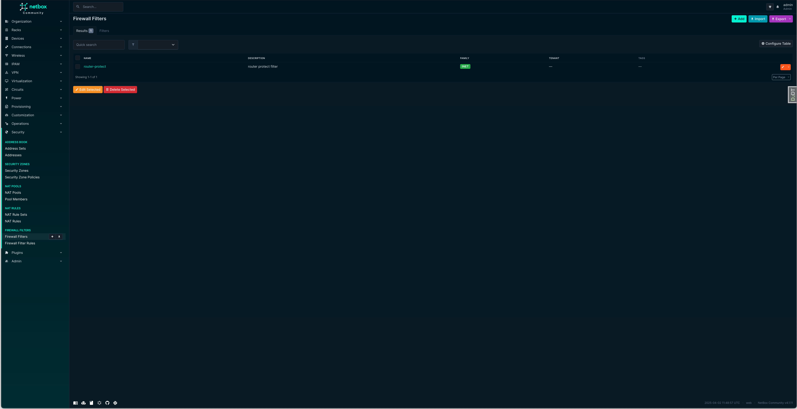
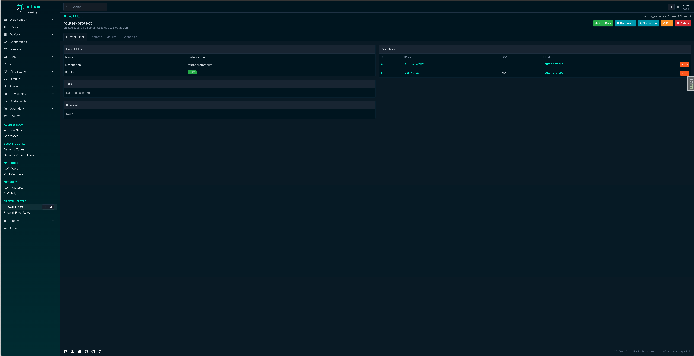

Firewall Filter Rules
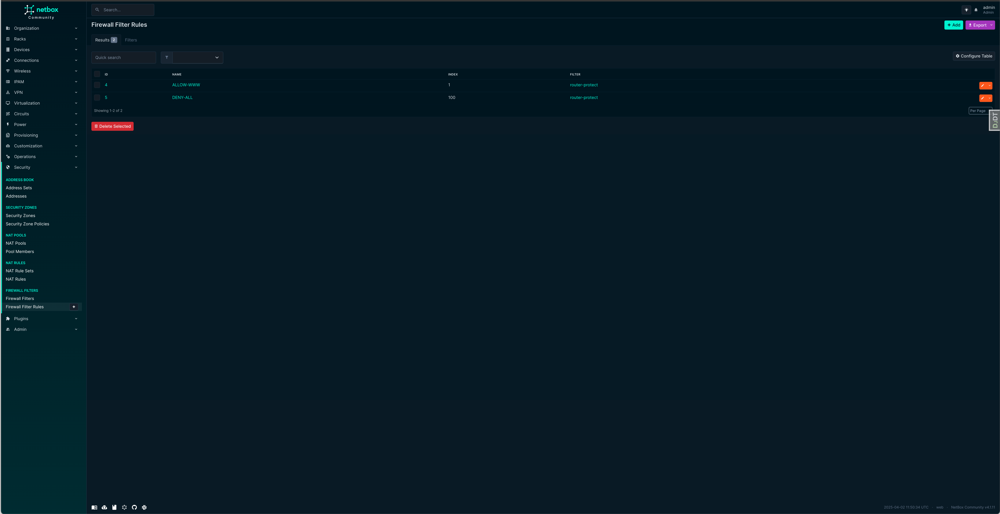
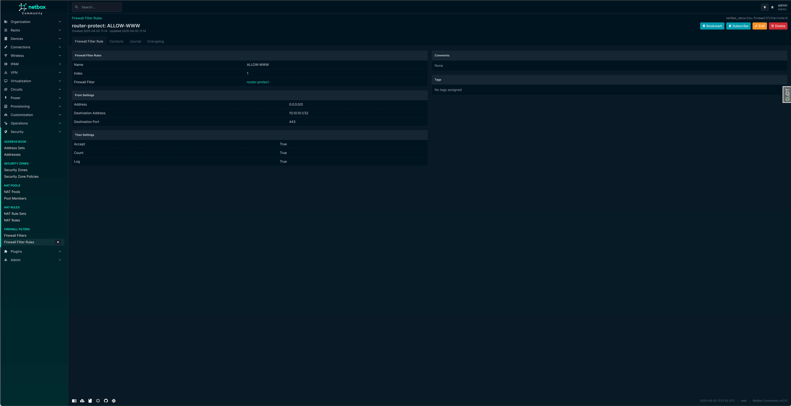
